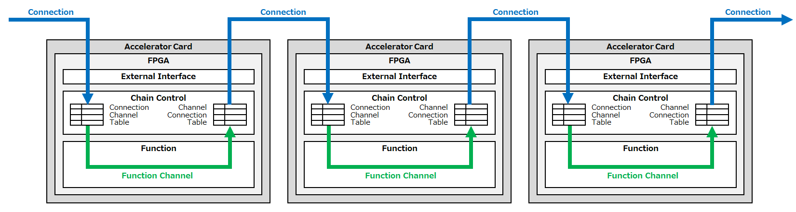
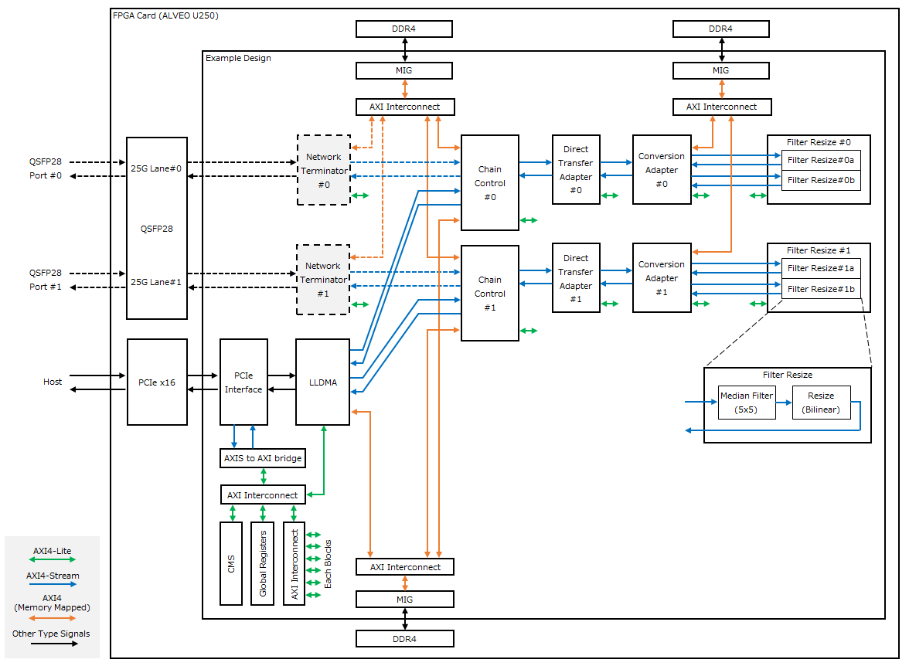

# OpenKasugai Hardware とは

OpenKasugai Projectは、FPGA、GPU、xPUといった様々なハードウェアアクセラレータ（HWA）を組み合わせてデータ処理を行えるコンピューティング基盤を目指しています。本システムは複数の演算処理（ファンクション）を組み合わせることで、ユーザごとにカスタマイズしたサービスを提供します。また、ファンクションごとに最適なHWAを使用することで、アプリケーション性能を向上させることができます。

上記を実現するため、OpenKasugai Hardwareはハードウェアファンクションチェイニングを採用します。本技術は、HWAが出力先を自律制御し、処理結果を任意のHWA内のファンクションに転送します。これによりCPUが通信制御・データ転送に介在しなくなるため、低レイテンシ・高スループットのデータ転送を実現できます。

実装サンプルでは、チェイン制御回路と独自のDMA回路（LLDMA: Low-Latency Direct device Memory Access）の組み合わせにより、PCIeバス経由で任意のFPGA間の直接データ転送を実現しています。

# 主な機能

実装サンプルは、画像処理（メディアンフィルタとリサイズ）を題材としてハードウェアファンクションチェイニングを実現したものを提供します。

|機能|説明|
|:--|:--|
|チェイン接続機能|チェイン制御モジュールによりハードウェアファンクションチェイニングのデータ転送機能を実現します。|
|LLDMA|PCI Expressによる外部インタフェース機能を提供します。ホストとFPGAカード間の転送の他、ホストのCPU処理を介さずにFPGAカード間で直接データ転送する機能（D2D）を提供します。|
|NW終端機能|Ethernetによる外部インタフェース機能を提供します。本実装サンプルでは未搭載です。本機能を利用する場合は後述の [PTU_25G_IC](./README_ja.md#nw終端機能について) の使用を推奨します。|
|ファンクション機能|画像処理機能を提供します。変換アダプタブロックとフィルタリサイズブロックから構成されます。前者はデータフレームのバッファリングと画像処理タスクの振り分けを行い、後者は振り分けられた画像処理タスク（5x5メディアンフィルタとリサイズ）の並列実行を可能とします。|
|直接転送機能|ファンクション機能をバイパスし、チェイン制御のIngressからEgressへの直接の転送を可能にします。|

# ブロック図

実装サンプルのブロック構成図を以下に示します。

## NW終端機能について

本実装サンプルではNW終端機能は提供していません。この機能を利用する場合は以下のIPの使用を推奨とします。

- ベンダ : [Intellectual Highway, Corp.](https://www.i-highway.com/)
- IP名 : Interconnect用25GbE対応PTU
- 型格 : `PTU_25G_IC`
- バージョン : `2.0.0-1`

# ドキュメント

|タイトル|説明|
|:--|:--|
|README|本書|
|[チュートリアル](./TUTORIAL_ja.md)|サンプル実装を検証するための環境構築と実行手順を説明します。|
|[ビルド手順書](./BUILD_ja.md)|サンプル実装のビルド手順を説明します。|
|[ファンクション向け開発ガイドライン](https://openkasugai.github.io/hardware-design/)|実装サンプルをカスタマイズする場合や新規にファンクションを開発する場合のデザイン仕様およびビルド手順を説明します。|

# インストール手順

[チュートリアル の『インストール手順』](./TUTORIAL_ja.md#2-インストール手順) を参照のこと。

# システム要件

実装サンプルの検証に使用する環境について記載します。検証時のシステム構成については [チュートリアル の『検証環境構成』](./TUTORIAL_ja.md#1-検証環境構成) を参照のこと。

## 推奨ハードウェア構成

|項目|内容|備考|
|:--|:--|:--:|
|マザーボード|PCI Express 3.0 x16スロット対応のもの (デュアルスロット)|\*1|
|電源|225W (PCI Express スロット + 8ピンAUX電源)|\*1|
|メモリ|運用: 16GiB以上 開発: 64GiB以上 (80GiB以上推奨)|\*1|
|FPGAカード|Alveo U250||

\*1) Alveo U250 の [Minimum System Requirements](https://docs.amd.com/r/en-US/ug1301-getting-started-guide-alveo-accelerator-cards/Minimum-System-Requirements) 
に準じます。

## 推奨ソフトウェア構成

|項目|バージョン|
|:--|:--|
|OS|Ubuntu 22.04.4 LTS|
|Kernel|5.15.0-117-generic|
|Vivado/Vitis HLS|2023.1|
|build-essential|12.9|
|cmake|3.22.1|
|python3-pip|3.10.12|
|pkg-config|0.29.2|
|meson|0.61.2.1|
|ninja|1.11.1.1|
|pyelftools|0.31|
|libnuma-dev|2.0.14.3|
|udev|249.11|
|libpciaccess-dev|0.16.3|
|DPDK|23.11|
|OpenCV|3.4.3|

# コントリビューション

[OpenKasugai Hardware へのコントリビューション](./CONTRIBUTING_ja.md)をご参照ください。

# ライセンス

## hardware-design リポジトリ

|項目|パス|ライセンス|
|:--|:--|:--|
|チェイン制御|`/chain-control/chain_control/`|Apache License 2.0|
|直接転送アダプタ|`/chain-control/direct_trans_adaptor/`|Apache License 2.0|
|LLDMA|`/external-if/LLDMA/`|Apache License 2.0|
|フィルタリサイズ|`/function/filter_resize/filter_resize/`|Apache License 2.0|
|変換アダプタ|`/function/filter_resize/conversion_adaptor/`|Apache License 2.0|
|グローバルレジスタ|`/example-design/fpga_reg/`|Apache License 2.0|
|PCI変換ブロック|`/example-design/pci_conversion/`|Apache License 2.0|
|ビルド用スクリプト|`/example-design/script/`|Apache License 2.0|

## hardware-drivers リポジトリ

|項目|パス|ライセンス|
|:--|:--|:--|
|サンプルプログラム|`/tools/sample_tester/`|BSD 3-Clause License|
|ライブラリ|`/lib/`|BSD 3-Clause License|
|ドライバ|`/driver/`|GNU General Public License v2.0|
