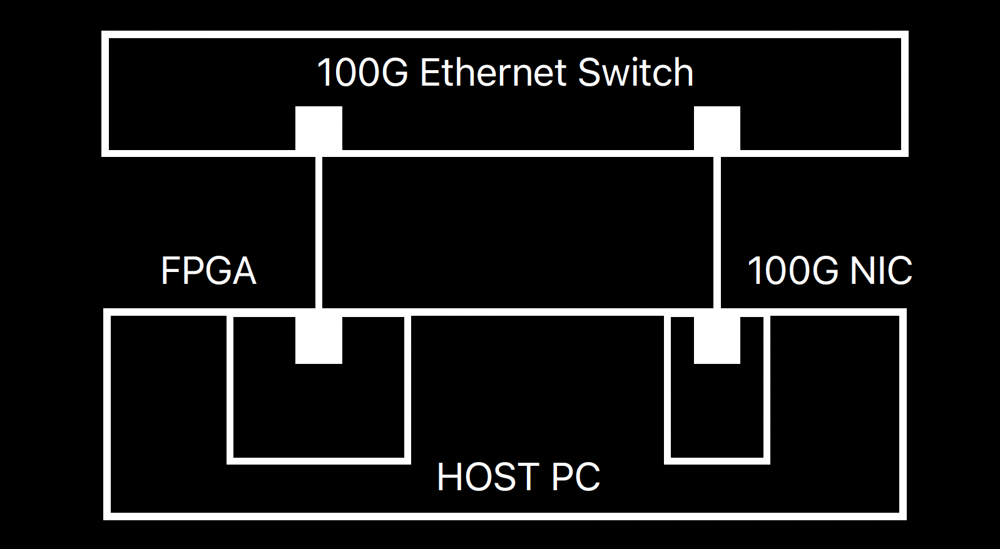

# Test Procedure for Sample Implementation

## Preparations

### Install Tools

- Install the packages required for the build.
  ```sh
  $ sudo apt install build-essential cmake python3-pip
  ```

- Download and install Vivado ML edition 2023.1 from [AMD Download Site](https://japan.xilinx.com/support/download/index.html/content/xilinx/ja/downloadNav/vivado-design-tools/2023-1.html). Vitis is also included in this installer.

  For the installation procedure, see [UG973 : Vivado Design Suite User Guide: Release Notes, Installation, and Licensing](https://docs.amd.com/r/2023.1-English/ug973-vivado-release-notes-install-license/Release-Notes).

### Repository clone

From now on, the working directory for this tutorial is `$workdir`.

```sh
$ cd $workdir
$ git clone -b experimental https://github.com/openkasugai/hardware-design.git
$ git clone -b experimental https://github.com/openkasugai/hardware-drivers.git
```

### Hugepage Settings

Set Hugepage to secure that there is enough contiguous memory space required for DMA transfers between the FPGA-HOST.

Edit `/etc/default/grub` and set `GRUB_CMDLINE_LINUX_DEFAULT` to hugepagesz=1G so that 32 pages are allocated at boot time.

```diff
- GRUB_CMDLINE_LINUX_DEFAULT=""
+ GRUB_CMDLINE_LINUX_DEFAULT="default_hugepagesz=1G hugepagesz=1G hugepages=32"
```

Reflect the Grub settings and reboot the system.

```sh
$ sudo update-grub
$ sudo reboot
```

After rebooting, verify that the settings take reflect.

```sh
$ cat /proc/meminfo
# (Omitted)
HugePages_Total:      32
HugePages_Free:       32
HugePages_Rsvd:        0
HugePages_Surp:        0
Hugepagesize:    1048576 kB
```

## Generate and Write Bitstreams

See [Build Instructions](./BUILD.md).

## Software Build and Installation

Refer to the README in `hardware-drivers` and do the following.
- Build Drivers and Libraries
- Install Drivers
- Build Tests

## Running the Test

### Test with PCIe transfers

- Execute at $workdir/hardware-drivers/
  ```sh
  $ cd test/iddma
  $ make test
  ```

- The following tests are performed depending on board connection status and board design selection.
  - Host -> HLS nop function (AXIS) -> Host ( H2D+D2H Transfer Test )
  - Host -> HLS nop function (AXIS) -> HLS nop function (AXIS) -> Host ( D2D Transfer Test (With 2 FPGAs installed) )
  - Host -> HLS nop function (AXI) -> Host ( H2D+D2H Transfer Test )
  - Host -> HLS vector fp increment function -> Host  ( H2D+D2H Transfer Test (Need to set up nop_and_vec_fp_inc board design in FPGA) )

### Test with TCP transfers. (Need to set up nop_toe board design in FPGA)

- Connect between the FPGA and the host as shown in the figure.<br/>
<br/>

- Set environment variables for each IP address and port information.
  ```sh
  $ export FPGA_ETH_IP=192.168.130.197    # fpga IP address
  $ export FPGA_ETH_MASK=255.255.255.0    # fpga subnet mask
  $ export FPGA_ETH_GATEWAY=192.168.130.1 # fpga default gateway
  $ export CPU_IP=192.168.130.97     # CPU test side IP address
  $ export CPU_PORT_BASE=30000       # CPU test side listen port
  $ export XSE_RX_PORT_BASE=20000    # fpga test side fpga listen port
  $ export XSE_IP=${FPGA_ETH_IP}     # fpga test side fpga IP address
  $ export XSE_TX_PORT_BASE=30000    # fpga test side fpga connect port
  ```

- Execute at $workdir/hardware-drivers/ and setup FPGA TOE
  ```sh
  $ make setup-toe
  ```

- H2D+D2H transfer test of Host NIC -> FPGA NIC -> HLS nop function (AXIS) -> FPGA NIC -> Host NIC is performed by executing the following.
  ```sh
  $ cd test/iddma
  $ make test_tcp
  ```
