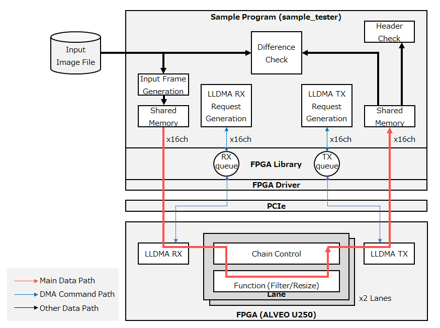

# 1. Validation environment configuration

Indicates the configuration to use for validation. See the [System Requirements](./README.md#system-requirements) README for the required hardware and software versions.

## 1.1. Single FPGA Configuration

Single FPGA card configuration.
For this verification, you need to prepare a video file as input data.



## 1.2. Two FPGAs configuration (D2D-H / D2D-D)

Two FPGA cards configuration. D2D-H transfers between FPGAs via shared memory on the host side. D2D-D transfers between FPGAs without going through the host.


----

# 2. Installation Procedure

## 2.1. Installing Vivado/Vitis
Download and install Vivado ML edition 2023.1 from [AMD Download Site](https://japan.xilinx.com/support/download/index.html/content/xilinx/ja/downloadNav/vivado-design-tools/2023-1.html). Vitis is also included in this installer.

For the installation procedure, see [UG973 : Vivado Design Suite User Guide: Release Notes, Installation, and Licensing](https://docs.amd.com/r/2023.1-English/ug973-vivado-release-notes-install-license/Release-Notes).

## 2.2. Repository clone
From now on, the working directory for this tutorial is `$workdir`.

```sh
$ cd $workdir
$ git clone https://github.com/openkasugai/hardware-design.git
$ git clone https://github.com/openkasugai/hardware-drivers.git
```

## 2.3. Installing the FPGA Library

Install the DPDK, JSON, and MCAP libraries.

```sh
$ cd $workdir/hardware-drivers/lib
$ sudo apt install build-essential python3-pip pkg-config libnuma-dev libpciaccess-dev
$ sudo pip3 install meson ninja pyelftools
$ make dpdk
$ make json
$ make mcap
```

When installing `libpciaccess-dev`, you may see a `Newer kernel available` message in the TUI under some circumstances. In this case, select `<OK>` and then select `<Cancel>` on the next `Daemons using outdated libraries` screen.

When you run `make mcap`, you will be prompted to add the path to the MCAP executable as follows (replace `$workdir` with your working directory):

```
  * Please set path of mcap into PATH, or mv mcap to the path included in PATH( ... ).
  * Examples:
  *  $ PATH=$workdir/hardware-drivers/lib/MCAP:$PATH
  *    or
  *  $ mv $workdir/hardware-drivers/lib/MCAP/mcap /usr/local/bin
```

Follow the instructions to set your PATH environment variable or put `$workdir/hardware-drivers/lib/MCAP/mcap` in a directory that is in your path.

After completing the above, install the FPGA library.
`[libfpga] Build library(type: 0 v. 1.0. 0-0) Succeed!! `is displayed.

```
$ make
[...]
[libfpga]Build library(type:0 v.1.0.0-0) Succeed!!
```


## 2.4. Installing OpenCV

Download and install OpenCV.
Depending on the execution environment, you may be prompted for the sudo password during installation.

```sh
$ cd $workdir/hardware-drivers/lib/OpenCV
$ sudo apt install cmake
$ ./install_opencv_ubuntu22.04.sh
```

Verify that OpenCV was installed successfully.
If you see 36 shared libraries for `libopencv`, the installation is successful.

```sh
$ ldconfig -p | grep libopencv
      libopencv_viz.so.3.4 (libc6,x86-64) => /usr/local/opencv-3.4.3/lib/libopencv_viz.so.3.4
      libopencv_viz.so (libc6,x86-64) => /usr/local/opencv-3.4.3/lib/libopencv_viz.so
      libopencv_videostab.so.3.4 (libc6,x86-64) => /usr/local/opencv-3.4.3/lib/libopencv_videostab.so.3.4
      libopencv_videostab.so (libc6,x86-64) => /usr/local/opencv-3.4.3/lib/libopencv_videostab.so
      [...]
```

## 2.5. Installing IPMItool

Install IPMItool.

```sh
$ sudo apt install ipmitool
```

## 2.6. Building the FPGA Driver

Build the FPGA driver.

```sh
$ cd $workdir/hardware-drivers/driver
$ make
```

## 2.7. Set Vitis Installation Path

If you installed Vitis HLS in a location other than `/tools/Xilinx/Vitis_HLS/2023.1`, edit `$workdir/hardware-drivers/tools/sample_tester/cppfunc/Makefile` and specify the installation path in the `XILINX_VITIS_HLS` variable.

Add the installation path setting to line 15 of `$workdir/hardware-drivers/tools/sample_tester/cppfunc/Makefile`.
 `$yourpath` is the path where you installed Vitis HLS.

```diff
+ XILINX_VITIS_HLS=$yourpath/Vitis_HLS/2023.1
```

## 2.8. Hugepage Settings

Set Hugepage to secure that there is enough contiguous memory space required for DMA transfers between the FPGA-HOST.

Edit `/etc/default/grub` and set `GRUB_CMDLINE_LINUX_DEFAULT` to hugepagesz=1G so that 16 pages are allocated at boot time.

```diff
- GRUB_CMDLINE_LINUX_DEFAULT=""
+ GRUB_CMDLINE_LINUX_DEFAULT="default_hugepagesz=1G hugepagesz=1G hugepages=16"
```

Reflect the Grub settings and reboot the system.

```sh
$ sudo update-grub
$ sudo reboot
```

After rebooting, verify that the settings take reflect.

```sh
$ cat /proc/meminfo
# (Omitted)
HugePages_Total:      16
HugePages_Free:       16
HugePages_Rsvd:        0
HugePages_Surp:        0
Hugepagesize:    1048576 kB
```

## 2.9. Preparing Bitstream

- If you use the built Bitstream, no preparation is required as it is included under `$workdir/hardware-design/example-design/bitstream/`.
- If you want to build it yourself, see [build instructions](./BUILD.md).

----

# 3. instructions for building the sample program

## 3.1. Sample Program Overview

The sample program is configured by default to input a 4 K (3840x2160px) video file, perform 5x5 median filtering and resizing to 1280x1280px using the FPGA, and then return it to the sample program.

The data path between the host and the FPGA is identified by a connection ID (CID), and the data path within the FPGA is identified by a function channel (CHID). LLDMA can accommodate 16 connections (CID=0.. 15). The functions in the FPGA consist of two lanes, each of which can accommodate eight function channels (CHID=0.. 7). CHID is a local value within each lane. Each channel can be selected either in filter resize mode, which performs image processing, or in direct transfer mode, which bypasses image processing and outputs as is.


## 3.2. parameter setting (param_tables.c)

Edit `$workdir/hardware-drivers/tools/sample_tester/src/param_tables.c` and configure each function channel setting.

### FPGA Frame Size Setting : g_param_framesizes_func

Sets the input/output size of the function.

|Item|Description|range|
|:--|:--|:--:|
|`INPUT HEIGHT`|Set the input image height for each channel|64~2160|
|`INPUT WIDTH`|Set the width of the input image for each channel|64~3840|
|`OUTPUT HEIGHT`|Set the output image height for each channel|64~2160|
|`OUTPUT WIDTH`|Set the output image width for each channel|64~3840|

Since this is a per-lane configuration, the same value is applied to LANE0 (channel 0-7) and LANE1 (channel 8-15).

In the case of a single FPGA, the value of Device 0 is used. In a two-FPGA configuration, the first card uses the Device0 value, and the second card uses the Device1 value.

```c++
static const framesize_t g_param_framesizes_func[][CH_NUM_MAX] = {
    /* { INPUT HEIGHT, INPUT WIDTH, OUTPUT HEIGHT, OUTPUT WIDTH } */
    {
        /* Device 0 */
        { 2160, 3840, 1280, 1280 }, // CH0  --.
        { 2160, 3840, 1280, 1280 }, // CH1    |
        { 2160, 3840, 1280, 1280 }, // CH2    |
        { 2160, 3840, 1280, 1280 }, // CH3    | LANE0
        { 2160, 3840, 1280, 1280 }, // CH4    |
        { 2160, 3840, 1280, 1280 }, // CH5    |
        { 2160, 3840, 1280, 1280 }, // CH6    |
        { 2160, 3840, 1280, 1280 }, // CH7  --'
        { 2160, 3840, 1280, 1280 }, // CH8  --.
        { 2160, 3840, 1280, 1280 }, // CH9    |
        { 2160, 3840, 1280, 1280 }, // CH10   |
        { 2160, 3840, 1280, 1280 }, // CH11   | LANE1
        { 2160, 3840, 1280, 1280 }, // CH12   |
        { 2160, 3840, 1280, 1280 }, // CH13   |
        { 2160, 3840, 1280, 1280 }, // CH14   |
        { 2160, 3840, 1280, 1280 }, // CH15 --'
    },
    {
        /* Device 1 */
        { 1280, 1280, 1280, 1280 }, // CH0  --.
        { 1280, 1280, 1280, 1280 }, // CH1    |
        { 1280, 1280, 1280, 1280 }, // CH2    |
        { 1280, 1280, 1280, 1280 }, // CH3    | LANE0
        { 1280, 1280, 1280, 1280 }, // CH4    |
        { 1280, 1280, 1280, 1280 }, // CH5    |
        { 1280, 1280, 1280, 1280 }, // CH6    |
        { 1280, 1280, 1280, 1280 }, // CH7  --'
        { 1280, 1280, 1280, 1280 }, // CH8  --.
        { 1280, 1280, 1280, 1280 }, // CH9    |
        { 1280, 1280, 1280, 1280 }, // CH10   |
        { 1280, 1280, 1280, 1280 }, // CH11   | LANE1
        { 1280, 1280, 1280, 1280 }, // CH12   |
        { 1280, 1280, 1280, 1280 }, // CH13   |
        { 1280, 1280, 1280, 1280 }, // CH14   |
        { 1280, 1280, 1280, 1280 }, // CH15 --'
    }
};
```

### Chain Control Settings : g_param_chain_ctrl_tbls

Configure the chain control settings to the FPGA chain control section.

|Item|Description|range|
|:--|:--|:--:|
|`FUNCTION CHID`|Sets the function (filter size) CHID for each channel.|0~7|
|`EXTIF ID`|Set the external IF ID to be associated with `FUNCTION CHID`|0 (*)|
|`LLDMA CID`|Specifies the connection ID (CID) to be associated with `FUNCTION CHID`|0~15|

* The `EXTIF ID` is used to identify multiple external IFs when they are included. Since this sample FPGA is only LLDMA, `EXTIF ID` is fixed to 0.

The default settings are:. These are fixed values for this test and do not need to be changed.

```c++
static const chain_ctrl_cid_t g_param_chain_ctrl_tbls[CH_NUM_MAX] = {
    /* { FUNCTION CHID, LLDMA EXTIF ID, LLDMA CID} */
    /* Lane#0 */
    { 0, 0, 0 },  // CH0
    { 1, 0, 1 },  // CH1
    { 2, 0, 2 },  // CH2
    { 3, 0, 3 },  // CH3
    { 4, 0, 4 },  // CH4
    { 5, 0, 5 },  // CH5
    { 6, 0, 6 },  // CH6
    { 7, 0, 7 },  // CH7
    /* Lane#1 */
    { 0, 0, 8 },  // CH8
    { 1, 0, 9 },  // CH9
    { 2, 0, 10 }, // CH10
    { 3, 0, 11 }, // CH11
    { 4, 0, 12 }, // CH12
    { 5, 0, 13 }, // CH13
    { 6, 0, 14 }, // CH14
    { 7, 0, 15 }, // CH15
};
```

### Chain Control Flag Settings : g_param_chain_flags_tbls

|Item|Description|range|
|:--|:--|:--:|
|`IG_DIRECT_FLAG`|Flag to enable direct forwarding|0:Disabled, 1:Enabled|
|`IG_ACTIVE_FLAG`|Flag to enable forwarding on the ingress side of chain control|0:Not Allow, 1:Allow|
|`EG_ACTIVE_FLAG`|Flag to enable forwarding on the egress side of chain control|0:Not Allow, 1:Allow|
|`EG_VIRTUAL_FLAG`|Virtual connection flag (reserved for future use)|0 const|
|`EG_BLOCKING_FLAG`|Blocking forward permit flag (*)|0:Not Allow, 1:Allow|

* `EG_BLOCKING_FLAG` is a flag that permits blocking of another channel's write until that channel's write is complete when the write is taking time due to the full transmit buffer on the FPGA side. 

- The channel to use is set to `IG_ACTIVE_FLAG=1`, `EG_ACTIVE_FLAG=1`.
- Channels using the filter resize function should be set to `IG_DIRECT_FLAG=0` and `EG_BLOCKING_FLAG=1`.
- Direct transfer channels are setting to IG_DIRECT_FLAG=1` and EG_BLOCKING_FLAG=0`.

In the case of a single FPGA, the value of Device 0 is used. In a two-FPGA configuration, the first card uses the Device0 value, and the second card uses the Device1 value.

The default settings are as follows, with all channels enabled, the first card set to filter resize mode, and the second card set to direct transfer mode.

```c++
static const chain_flags_t g_param_chain_flags_tbls[][CH_NUM_MAX] = {
    /* IG_DIRECT_FLAG, IG_ACTIVE_FLAG, EG_ACTIVE_FLAG, EG_VIRTUAL_FLAG, EG_BLOCKING_FLAG */
    {
        /* Device 0 */
        { 0, 1, 1, 0, 1 }, // CH0  --.
        { 0, 1, 1, 0, 1 }, // CH1    |
        { 0, 1, 1, 0, 1 }, // CH2    |
        { 0, 1, 1, 0, 1 }, // CH3    | LANE0
        { 0, 1, 1, 0, 1 }, // CH4    |
        { 0, 1, 1, 0, 1 }, // CH5    |
        { 0, 1, 1, 0, 1 }, // CH6    |
        { 0, 1, 1, 0, 1 }, // CH7  --'
        { 0, 1, 1, 0, 1 }, // CH8  --.
        { 0, 1, 1, 0, 1 }, // CH9    |
        { 0, 1, 1, 0, 1 }, // CH10   |
        { 0, 1, 1, 0, 1 }, // CH11   | LANE1
        { 0, 1, 1, 0, 1 }, // CH12   |
        { 0, 1, 1, 0, 1 }, // CH13   |
        { 0, 1, 1, 0, 1 }, // CH14   |
        { 0, 1, 1, 0, 1 }, // CH15 --'
    },
    {
        /* Device 1 */
        { 1, 1, 1, 0, 0 }, // CH0  --.
        { 1, 1, 1, 0, 0 }, // CH1    |
        { 1, 1, 1, 0, 0 }, // CH2    |
        { 1, 1, 1, 0, 0 }, // CH3    | LANE0
        { 1, 1, 1, 0, 0 }, // CH4    |
        { 1, 1, 1, 0, 0 }, // CH5    |
        { 1, 1, 1, 0, 0 }, // CH6    |
        { 1, 1, 1, 0, 0 }, // CH7  --'
        { 1, 1, 1, 0, 0 }, // CH8  --.
        { 1, 1, 1, 0, 0 }, // CH9    |
        { 1, 1, 1, 0, 0 }, // CH10   |
        { 1, 1, 1, 0, 0 }, // CH11   | LANE1
        { 1, 1, 1, 0, 0 }, // CH12   |
        { 1, 1, 1, 0, 0 }, // CH13   |
        { 1, 1, 1, 0, 0 }, // CH14   |
        { 1, 1, 1, 0, 0 }, // CH15 --'
    }
};
```

### Input movie file setting : g_param_moviefile

Specifies the path of the movie file for each channel.

- Specify a movie file that is up to 4 K (3840x2160) in size. The encoding is assumed to be h264. The frame rate of the movie file is ignored because the transfer frame rate is overridden by the command line options described below.
- Set a separate movie file for each channel. OpenCV decoding errors can occur when multiple channels access the same file.
- Specify an absolute path.

The default settings are:

```c++
static const char *g_param_moviefile[CH_NUM_MAX] = {
    "/home/data/4K_ch00.mp4", // CH0  --.
    "/home/data/4K_ch01.mp4", // CH1    |
    "/home/data/4K_ch02.mp4", // CH2    |
    "/home/data/4K_ch03.mp4", // CH3    | LANE0
    "/home/data/4K_ch04.mp4", // CH4    |
    "/home/data/4K_ch05.mp4", // CH5    |
    "/home/data/4K_ch06.mp4", // CH6    |
    "/home/data/4K_ch07.mp4", // CH7  --'
    "/home/data/4K_ch08.mp4", // CH8  --.
    "/home/data/4K_ch09.mp4", // CH9    |
    "/home/data/4K_ch10.mp4", // CH10   |
    "/home/data/4K_ch11.mp4", // CH11   | LANE1
    "/home/data/4K_ch12.mp4", // CH12   |
    "/home/data/4K_ch13.mp4", // CH13   |
    "/home/data/4K_ch14.mp4", // CH14   |
    "/home/data/4K_ch15.mp4", // CH15 --'
};
```

## 3.3. Build

After setting `param_tables.c`, build the sample program.

```sh
$ cd $workdir/hardware-drivers/tools/sample_tester
$ make
```

----

# 4. Execution command

Indicates the format of the execution command.

```sh
$ sample_tester -- -d <device> -- --tp <model> --chid <num> -f <num> -r <num> --deqtcore <num>
```

## 4.1. Required Parameters

- `-d <device>` : Device file specification. Comma-separated for multiple FPGAs
- `--tp <model>` : Test model. Specifies the test configuration.
    - `hh` : Single FPGA Configuration
    - `d2dh_hh` : D2D-H
    - `d2dd_hh` : D2D-D
- `--chid <num>` : The connection channel ID specification. 0~15. Multiple channel ID specifications are separated by commas. Contiguous channel ID specification can be specified with hyphens.(Examples: --chid 0,3,5-7,9,10,12-15)
- `-f <num>` : Specify transmit FPS
    - Any value. When FPS is specified, it is the number of frame enqueues per second. If you do not specify an FPS, the enqueue will be queued so that there are  no vacancies.
- `-r <num>` : Specify the number of transmitted frames
    - The number of frames to transmit. It must be less than or equal to the number of frames in the movie file.
- `--deqtcore <num>` : CPU core number specification for per-channel queue processing. 1~(Host CPU Cores-1).
    - For multichannel, CPU cores are used from the specified number to the number of channels (For example `--chid 0-3 --deqtcore 5` uses CPU cores 5, 6, 7, 8).If the CPU core with the corresponding number does not exist, a communication error occurs.

## 4.2. Additional Parameters

- `--loglevel <num>` : Specifying log levels for applog. 1~7.default 5(ERROR level)

    |Value|Name|Description|
    |:--:|:--|:--|
    |1|`LOG_TRACE`|Displays all logs containing trace information inside the sample program|
    |2|`LOG_DEBUG`|Displays information about debugging the sample program in addition to `LOG_INFO`|
    |3|`LOG_INFO`|Displays information about the sample program in addition to `LOG_WARN`|
    |4|`LOG_WARN`|Displays warning messages in addition to `LOG_ERROR`|
    |5|`LOG_ERROR`|Display only error messages|
    |6|(n/a)|Not used|
    |7|`LOG_FORCE`|Suppress all logging|

- `-m` : The frame transmitted will be repeated the first frame of the movie.
- `--ppms` : Outputs the transmitted image data to a PPM file. The output destination is the `send_data/`directory under the current directory.
- `--ppmr` : Outputs the received image data to a PPM file. The output destination is the `receive_data/`directory under the current directory.
- `-p` : Performance measurement. *When performance measurement is enabled, some log output of `result.log` and `applog` is suppressed during the measurement period.

----

# 5. Test Procedure

## 5.1. Vivado Environment Variable Settings

Set the environment variables for use Vivado 2023.1 commands. Not required if it has already been executed.

```sh
$ source /tools/Xilinx/Vivado/2023.1/settings64.sh
```

If you installed Vivado somewhere other than `/tools/Xilinx/Vivado/2023.1`, replace the path.

## 5.2. Writing MCS Files

Change to the tools directory and copy the mcs file you want to write.

```sh
$ cd $workdir/hardware-drivers/tools/run_flash
$ cp /path/to/OpenKasugai-fpga-example-design-1.0.0-1.mcs .
```

Write the MCS file to the FPGA using `run_flash.sh`. The `-t` option specifies the MCS file and the `-i` option specifies the device index.

If you see `Flash programming completed successfully`, you have succeeded.

```sh
$ ./run_flash.sh -t OpenKasugai-fpga-example-design-1.0.0-1.mcs -i 0
# (Omitted)
INFO: [Labtoolstcl 44-377] Flash programming completed successfully
program_hw_cfgmem: Time (s): cpu = 00:00:04 ; elapsed = 00:32:58 . Memory (MB): peak = 3755.586 ; gain = 252.000 ; free physical = 490216 ; free virtual = 493877
INFO: [Common 17-206] Exiting Vivado at Fri Oct 28 16:55:10 2022...
```

To write to the second and subsequent FPGAs, change the device index and run `run_flash.sh` again.

```sh
$ ./run_flash.sh -t OpenKasugai-fpga-example-design-1.0.0-1.mcs -i 1
# (Omitted)
INFO: [Labtoolstcl 44-377] Flash programming completed successfully
program_hw_cfgmem: Time (s): cpu = 00:00:04 ; elapsed = 00:32:58 . Memory (MB): peak = 3755.586 ; gain = 252.000 ; free physical = 490216 ; free virtual = 493877
INFO: [Common 17-206] Exiting Vivado at Fri Oct 28 16:55:10 2022...
```

When complete, cold reboot the host. Shut down the system with `sudo poweroff` and turn on the power manually or by IPMITool.

```sh
$ sudo poweroff
```

## 5.3. Bitstream writes

Check the BDF of the FPGA card with `lspci`. The number of FPGA cards is displayed. `xx: xx.x`, `yy: yy.y` is BDF.

Write the Bitstream is required after every system startup and restarting. 

```sh
$ lspci | grep Xilinx | grep Memory
xx:xx.x Memory controller: Xilinx Corporation Device 903f
yy:yy.y Memory controller: Xilinx Corporation Device 903f
```

Write the Bitstream using the `mcap` command.

```sh
$ cd $workdir/hardware-drivers/lib/MCAP
$ sudo ./mcap -x 903f -s xx:xx.x -p /path/to/OpenKasugai-fpga-example-design-1.0.0-2.bit
$ sudo ./mcap -x 903f -s yy:yy.y -p /path/to/OpenKasugai-fpga-example-design-1.0.0-2.bit
```

`FPGA Configuration Done!! `indicates success.

## 5.4. Installing the FPGA Driver

Install the FPGA driver. 

 The FPGA driver installation is required after every system startup and restarting. If it is already installed, run `rmmod` and then `insmod`.

```sh
$ cd $workdir/hardware-drivers/driver
$ sudo rmmod xpcie
$ sudo insmod xpcie.ko
```

Verify the device file name of the FPGA.

```sh
$ ls /dev/xpcie*
/dev/xpcie_XXXXXXXXXXXX
/dev/xpcie_YYYYYYYYYYYY
...
```

## 5.5. Building the Soft Reset Tool
Build the soft reset tool.
If `reg32r` and `reg32w` executables are generated, you are successful.

```sh
$ cd $workdir/hardware-drivers/tools/dbgreg
$ make
```

## 5.6. Running the Test (Single FPGA Configuration)
Perform a soft reset on all FPGAs used.

```sh
$ cd $workdir/hardware-drivers/tools/dbgreg
$ ./reg32w /dev/xpcie_XXXXXXXXXXXX 000c 1
$ ./reg32w /dev/xpcie_XXXXXXXXXXXX 000c 0
```

Run the test with the `sample_tester` command with `hh` for the `--tp` option.

```sh
$ cd $workdir/hardware-drivers/tools/sample_tester
$ ./build/sample_tester -- -d <device> -- --tp hh --chid <num> -f <num> -r <num> --deqtcore <num>
```

- Example: Channel 0, CPU core 5 is used for the thread.

    ```sh
    $ sudo ./build/sample_tester -- -d /dev/xpcie_XXXXXXXXXXXX -- --tp hh --chid 0 -f 5 -r 50 --deqtcore 5
    ```

- Example: Specify multiple channel IDs. For channels 0, 2, 3, 4, 5, 8, 9, 10, 15.

    ```sh
    $ sudo ./build/sample_tester -- -d /dev/xpcie_XXXXXXXXXXXX -- --tp hh --chid 0,2-5,8-10,15 -f 5 -r 50 --deqtcore 5
    ```

- Example: To set the log level to debug log output, specify `--loglevel 2`.

    ```sh
    $ sudo ./build/sample_tester -- -d /dev/xpcie_XXXXXXXXXXXX -- --tp hh --chid 0,8 -f 5 -r 50 --deqtcore 5 --loglevel 2
    ```

- Example: To send the first frame of the movie repeatedly, specify `-m`.

    ```sh
    $ sudo ./build/sample_tester -- -d /dev/xpcie_XXXXXXXXXXXX -- --tp hh --chid 0,8 -f 5 -r 50 --deqtcore 5 -m
    ```

## 5.7. Running the Test (Two FPGAs Configuration)
Perform a soft reset on all FPGAs used.

```sh
$ cd $workdir/hardware-drivers/tools/dbgreg
$ ./reg32w /dev/xpcie_XXXXXXXXXXXX 000c 1
$ ./reg32w /dev/xpcie_XXXXXXXXXXXX 000c 0
$ ./reg32w /dev/xpcie_YYYYYYYYYYYY 000c 1
$ ./reg32w /dev/xpcie_YYYYYYYYYYYY 000c 0
```

Run the test with the `sample_tester` command with `d2dh_hh` or `d2dd_hh` for the `--tp` option. The `-d` option specifies the device file names of the two FPGA cards separated by commas.

```sh
$ cd $workdir/hardware-drivers/tools/sample_tester
$ ./build/sample_tester -- -d <device0>,<device1> -- --tp <model> --chid <num> -f <num> -r <num> --deqtcore <num>
```

- Example: Channel 0, CPU core 5 is used for the thread.

    ```sh
    $ sudo ./build/sample_tester -- -d /dev/xpcie_XXXXXXXXXXXX,/dev/xpcie_YYYYYYYYYYYY -- --tp d2dh_hh --chid 0 -f 5 -r 50 --deqtcore 5
    ```

- Example: Specify multiple channel IDs. For channels 0, 2, 3, 4, 5, 8, 9, 10, 15.

    ```sh
    $ sudo ./build/sample_tester -- -d /dev/xpcie_XXXXXXXXXXXX,/dev/xpcie_YYYYYYYYYYYY -- --tp d2dh_hh --chid 0,2-5,8-10,15 -f 5 -r 50 --deqtcore 5
    ```

- Example: To set the log level to debug log output, specify `--loglevel 2`.

    ```sh
    $ sudo ./build/sample_tester -- -d /dev/xpcie_XXXXXXXXXXXX,/dev/xpcie_YYYYYYYYYYYY -- --tp d2dh_hh --chid 0,8 -f 5 -r 50 --deqtcore 5 --loglevel 2
    ```

- Example: To send the first frame of the movie repeatedly, specify `-m`.

    ```sh
    $ sudo ./build/sample_tester -- -d /dev/xpcie_XXXXXXXXXXXX,/dev/xpcie_YYYYYYYYYYYY -- --tp d2dh_hh --chid 0,8 -f 5 -r 50 --deqtcore 5 -m
    ```

## 5.8. Reviewing Logs

The execution log is output to `result.log`.

This section provides examples of `./build/sample_tester -- -d /dev/xpcie_XXXXXXXXXXXX -- --chid 0,8 -f 5 -r 50 --deqtcore 5` execution logs.

```
result log start...0111-152831:

Version: 0.10.02

Argument options...
  Test model: TP_HOST_HOST
  Num of channels in FPGA lane0: 1 [CH0]
  Num of channels in FPGA lane1: 1 [CH8]
  Num of channels in FPGA lane2: 0
  Num of channels in FPGA lane3: 0
  Num of frames: 50
  Tester FPS: 5
  Enqueue interval: none
  Num of enqueue per test run: none
  Dequeue thread's CPU core No.: 5,13
  enable tester execute: false
  enable tester measurement mode: false
  enable validation of received image: true
  enable ppm file output of send data: false
  enable ppm file output of receive data: false
  enable ppm file output of expected data: false
  enable performance measurement: false
  enable FPGA power measurement: false
  enable HOST power measurement: false
  enable L2 Switch power measurement: false

create tester config file: "tester_config.json"

FPGA device info
--------------------------------------------------
  Device file path    : /dev/xpcie_XXXXXXXXXXXX
  Device vendor       : Xilinx Corporation
  Device kind         : ALVEO U250 PQ
  Device index        : 0
  PCIe bus id         : 0000:1f:00.0
  Bitstream id parent : 0x0001221c
    FPGA type     : 0x0001
    FPGA version  : 0x22
    FPGA revision : 0x1c
  Bitstream id child  : 0x0001221c
    FPGA type     : 0x0001
    FPGA version  : 0x22
    FPGA revision : 0x1c
  ------------------------------------------------

//--- TEST START ---

--- function chain connect ---
dev(0) CH(0) func_kernel_id(0), fchid(0) ingress_extif_id(0) ingress_cid(0) egress_extif_id(0) egress_cid(0)
dev(0) CH(8) func_kernel_id(1), fchid(0) ingress_extif_id(0) ingress_cid(8) egress_extif_id(0) egress_cid(8)

_/_/_/_/_/ TEST No.1: from TASK(1) to TASK(50), enq_num 50 _/_/_/_/_/

--- generate send image data ---
CH(0) generating send image data...
CH(8) generating send image data...

--- generate expected image data ---
CH(0) generating expected image(filter/resize) data...
CH(8) generating expected image(filter/resize) data...

--- enqueue set dma cmd ---
CH(0) dma rx data size=24883248 Byte
CH(8) dma rx data size=786480 Byte

--- dequeue set dma cmd ---
CH(0) dma tx data size=4915248 Byte
CH(8) dma tx data size=786480 Byte

--- receive thread start ---

--- dma tx dequeue thread start ---
CH(0) DMA TX dma_info: dir(1) chid(0) queue_addr(0x7f7f7390b000) queue_size(255)
CH(8) DMA TX dma_info: dir(1) chid(8) queue_addr(0x7f7f73907000) queue_size(255)
CH(0) DMA TX dmacmd_info: deq(0) task_id(1) dst_len(4915264) dst_addr(0x17fb2a400)
CH(8) DMA TX dmacmd_info: deq(0) task_id(1) dst_len(786496) dst_addr(0x15c57d400)

--- dma tx enqueue thread start ---

--- dma rx dequeue thread start ---
CH(8) DMA RX dma_info: dir(0) chid(8) queue_addr(0x7f7f7390f000) queue_size(255)
CH(0) DMA RX dma_info: dir(0) chid(0) queue_addr(0x7f7f73913000) queue_size(255)
CH(8) DMA RX dmacmd_info: enq(0) task_id(1) src_len(786496) src_addr(0x15c4bd000)
CH(0) DMA RX dmacmd_info: enq(0) task_id(1) src_len(24883264) src_addr(0x17e36f000)

--- send frame ---

--- dma rx enqueue thread start ---

...waitting for all dequeue process to finish
CH(8) DMA RX dmacmd_info: enq(0) result_task_id(1) result_status(0) result_data_len(0)
CH(8) DMA RX dmacmd_info: enq(1) task_id(2) src_len(786496) src_addr(0x15c32d000)
CH(8) DMA TX dmacmd_info: deq(0) result_task_id(1) result_status(0) result_data_len(786480)
CH(8) DMA TX dmacmd_info: deq(1) task_id(2) dst_len(786496) dst_addr(0x15c3ed400)
CH(0) DMA RX dmacmd_info: enq(0) result_task_id(1) result_status(0) result_data_len(0)
CH(0) DMA RX dmacmd_info: enq(1) task_id(2) src_len(24883264) src_addr(0x17c6f4000)
CH(0) DMA TX dmacmd_info: deq(0) result_task_id(1) result_status(0) result_data_len(4915248)
CH(0) DMA TX dmacmd_info: deq(1) task_id(2) dst_len(4915264) dst_addr(0x17deaf400)
...omission
CH(8) DMA RX dmacmd_info: enq(49) result_task_id(50) result_status(0) result_data_len(0)
CH(8) DMA TX dmacmd_info: deq(49) result_task_id(50) result_status(0) result_data_len(786480)
CH(0) DMA RX dmacmd_info: enq(49) result_task_id(50) result_status(0) result_data_len(0)
CH(0) DMA TX dmacmd_info: deq(49) result_task_id(50) result_status(0) result_data_len(4915248)

//--- TEST END ---//
```

## 5.9. Basic Measurement Function

Displays the measurement results in `result.log` at the end of the communication.

|Item name in the log|Description|
|:--|:--|
|CH(x) throughput [fps]|Throughput per Channel (Frame Rate)|
|CH(x) throughput [bps]|Throughput per Channel (Bit Rate)|
|CH(x) latency|Average latency per channel|
|CH(x) transfer data size [frame]|Number of frames sended/received per channel|
|CH(x) transfer data size [Byte]|Amount of data sended/received per channel|
|CH(x) header OK|Number of normal frames per channel|
|CH(x) header NG|Number of abnormal frames per channel|
|ALL CH TOTAL throughput [fps]|Total throughput of all channels (Frame Rate)|
|ALL CH TOTAL throughput [bps]|Total throughput of all channels (Bit Rate)|
|ALL CH TOTAL transfer data size [frame]|Total sended/received frames for all channels|
|ALL CH TOTAL transfer data size [Byte]|Total amount of sended/received data for all channels|
|ALL CH AVE throughput [fps]|Average throughput of all channels(Frame Rate)|
|ALL CH AVE throughput [bps]|Average throughput of all channels(Bit Rate)|

If the `-p` option is specified, the result of latency variation per channel is logged.

- Log the latency of all frames along with the frame header validation results.
- The following latency variations are calculated using the latency time of all frames per channel and output to the log.
    - max, min. ave(All Frames)

## 5.10. DMA measurement function

If the `-p` option is specified, the DMA measurement results are displayed in `result.log`.

In this sample program, processing for one image frame is processed as one "task". The `Performance per task` section displays the measurement results per task.

|Item name in the log|Description|
|:--|:--|
|`transfer data size per task`|Data size transferred per task(RX, TX, RX+TX)|
|`RX latency per task`|RX latency per task|
|`RX throughput per task`|RX throughput per task|
|`TX latency per task`|TX latency per task|
|`TX throughput per task`|TX throughput per task|
|`RX(enqueue)->TX(dequeue) latency per task`|RX->TX latency per task|
|`RX(enqueue)->TX(dequeue) throughput per task`|RX->TX throughput per task|

The `All task performance` section displays the measurement results for the entire channel. Measures from the start of the first task to the end of all tasks.

|Item name in the log|Description|
|:--|:--|
|`number of task`|Number of tasks in the channel|
|`transfer data size`|Total transfer data size of the channel(RX, TX, RX+TX)|
|`RX latency`|RX latency from the start of a task to the end of all tasks for a channel|
|`RX throughput `|RX throughput from the start of a channel task to the end of all tasks|
|`TX latency`|TX latency from the start of a task to the end of all tasks for a channel|
|`TX throughput `|TX throughput from the start of a task to the end of all tasks for a channel|
|`RX(task=1 enqueue)->TX(task=xx dequeue) latency`|Between channel first RX-> last TX Latency *Only displayed for simultaneous RX and TX test models|
|`RX(task=1 enqueue)->TX(task=xx dequeue) throughput`|Between overall first RX-> last TX throughput of the channel *Only displayed for simultaneous RX and TX test models|

The `ALL CH TOTAL` section displays the overall measurement results.

|Item name in the log|Description|
|:--|:--|
|`number of ch`|Number of channels|
|`number of all task`|Total tasks for all channels|
|`transfer data size`|Total transfer data size of all channels(RX, TX, RX+TX)|
|`RX latency`|RX latency from the start of all tasks to the end of all tasks|
|`RX throughput `|RX throughput from the start of all tasks to the end of all tasks|
|`TX latency`|TX latency from the start of all tasks to the end of all tasks|
|`TX throughput `|TX throughput from the start of all tasks to the end of all tasks|
|`RX(task=1 enqueue)->TX(task=xx dequeue) latency`|Between overall first RX-> last TX Latency *Only displayed for simultaneous RX and TX test models|
|`RX(task=1 enqueue)->TX(task=xx dequeue) throughput`|Between total first RX-> last TX Throughput *Only displayed for simultaneous RX and TX test models|

----

# 6. Troubleshooting

## 6.1. Building the Sample Program

### Missing Vitis HLS Header File

- How to determine: When you build the sample program, you get an error about including the Vitis HLS header file.

    ```
    ./Vitis_Libraries/vision/L1/include/common/xf_structs.hpp:27:10: fatal error: ap_axi_sdata.h: No such file or directory
    27 | #include "ap_axi_sdata.h"
        |          ^~
    ```

- Cause: The installation path of Vitis HLS is not specified in the Makefile.
- Solution: Set the `XILINX_VITIS_HLS` variable in `$workdir/hardware-drivers/tools/sample_tester/cppfunc/Makefile` to the Vitis HLS installation path.

----
