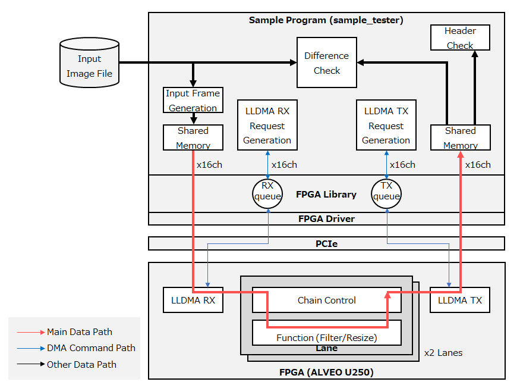
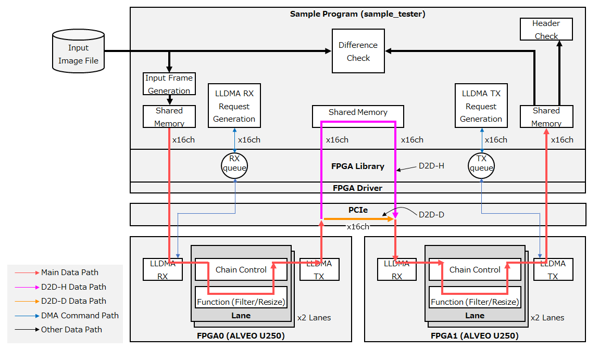
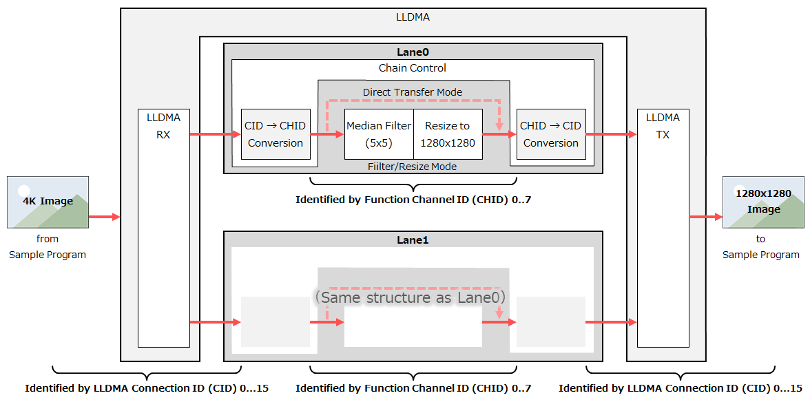

# 1. 検証環境構成

検証に使用する構成を示します。必要なハードウェアやソフトウェアのバージョンについてはREADMEの [システム要件](./README_ja.md#システム要件) をご覧ください。

## 1.1. FPGA 1枚構成

FPGAカード1枚の構成です。

本検証では、入力データとして動画ファイルを準備する必要があります。



## 1.2. FPGA 2枚構成 (D2D-H / D2D-D)

FPGAカード2枚の構成です。D2D-H では FPGA間の転送においてホスト側の共有メモリを経由します。D2D-D ではホストを経由せずに FPGA間の転送を行います。



----

# 2. インストール手順

## 2.1. Vivado/Vitis のインストール

Vivado ML エディション 2023.1 を [AMD のダウンロードサイト](https://japan.xilinx.com/support/download/index.html/content/xilinx/ja/downloadNav/vivado-design-tools/2023-1.html) からダウンロードし、インストールします。Vitis もこのインストーラに含まれます。

インストール手順は [UG973 : Vivado Design Suite User Guide: Release Notes, Installation, and Licensing](https://docs.amd.com/r/2023.1-English/ug973-vivado-release-notes-install-license/Release-Notes) を参照してください。

## 2.2. リポジトリの clone

以降、本チュートリアルの作業ディレクトリを `$workdir` とします。

```sh
$ cd $workdir
$ git clone https://github.com/openkasugai/hardware-design.git
$ git clone https://github.com/openkasugai/hardware-drivers.git
```

## 2.3. FPGAライブラリのインストール

DPDK、JSON、MCAPライブラリをインストールします。

```sh
$ cd $workdir/hardware-drivers/lib
$ sudo apt install build-essential python3-pip pkg-config libnuma-dev libpciaccess-dev
$ sudo pip3 install meson ninja pyelftools
$ make dpdk
$ make json
$ make mcap
```

`libpciaccess-dev` のインストールの際、環境によっては TUI にて `Newer kernel available` メッセージが表示されることがあります。その場合は `<Ok>` を選択後、次に表示される `Daemons using outdated libraries` の画面にて `<Cancel>` を選択してください。

`make mcap` を実行すると、次のように MCAP の実行ファイルに対してパスを通すよう指示が表示されます(`$workdir` は作業ディレクトリに読み替えてください)。

```
  * Please set path of mcap into PATH, or mv mcap to the path included in PATH( ... ).
  * Examples:
  *  $ PATH=$workdir/hardware-drivers/lib/MCAP:$PATH
  *    or
  *  $ mv $workdir/hardware-drivers/lib/MCAP/mcap /usr/local/bin
```

指示に従い PATH 環境変数を設定するか、`$workdir/hardware-drivers/lib/MCAP/mcap` をパスの通ったディレクトリに配置してください。

上記が完了した後、FPGAライブラリをインストールします。
`[libfpga]Build library(type:0 v.1.0.0-0) Succeed!!`が表示されれば成功です。

```
$ make
# (中略)
[libfpga]Build library(type:0 v.1.0.0-0) Succeed!!
```


## 2.4. OpenCV のインストール

OpenCV をダウンロードし、インストールします。
実行環境によっては、インストール実行時にsudoパスワードを求められることがあります。

```sh
$ cd $workdir/hardware-drivers/lib/OpenCV
$ sudo apt install cmake
$ ./install_opencv_ubuntu22.04.sh
```

OpenCV が正常にインストールされたことを確認します。
`libopencv`に関して36個の共有ライブラリが表示されるとインストール成功です。

```sh
$ ldconfig -p | grep libopencv
      libopencv_viz.so.3.4 (libc6,x86-64) => /usr/local/opencv-3.4.3/lib/libopencv_viz.so.3.4
      libopencv_viz.so (libc6,x86-64) => /usr/local/opencv-3.4.3/lib/libopencv_viz.so
      libopencv_videostab.so.3.4 (libc6,x86-64) => /usr/local/opencv-3.4.3/lib/libopencv_videostab.so.3.4
      libopencv_videostab.so (libc6,x86-64) => /usr/local/opencv-3.4.3/lib/libopencv_videostab.so
      # (以下略)
```

## 2.5. IPMItool のインストール

IPMItool をインストールします。

```sh
$ sudo apt install ipmitool
```

## 2.6. FPGAドライバのビルド

FPGAドライバをビルドしておきます。
エラーなくビルド完了し、`xpcie.ko`が生成されていれば成功です。

```sh
$ cd $workdir/hardware-drivers/driver
$ make
```

## 2.7. Vitis インストールパスの設定

Vitis HLS を `/tools/Xilinx/Vitis_HLS/2023.1` 以外の場所にインストールした場合は、`$workdir/hardware-drivers/tools/sample_tester/cppfunc/Makefile` を編集して `XILINX_VITIS_HLS` 変数にインストールパスを指定します。


`$workdir/hardware-drivers/tools/sample_tester/cppfunc/Makefile`の15行目にインストールパス設定を追加します。`$yourpath`はVitis HLSをインストールしたパスを示します。
```diff
+ XILINX_VITIS_HLS=$yourpath/Vitis_HLS/2023.1
```

## 2.8. Hugepage の設定

FPGA-ホスト間のDMA転送に必要な連続したメモリ領域を十分な大きさで確保するために、Hugepageを設定します。

`/etc/default/grub` を編集し、`GRUB_CMDLINE_LINUX_DEFAULT` に hugepagesz=1G で 16ページ分が起動時に確保されるように設定します。

```diff
- GRUB_CMDLINE_LINUX_DEFAULT=""
+ GRUB_CMDLINE_LINUX_DEFAULT="default_hugepagesz=1G hugepagesz=1G hugepages=16"
```

Grub設定を反映し、システムを再起動します。

```sh
$ sudo update-grub
$ sudo reboot
```

再起動後、設定が反映されていることを確認します。

```sh
$ cat /proc/meminfo
# (中略)
HugePages_Total:      16
HugePages_Free:       16
HugePages_Rsvd:        0
HugePages_Surp:        0
Hugepagesize:    1048576 kB
```

## 2.9. Bitstream の準備

- ビルド済Bitstreamを使用する場合は、`$workdir/hardware-design/example-design/bitstream/` の配下に含まれているため準備は不要です。
- 自身でビルドを実施する場合は [ビルド手順書](./BUILD_ja.md) を参照してください。

----

# 3. サンプルプログラムのビルド手順

## 3.1. サンプルプログラムの概要

サンプルプログラムは、デフォルトでは 4K (3840x2160px) の動画を入力し、FPGA で 5x5 のメディアンフィルタ処理と 1280x1280px へのリサイズ処理を実施した後、サンプルプログラムへ返す設定になっています。

ホストとFPGAのデータパスはコネクションID(CID)によって識別され、FPGA内のデータパスはファンクションチャネル(CHID)によって識別されます。LLDMAは16のコネクション(CID=0..15)を収容できます。FPGA内の機能は2つのレーンによって構成され、各レーンは8つのファンクションチャネル(CHID=0..7)を収容できます。CHIDは各レーン内でローカルな値です。各チャネルは画像処理を実施するフィルタリサイズモードと、画像処理をバイパスしてそのまま出力する直接転送モードを選択できます。



## 3.2. パラメータ設定 (param_tables.c)

`$workdir/hardware-drivers/tools/sample_tester/src/param_tables.c` を編集し、ファンクションチャネル毎の設定を行います。

### FPGAフレームサイズ設定 : g_param_framesizes_func

ファンクションの入出力サイズの設定を行います。

|項目|説明|値域|
|:--|:--|:--:|
|`INPUT HEIGHT`|各チャネルの入力画像の高さを設定|64～2160|
|`INPUT WIDTH`|各チャネルの入力画像の幅を設定|64～3840|
|`OUTPUT HEIGHT`|各チャネルの出力画像の高さを設定|64～2160|
|`OUTPUT WIDTH`|各チャネルの出力画像の幅を設定|64～3840|

レーン毎の設定となるため、LANE0 (チャネル0-7) と LANE1 (チャネル8-15) にそれぞれ同一の値を適用します。

FPGA 1枚構成の場合は Device 0 側の値が使用されます。FPGA 2毎構成の場合は 1枚目のカードには Device 0 側の値が使用され、2枚目のカードには Device 1 側の値が使用されます。

```c++
static const framesize_t g_param_framesizes_func[][CH_NUM_MAX] = {
    /* { INPUT HEIGHT, INPUT WIDTH, OUTPUT HEIGHT, OUTPUT WIDTH } */
    {
        /* Device 0 */
        { 2160, 3840, 1280, 1280 }, // CH0  --.
        { 2160, 3840, 1280, 1280 }, // CH1    |
        { 2160, 3840, 1280, 1280 }, // CH2    |
        { 2160, 3840, 1280, 1280 }, // CH3    | LANE0
        { 2160, 3840, 1280, 1280 }, // CH4    |
        { 2160, 3840, 1280, 1280 }, // CH5    |
        { 2160, 3840, 1280, 1280 }, // CH6    |
        { 2160, 3840, 1280, 1280 }, // CH7  --'
        { 2160, 3840, 1280, 1280 }, // CH8  --.
        { 2160, 3840, 1280, 1280 }, // CH9    |
        { 2160, 3840, 1280, 1280 }, // CH10   |
        { 2160, 3840, 1280, 1280 }, // CH11   | LANE1
        { 2160, 3840, 1280, 1280 }, // CH12   |
        { 2160, 3840, 1280, 1280 }, // CH13   |
        { 2160, 3840, 1280, 1280 }, // CH14   |
        { 2160, 3840, 1280, 1280 }, // CH15 --'
    },
    {
        /* Device 1 */
        { 1280, 1280, 1280, 1280 }, // CH0  --.
        { 1280, 1280, 1280, 1280 }, // CH1    |
        { 1280, 1280, 1280, 1280 }, // CH2    |
        { 1280, 1280, 1280, 1280 }, // CH3    | LANE0
        { 1280, 1280, 1280, 1280 }, // CH4    |
        { 1280, 1280, 1280, 1280 }, // CH5    |
        { 1280, 1280, 1280, 1280 }, // CH6    |
        { 1280, 1280, 1280, 1280 }, // CH7  --'
        { 1280, 1280, 1280, 1280 }, // CH8  --.
        { 1280, 1280, 1280, 1280 }, // CH9    |
        { 1280, 1280, 1280, 1280 }, // CH10   |
        { 1280, 1280, 1280, 1280 }, // CH11   | LANE1
        { 1280, 1280, 1280, 1280 }, // CH12   |
        { 1280, 1280, 1280, 1280 }, // CH13   |
        { 1280, 1280, 1280, 1280 }, // CH14   |
        { 1280, 1280, 1280, 1280 }, // CH15 --'
    }
};
```

### チェイン制御設定 : g_param_chain_ctrl_tbls

FPGAのチェイン制御部にチェイン制御設定を行います。

|項目|説明|値域|
|:--|:--|:--:|
|`FUNCTION CHID`|各チャネルのファンクション(フィルタリサイズ)側CHIDを設定|0~7|
|`EXTIF ID`|`FUNCTION CHID` と紐付ける外部IF ID を設定|0 (※)|
|`LLDMA CID`|`FUNCTION CHID` と紐付けるコネクションID(CID)を設定|0～15|

※ `EXTIF ID` は複数の外部IFを搭載している場合にその識別のために使用されます。本サンプルFPGAでは LLDMA のみのため、`EXTIF ID` は 0 固定となります。

デフォルト設定は以下の通りです。これらは本試験においては固定値のため変更の必要はありません。

```c++
static const chain_ctrl_cid_t g_param_chain_ctrl_tbls[CH_NUM_MAX] = {
    /* { FUNCTION CHID, LLDMA EXTIF ID, LLDMA CID} */
    /* Lane#0 */
    { 0, 0, 0 },  // CH0
    { 1, 0, 1 },  // CH1
    { 2, 0, 2 },  // CH2
    { 3, 0, 3 },  // CH3
    { 4, 0, 4 },  // CH4
    { 5, 0, 5 },  // CH5
    { 6, 0, 6 },  // CH6
    { 7, 0, 7 },  // CH7
    /* Lane#1 */
    { 0, 0, 8 },  // CH8
    { 1, 0, 9 },  // CH9
    { 2, 0, 10 }, // CH10
    { 3, 0, 11 }, // CH11
    { 4, 0, 12 }, // CH12
    { 5, 0, 13 }, // CH13
    { 6, 0, 14 }, // CH14
    { 7, 0, 15 }, // CH15
};
```

### チェイン制御フラグ設定 : g_param_chain_flags_tbls

|項目|説明|値域|
|:--|:--|:--:|
|`IG_DIRECT_FLAG`|直接転送を有効化するフラグ|0:無効、1:有効|
|`IG_ACTIVE_FLAG`|チェイン制御の Ingress 側の転送を有効化するフラグ|0:不許可、1:許可|
|`EG_ACTIVE_FLAG`|チェイン制御の Egress 側の転送を有効化するフラグ|0:不許可、1:許可|
|`EG_VIRTUAL_FLAG`|仮想コネクションフラグ(将来のために予約)|0固定|
|`EG_BLOCKING_FLAG`|ブロッキング転送許可フラグ(※)|0:不許可、1:許可|

※ `EG_BLOCKING_FLAG` は、FPGA 側の送信バッファフルにより書き込みに時間がかかっている場合に、当該チャネルの書き込みが完了するまで他のチャネルの書き込みをブロックすることを許可するフラグです。

- 使用するチャネルは `IG_ACTIVE_FLAG=1`、`EG_ACTIVE_FLAG=1` に設定します。
- フィルタリサイズファンクションを使用するチャネルは、`IG_DIRECT_FLAG=0`、`EG_BLOCKING_FLAG=1` に設定します。
- 直接転送を行うチャネルは、`IG_DIRECT_FLAG=1`、`EG_BLOCKING_FLAG=0` に設定します。

FPGA 1枚構成の場合は Device 0 側の値が使用されます。FPGA 2枚構成の場合は 1枚目のカードには Device 0 側の値が使用され、2枚目のカードには Device 1 側の値が使用されます。

デフォルト設定は以下の通りで、全てのチャネルを有効化し、1枚目のカードフィルタリサイズモードに設定され、2枚目のカードは直接転送モードに設定されています。

```c++
static const chain_flags_t g_param_chain_flags_tbls[][CH_NUM_MAX] = {
    /* IG_DIRECT_FLAG, IG_ACTIVE_FLAG, EG_ACTIVE_FLAG, EG_VIRTUAL_FLAG, EG_BLOCKING_FLAG */
    {
        /* Device 0 */
        { 0, 1, 1, 0, 1 }, // CH0  --.
        { 0, 1, 1, 0, 1 }, // CH1    |
        { 0, 1, 1, 0, 1 }, // CH2    |
        { 0, 1, 1, 0, 1 }, // CH3    | LANE0
        { 0, 1, 1, 0, 1 }, // CH4    |
        { 0, 1, 1, 0, 1 }, // CH5    |
        { 0, 1, 1, 0, 1 }, // CH6    |
        { 0, 1, 1, 0, 1 }, // CH7  --'
        { 0, 1, 1, 0, 1 }, // CH8  --.
        { 0, 1, 1, 0, 1 }, // CH9    |
        { 0, 1, 1, 0, 1 }, // CH10   |
        { 0, 1, 1, 0, 1 }, // CH11   | LANE1
        { 0, 1, 1, 0, 1 }, // CH12   |
        { 0, 1, 1, 0, 1 }, // CH13   |
        { 0, 1, 1, 0, 1 }, // CH14   |
        { 0, 1, 1, 0, 1 }, // CH15 --'
    },
    {
        /* Device 1 */
        { 1, 1, 1, 0, 0 }, // CH0  --.
        { 1, 1, 1, 0, 0 }, // CH1    |
        { 1, 1, 1, 0, 0 }, // CH2    |
        { 1, 1, 1, 0, 0 }, // CH3    | LANE0
        { 1, 1, 1, 0, 0 }, // CH4    |
        { 1, 1, 1, 0, 0 }, // CH5    |
        { 1, 1, 1, 0, 0 }, // CH6    |
        { 1, 1, 1, 0, 0 }, // CH7  --'
        { 1, 1, 1, 0, 0 }, // CH8  --.
        { 1, 1, 1, 0, 0 }, // CH9    |
        { 1, 1, 1, 0, 0 }, // CH10   |
        { 1, 1, 1, 0, 0 }, // CH11   | LANE1
        { 1, 1, 1, 0, 0 }, // CH12   |
        { 1, 1, 1, 0, 0 }, // CH13   |
        { 1, 1, 1, 0, 0 }, // CH14   |
        { 1, 1, 1, 0, 0 }, // CH15 --'
    }
};
```

### 入力動画ファイル設定 : g_param_moviefile

動画ファイルのパスをチャネル毎に指定します。

- 最大 4K (3840x2160) の動画ファイルを指定できます。エンコードは h264 を想定しています。転送のフレームレートは後述のコマンドラインオプションで上書きされるため、動画ファイルのフレームレートは無視されます。
- チャネル毎にそれぞれ別の動画ファイルを設定してください。複数チャネルが同一ファイルにアクセスするとOpenCVのデコードエラーが発生する場合があります。
- 絶対パスを指定してください。

デフォルト設定は以下の通りです。

```c++
static const char *g_param_moviefile[CH_NUM_MAX] = {
    "/home/data/4K_ch00.mp4", // CH0  --.
    "/home/data/4K_ch01.mp4", // CH1    |
    "/home/data/4K_ch02.mp4", // CH2    |
    "/home/data/4K_ch03.mp4", // CH3    | LANE0
    "/home/data/4K_ch04.mp4", // CH4    |
    "/home/data/4K_ch05.mp4", // CH5    |
    "/home/data/4K_ch06.mp4", // CH6    |
    "/home/data/4K_ch07.mp4", // CH7  --'
    "/home/data/4K_ch08.mp4", // CH8  --.
    "/home/data/4K_ch09.mp4", // CH9    |
    "/home/data/4K_ch10.mp4", // CH10   |
    "/home/data/4K_ch11.mp4", // CH11   | LANE1
    "/home/data/4K_ch12.mp4", // CH12   |
    "/home/data/4K_ch13.mp4", // CH13   |
    "/home/data/4K_ch14.mp4", // CH14   |
    "/home/data/4K_ch15.mp4", // CH15 --'
};
```

## 3.3. ビルド

`param_tables.c` 設定後はサンプルプログラムをビルドします。

```sh
$ cd $workdir/hardware-drivers/tools/sample_tester
$ make
```

----

# 4. 実行コマンド

実行コマンドのフォーマットを示す。

```sh
$ sample_tester -- -d <device> -- --tp <model> --chid <num> -f <num> -r <num> --deqtcore <num>
```

## 4.1. 必須パラメータ

- `-d <device>` : デバイスファイル指定。複数FPGAの場合はカンマ区切り
- `--tp <model>` : テストモデル。テストの構成を指定します。
    - `hh` : FPGA 1枚構成
    - `d2dh_hh` : D2D-H
    - `d2dd_hh` : D2D-D
- `--chid <num>` : 接続チャネルID指定。0～15。複数チャネルID指定はカンマ区切り。連続チャネルID指定はハイフンで指定可能。(例: --chid 0,3,5-7,9,10,12-15)
- `-f <num>` : 送信FPS指定
    - 任意の値。FPS指定時は1秒当たりのフレームエンキュー数となります。FPS指定しない場合はエンキューを空けないようにキューイングされます。
- `-r <num>` : 送信フレーム数指定
    - 送信するフレーム数。動画ファイルのフレーム数以下にする必要があります。
- `--deqtcore <num>` : チャネル毎キュー処理のCPUコア番号指定 1～(ホストのCPUコア数-1)。
    - マルチチャネルの場合、指定番号からチャネル数分のCPUコアが使用されます (例えば `--chid 0-3 --deqtcore 5` の場合、CPUコア5,6,7,8が使用されます)。該当の番号のCPUコアが存在しない場合疎通エラーとなります。

## 4.2. 追加パラメータ

- `--loglevel <num>` : applogのログレベル指定 1～7。default 5(ERRORレベル)

    |値|名称|説明|
    |:--:|:--|:--|
    |1|`LOG_TRACE`|サンプルプログラム内部のトレース情報を含む全てのログを表示します|
    |2|`LOG_DEBUG`|`LOG_INFO` に加え、サンプルプログラムのデバッグのための内部情報を表示します|
    |3|`LOG_INFO`|`LOG_WARN` に加え、サンプルプログラムの動作情報を表示します|
    |4|`LOG_WARN`|`LOG_ERROR` に加え、警告メッセージを表示します|
    |5|`LOG_ERROR`|エラーメッセージのみを表示します|
    |6|(n/a)|使用しません|
    |7|`LOG_FORCE`|全てのログ出力を抑制します|

- `-m` : 送信フレームが動画の先頭1フレーム目の繰り返し送信となります。
- `--ppms` : 送信イメージデータをPPMファイルに出力します。出力先はカレントディレクトリ配下の `send_data/` ディレクトリです。
- `--ppmr` : 受信イメージデータをPPMファイルに出力します。出力先はカレントディレクトリ配下の `receive_data/` ディレクトリです。
- `-p` : 性能測定。※性能測定有効時は測定期間中の `result.log` と `applog` の一部ログ出力が抑制されます。

----

# 5. テスト手順

## 5.1. Vivado環境変数設定

Vivado 2023.1 のコマンドを使用するための環境変数を設定します。既に実行済みの場合は不要です。

```sh
$ source /tools/Xilinx/Vivado/2023.1/settings64.sh
```

Vivadoを `/tools/Xilinx/Vivado/2023.1` 以外の場所にインストールした場合はパスを読み替えてください。

## 5.2. MCSファイルの書き込み

tools ディレクトリに移動し、書き込むmcsファイルをコピーします。

```sh
$ cd $workdir/hardware-drivers/tools/run_flash
$ cp /path/to/OpenKasugai-fpga-example-design-1.0.0-1.mcs .
```

`run_flash.sh` を使ってFPGAにMCSファイルを書き込みます。`-t` オプションでMCSファイルを指定し、`-i` オプションでデバイスのインデックスを指定します。

`Flash programming completed successfully` が表示されれば成功です。

```sh
$ ./run_flash.sh -t OpenKasugai-fpga-example-design-1.0.0-1.mcs -i 0
# (中略)
INFO: [Labtoolstcl 44-377] Flash programming completed successfully
program_hw_cfgmem: Time (s): cpu = 00:00:04 ; elapsed = 00:32:58 . Memory (MB): peak = 3755.586 ; gain = 252.000 ; free physical = 490216 ; free virtual = 493877
INFO: [Common 17-206] Exiting Vivado at Fri Oct 28 16:55:10 2022...
```

2枚目以降のFPGAに書き込むにはデバイスのインデックスを変更して再度 `run_flash.sh` を実行します。

```sh
$ ./run_flash.sh -t OpenKasugai-fpga-example-design-1.0.0-1.mcs -i 1
# (中略)
INFO: [Labtoolstcl 44-377] Flash programming completed successfully
program_hw_cfgmem: Time (s): cpu = 00:00:04 ; elapsed = 00:32:58 . Memory (MB): peak = 3755.586 ; gain = 252.000 ; free physical = 490216 ; free virtual = 493877
INFO: [Common 17-206] Exiting Vivado at Fri Oct 28 16:55:10 2022...
```

完了後、ホストをコールドリブートします。`sudo poweroff` でシステムをシャットダウン後、IPMITool または手動にて電源を投入してください。

```sh
$ sudo poweroff
```

## 5.3. Bitstreamの書き込み

`lspci` にてFPGAカードのBDFを確認します。FPGAカードの枚数分表示されます。`xx:xx.x`、`yy:yy.y` がBDFです。
Bitstreamの書き込みはシステム起動後および再起動時は毎回必要です。

```sh
$ lspci | grep Xilinx | grep Memory
xx:xx.x Memory controller: Xilinx Corporation Device 903f
yy:yy.y Memory controller: Xilinx Corporation Device 903f
```

`mcap`コマンドを使用してBitstreamを書き込みます。システム起動後および再起動時は毎回必要です。

```sh
$ cd $workdir/hardware-drivers/lib/MCAP
$ sudo ./mcap -x 903f -s xx:xx.x -p /path/to/OpenKasugai-fpga-example-design-1.0.0-2.bit
$ sudo ./mcap -x 903f -s yy:yy.y -p /path/to/OpenKasugai-fpga-example-design-1.0.0-2.bit
```

`FPGA Configuration Done!!`と表示されれば成功です。

## 5.4. FPGAドライバのインストール

FPGAドライバをインストールします。システム起動後および再起動時は毎回必要です。既にインストール済みの場合は一旦 `rmmod` を実行した後で `insmod` を実行します。

```sh
$ cd $workdir/hardware-drivers/driver
$ sudo rmmod xpcie
$ sudo insmod xpcie.ko
```

FPGAのデバイスファイル名を確認します。

```sh
$ ls /dev/xpcie*
/dev/xpcie_XXXXXXXXXXXX
/dev/xpcie_YYYYYYYYYYYY
...
```

## 5.5. ソフトリセットツールのビルド
ソフトリセットツールをビルドします。
`reg32r`、`reg32w`の実行ファイルが生成されれば成功です。

```sh
$ cd $workdir/hardware-drivers/tools/dbgreg
$ make
```

## 5.6. テストの実行 (FPGA 1枚構成)
使用する全てのFPGAに対してソフトリセットを実行します。

```sh
$ cd $workdir/hardware-drivers/tools/dbgreg
$ ./reg32w /dev/xpcie_XXXXXXXXXXXX 000c 1
$ ./reg32w /dev/xpcie_XXXXXXXXXXXX 000c 0
```

`--tp` オプションに `hh` を指定して `sample_tester`コマンドでテストを実行します。

```sh
$ cd $workdir/hardware-drivers/tools/sample_tester
$ ./build/sample_tester -- -d <device> -- --tp hh --chid <num> -f <num> -r <num> --deqtcore <num>
```

- 例) チャネル0、CPUコア5をスレッドで使用。

    ```sh
    $ sudo ./build/sample_tester -- -d /dev/xpcie_XXXXXXXXXXXX -- --tp hh --chid 0 -f 5 -r 50 --deqtcore 5
    ```

- 例) チャネルIDを複数指定。チャネル0, 2, 3, 4, 5, 8, 9, 10, 15 の場合。

    ```sh
    $ sudo ./build/sample_tester -- -d /dev/xpcie_XXXXXXXXXXXX -- --tp hh --chid 0,2-5,8-10,15 -f 5 -r 50 --deqtcore 5
    ```

- 例) ログレベルをデバッグログ出力にする場合、`--loglevel 2` を指定。

    ```sh
    $ sudo ./build/sample_tester -- -d /dev/xpcie_XXXXXXXXXXXX -- --tp hh --chid 0,8 -f 5 -r 50 --deqtcore 5 --loglevel 2
    ```

- 例) 動画の先頭1フレーム目の繰り返し送信にする場合、`-m` を指定。

    ```sh
    $ sudo ./build/sample_tester -- -d /dev/xpcie_XXXXXXXXXXXX -- --tp hh --chid 0,8 -f 5 -r 50 --deqtcore 5 -m
    ```

## 5.7. テストの実行 (FPGA 2枚構成)
ソフトリセットを実行します。

```sh
$ cd $workdir/hardware-drivers/tools/dbgreg
$ ./reg32w /dev/xpcie_XXXXXXXXXXXX 000c 1
$ ./reg32w /dev/xpcie_XXXXXXXXXXXX 000c 0
$ ./reg32w /dev/xpcie_YYYYYYYYYYYY 000c 1
$ ./reg32w /dev/xpcie_YYYYYYYYYYYY 000c 0
```


`--tp` オプションに `d2dh_hh` または `d2dd_hh` を指定して `sample_tester`コマンドでテストを実行します。`-d` オプションでは 2枚の FPGAカードのデバイスファイル名をカンマ区切りで指定します。

```sh
$ cd $workdir/hardware-drivers/tools/sample_tester
$ ./build/sample_tester -- -d <device0>,<device1> -- --tp <model> --chid <num> -f <num> -r <num> --deqtcore <num>
```

- 例) チャネル0、CPUコア5をスレッドで使用。

    ```sh
    $ sudo ./build/sample_tester -- -d /dev/xpcie_XXXXXXXXXXXX,/dev/xpcie_YYYYYYYYYYYY -- --tp d2dh_hh --chid 0 -f 5 -r 50 --deqtcore 5
    ```

- 例) チャネルIDを複数指定。チャネル0, 2, 3, 4, 5, 8, 9, 10, 15 の場合。

    ```sh
    $ sudo ./build/sample_tester -- -d /dev/xpcie_XXXXXXXXXXXX,/dev/xpcie_YYYYYYYYYYYY -- --tp d2dh_hh --chid 0,2-5,8-10,15 -f 5 -r 50 --deqtcore 5
    ```

- 例) ログレベルをデバッグログ出力にする場合、`--loglevel 2` を指定。

    ```sh
    $ sudo ./build/sample_tester -- -d /dev/xpcie_XXXXXXXXXXXX,/dev/xpcie_YYYYYYYYYYYY -- --tp d2dh_hh --chid 0,8 -f 5 -r 50 --deqtcore 5 --loglevel 2
    ```

- 例) 動画の先頭1フレーム目の繰り返し送信にする場合、`-m` を指定。

    ```sh
    $ sudo ./build/sample_tester -- -d /dev/xpcie_XXXXXXXXXXXX,/dev/xpcie_YYYYYYYYYYYY -- --tp d2dh_hh --chid 0,8 -f 5 -r 50 --deqtcore 5 -m
    ```

## 5.8. ログの確認

実行ログは `result.log` に出力されます。

ここでは `./build/sample_tester -- -d /dev/xpcie_XXXXXXXXXXXX -- --chid 0,8 -f 5 -r 50 --deqtcore 5` の実行ログの例を示します。

```
result log start...0111-152831:

Version: 0.10.02

Argument options...
  Test model: TP_HOST_HOST
  Num of channels in FPGA lane0: 1 [CH0]
  Num of channels in FPGA lane1: 1 [CH8]
  Num of channels in FPGA lane2: 0
  Num of channels in FPGA lane3: 0
  Num of frames: 50
  Tester FPS: 5
  Enqueue interval: none
  Num of enqueue per test run: none
  Dequeue thread's CPU core No.: 5,13
  enable tester execute: false
  enable tester measurement mode: false
  enable validation of received image: true
  enable ppm file output of send data: false
  enable ppm file output of receive data: false
  enable ppm file output of expected data: false
  enable performance measurement: false
  enable FPGA power measurement: false
  enable HOST power measurement: false
  enable L2 Switch power measurement: false

create tester config file: "tester_config.json"

FPGA device info
--------------------------------------------------
  Device file path    : /dev/xpcie_XXXXXXXXXXXX
  Device vendor       : Xilinx Corporation
  Device kind         : ALVEO U250 PQ
  Device index        : 0
  PCIe bus id         : 0000:1f:00.0
  Bitstream id parent : 0x0001221c
    FPGA type     : 0x0001
    FPGA version  : 0x22
    FPGA revision : 0x1c
  Bitstream id child  : 0x0001221c
    FPGA type     : 0x0001
    FPGA version  : 0x22
    FPGA revision : 0x1c
  ------------------------------------------------

//--- TEST START ---

--- function chain connect ---
dev(0) CH(0) func_kernel_id(0), fchid(0) ingress_extif_id(0) ingress_cid(0) egress_extif_id(0) egress_cid(0)
dev(0) CH(8) func_kernel_id(1), fchid(0) ingress_extif_id(0) ingress_cid(8) egress_extif_id(0) egress_cid(8)

_/_/_/_/_/ TEST No.1: from TASK(1) to TASK(50), enq_num 50 _/_/_/_/_/

--- generate send image data ---
CH(0) generating send image data...
CH(8) generating send image data...

--- generate expected image data ---
CH(0) generating expected image(filter/resize) data...
CH(8) generating expected image(filter/resize) data...

--- enqueue set dma cmd ---
CH(0) dma rx data size=24883248 Byte
CH(8) dma rx data size=786480 Byte

--- dequeue set dma cmd ---
CH(0) dma tx data size=4915248 Byte
CH(8) dma tx data size=786480 Byte

--- receive thread start ---

--- dma tx dequeue thread start ---
CH(0) DMA TX dma_info: dir(1) chid(0) queue_addr(0x7f7f7390b000) queue_size(255)
CH(8) DMA TX dma_info: dir(1) chid(8) queue_addr(0x7f7f73907000) queue_size(255)
CH(0) DMA TX dmacmd_info: deq(0) task_id(1) dst_len(4915264) dst_addr(0x17fb2a400)
CH(8) DMA TX dmacmd_info: deq(0) task_id(1) dst_len(786496) dst_addr(0x15c57d400)

--- dma tx enqueue thread start ---

--- dma rx dequeue thread start ---
CH(8) DMA RX dma_info: dir(0) chid(8) queue_addr(0x7f7f7390f000) queue_size(255)
CH(0) DMA RX dma_info: dir(0) chid(0) queue_addr(0x7f7f73913000) queue_size(255)
CH(8) DMA RX dmacmd_info: enq(0) task_id(1) src_len(786496) src_addr(0x15c4bd000)
CH(0) DMA RX dmacmd_info: enq(0) task_id(1) src_len(24883264) src_addr(0x17e36f000)

--- send frame ---

--- dma rx enqueue thread start ---

...waitting for all dequeue process to finish
CH(8) DMA RX dmacmd_info: enq(0) result_task_id(1) result_status(0) result_data_len(0)
CH(8) DMA RX dmacmd_info: enq(1) task_id(2) src_len(786496) src_addr(0x15c32d000)
CH(8) DMA TX dmacmd_info: deq(0) result_task_id(1) result_status(0) result_data_len(786480)
CH(8) DMA TX dmacmd_info: deq(1) task_id(2) dst_len(786496) dst_addr(0x15c3ed400)
CH(0) DMA RX dmacmd_info: enq(0) result_task_id(1) result_status(0) result_data_len(0)
CH(0) DMA RX dmacmd_info: enq(1) task_id(2) src_len(24883264) src_addr(0x17c6f4000)
CH(0) DMA TX dmacmd_info: deq(0) result_task_id(1) result_status(0) result_data_len(4915248)
CH(0) DMA TX dmacmd_info: deq(1) task_id(2) dst_len(4915264) dst_addr(0x17deaf400)
...省略
CH(8) DMA RX dmacmd_info: enq(49) result_task_id(50) result_status(0) result_data_len(0)
CH(8) DMA TX dmacmd_info: deq(49) result_task_id(50) result_status(0) result_data_len(786480)
CH(0) DMA RX dmacmd_info: enq(49) result_task_id(50) result_status(0) result_data_len(0)
CH(0) DMA TX dmacmd_info: deq(49) result_task_id(50) result_status(0) result_data_len(4915248)

//--- TEST END ---//
```

## 5.9. 基本測定機能

疎通終了時に、`result.log` に測定結果を表示します。

|ログ上の項目名|説明|
|:--|:--|
|CH(x) throughput [fps]|チャネルごとのスループット (フレームレート)|
|CH(x) throughput [bps]|チャネルごとのスループット (ビットレート)|
|CH(x) latency|チャネルごとの平均レイテンシ|
|CH(x) transfer data size [frame]|チャネルごとの送信/受信フレーム数|
|CH(x) transfer data size [Byte]|チャネルごとの送信/受信データ量|
|CH(x) header OK|チャネルごとの正常フレーム数|
|CH(x) header NG|チャネルごとの異常フレーム数|
|ALL CH TOTAL throughput [fps]|全チャネル合計 スループット (フレームレート)|
|ALL CH TOTAL throughput [bps]|全チャネル合計 スループット (ビットレート)|
|ALL CH TOTAL transfer data size [frame]|全チャネル合計 送信/受信フレーム数|
|ALL CH TOTAL transfer data size [Byte]|全チャネル合計 送信/受信データ量|
|ALL CH AVE throughput [fps]|全チャネル平均 スループット(フレームレート)|
|ALL CH AVE throughput [bps]|全チャネル平均 スループット(ビットレート)|

`-p`オプション指定時にはチャネルごとのレイテンシ変動の結果をログ出力します。

- 全フレームのレイテンシをフレームヘッダの妥当性チェック結果と併せてログに出力します。
- チャネル毎の全フレームのレイテンシ時間を用いて以下のレイテンシ変動を算出しログに出力します。
    - max, min. ave(全フレーム)

## 5.10. DMA測定機能

`-p`オプション指定時には `result.log` にDMA測定結果を表示します。

本サンプルプログラムにおいては画像 1フレームに対する処理を 1つの「タスク」として処理します。`Performance per task` の項に 1タスクあたりの測定結果が表示されます。

|ログ上の項目名|説明|
|:--|:--|
|`transfer data size per task`|1タスクあたりの転送データサイズ(RX, TX, RX+TX)|
|`RX latency per task`|1タスクあたりのRXレイテンシ|
|`RX throughput per task`|1タスクあたりのRXスループット|
|`TX latency per task`|1タスクあたりのTXレイテンシ|
|`TX throughput per task`|1タスクあたりのTXスループット|
|`RX(enqueue)->TX(dequeue) latency per task`|1タスクあたりのRX->TX間レイテンシ|
|`RX(enqueue)->TX(dequeue) throughput per task`|1タスクあたりのRX-TX間スループット|

`All task performance` の項にチャネル全体の測定結果が表示されます。最初のタスク開始から全タスク終了まで測定します。

|ログ上の項目名|説明|
|:--|:--|
|`number of task`|チャネルのタスク数|
|`transfer data size`|チャネルの全転送データサイズ(RX, TX, RX+TX)|
|`RX latency`|チャネルのタスク開始から全タスク終了までのRXレイテンシ|
|`RX throughput `|チャネルのタスク開始から全タスク終了までのRXスループット|
|`TX latency`|チャネルのタスク開始から全タスク終了までのTXレイテンシ|
|`TX throughput `|チャネルのタスク開始から全タスク終了までのTXスループット|
|`RX(task=1 enqueue)->TX(task=xx dequeue) latency`|チャネルの最初RX->最終TX間レイテンシ ※RXとTXの同時使用テストモデル時のみ表示|
|`RX(task=1 enqueue)->TX(task=xx dequeue) throughput`|チャネルの全体の最初RX->最終TX間スループット ※RXとTXの同時使用テストモデル時のみ表示|

`ALL CH TOTAL` の項に全体の測定結果が表示されます。

|ログ上の項目名|説明|
|:--|:--|
|`number of ch`|チャネル数|
|`number of all task`|全チャネルのタスク総数|
|`transfer data size`|全チャネルの転送データサイズ総数(RX, TX, RX+TX)|
|`RX latency`|全体のタスク開始から全タスク終了までのRXレイテンシ|
|`RX throughput `|全体のタスク開始から全タスク終了までのRXスループット|
|`TX latency`|全体のタスク開始から全タスク終了までのTXレイテンシ|
|`TX throughput `|全体のタスク開始から全タスク終了までのTXスループット|
|`RX(task=1 enqueue)->TX(task=xx dequeue) latency`|全体の最初RX->最終TX間レイテンシ ※RXとTXの同時使用テストモデル時のみ表示|
|`RX(task=1 enqueue)->TX(task=xx dequeue) throughput`|全体の最初RX->最終TX間スループット ※RXとTXの同時使用テストモデル時のみ表示|

----

# 6. トラブルシューティング

## 6.1. サンプルプログラムのビルド

### Vitis HLS のヘッダファイルが見つからない

- 判断方法: サンプルプログラムのビルド時、Vitis HLS のヘッダファイルのインクルードに関するエラーが出る。

    ```
    ./Vitis_Libraries/vision/L1/include/common/xf_structs.hpp:27:10: fatal error: ap_axi_sdata.h: No such file or directory
    27 | #include "ap_axi_sdata.h"
        |          ^~
    ```

- 発生要因: Makefile で Vitis HLS のインストールパスが設定されていない。
- 解決方法: `$workdir/hardware-drivers/tools/sample_tester/cppfunc/Makefile` の `XILINX_VITIS_HLS` 変数に Vitis HLS のインストールパスを設定します。

----
