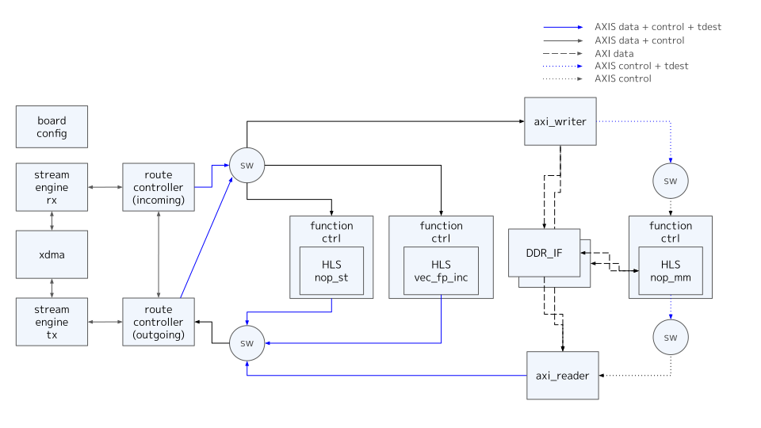
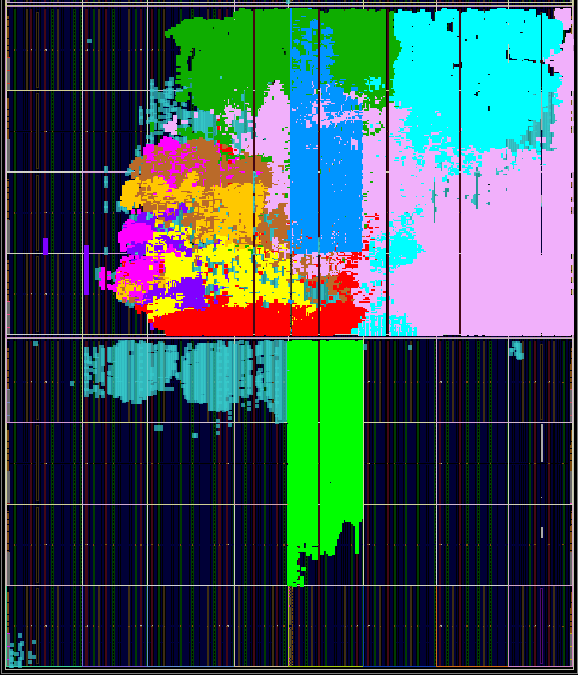
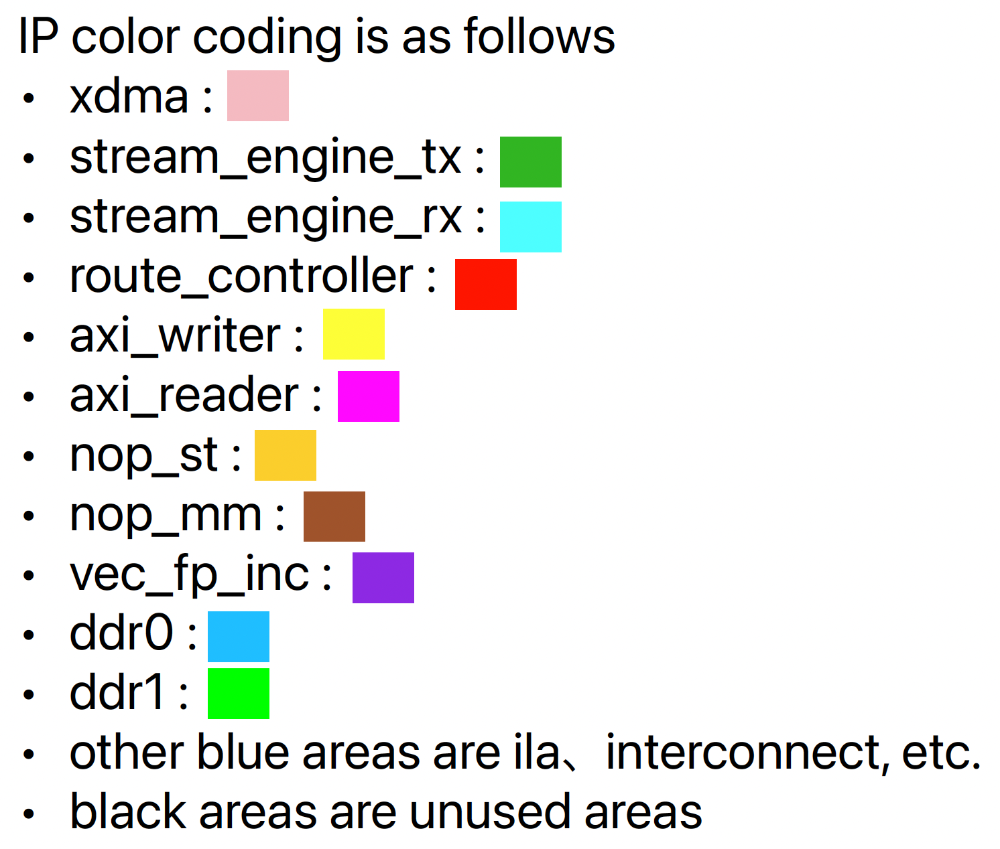

# Overview

- The board design with HLS functions of nop_st, nop_mm, vec_fp_inc
- DDR uses 2 channels of SLR0 and SLR1

## Overall structure of board design

# Implementation

## clock regions

- DDR I/F is 300MHz, and the other is 250MHz, which is the user clk of xdma.
- AXI interconnect to DDR I/F is implemented as follows
  - DDR0 clk is used as base clock and X-bar part is driven at 300MHz.
  - Packet mode FIFO is set so that DDR is accessed only after write data is collected.

## tdest routing

- The tdest controlled by route_controller has the following settings
  - function inputs
    - 0 : nop_st
    - 1 : vec_fp_inc
    - 8 : nop_mm
  - route_controller
    - 0 : pcie side
- As for the usage of tdests, for each master interface, consecutive tdest assignments are required, and in this board, 8 or more is assumed to be tdest to axi_writer.

## Synthesis Result

 

