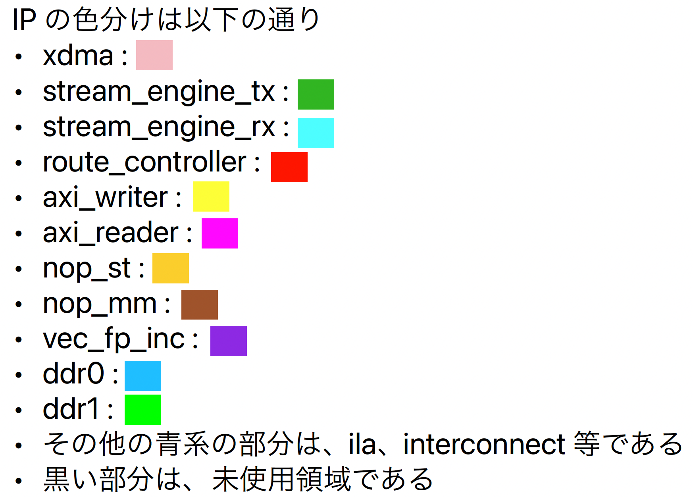

# Overview

- nop_st, nop_mm, vec_fp_inc の HLS function を備えた board design である
- DDR は SLR0, SLR1 の 2ch を使用

## board design 全体構成

# Implementation

## clock regions

- DDR I/F が 300MHz であり、そのほかは、xdma の user clk である 250MHz としている
- DDR I/F への AXI interconnect は以下の実装としている
  - DDR0 の clk をベースクロックとし、X-bar 部分を 300MHz 駆動としている
  - write data がまとまってから DDR へアクセスするように packet mode FIFO の設定としている

## tdest routing

- route_controller によって制御する tdest は以下の設定としている
  - function inputs
    - 0 : nop_st
    - 1 : vec_fp_inc
    - 8 : nop_mm
  - route_controller
    - 0 : pcie side
- tdest の使い分けとして、各 master interface に対して、連続した tdest の割り当てが必要であり、本 board では 8以上を axi_writer への tdest とした

## Synthesis Result

 

