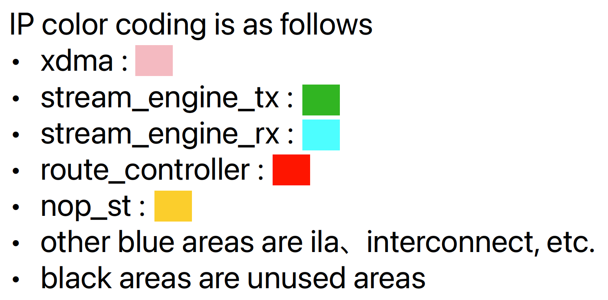

# Overview

- The board design for operation check of D2D transfer with only nop_st HLS function.

## Overall structure of board design

# Implementation

## clock regions

- All running at 250MHz, which is the user clk for xdma

## tdest routing

- The tdest controlled by route_controller has the following settings
  - function inputs
    - 0 : nop_st
  - route_controller
    - 0 : pcie side
- The implementation discards the non-zero tdest by axis sink

## Synthesis Result

 

