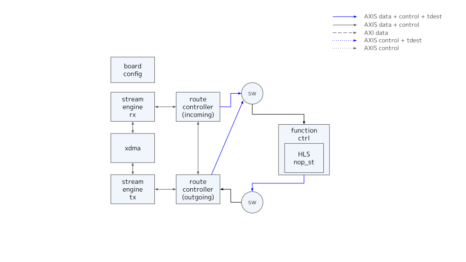
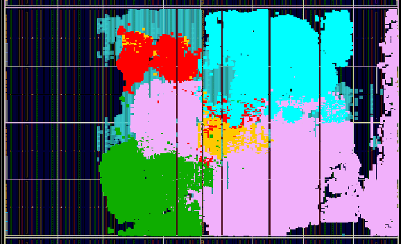
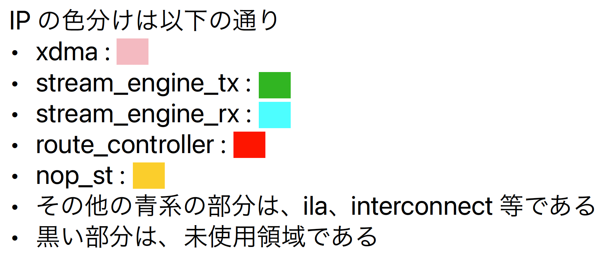

# Overview

- nop_st HLS function のみを備えた D2D 転送の動作確認用の board design である

## board design 全体構成

# Implementation

## clock regions

- 全て xdma の user clk である 250MHz で動作するものである

## tdest routing

- route_controller によって制御する tdest は以下の設定としている
  - function inputs
    - 0 : nop_st
  - route_controller
    - 0 : pcie side
- tdest が 0 以外のものを axis sink によって捨てる実装となっている

## Synthesis Result

 

