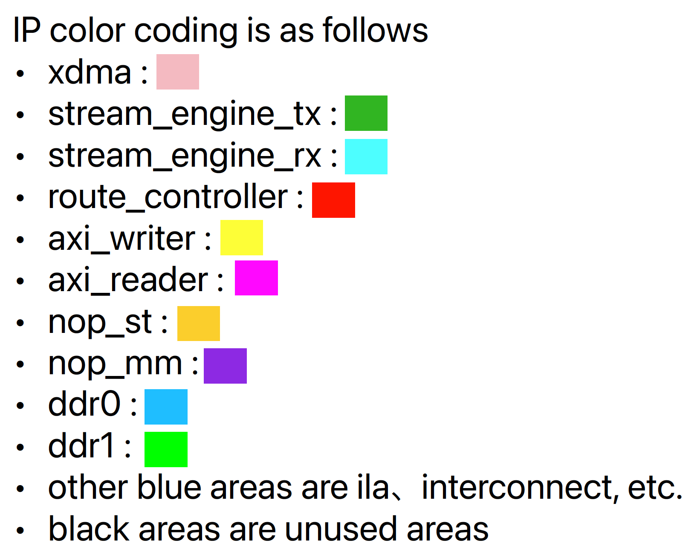

# Overview

- The board design for operation check of AXI function with HLS function of nop_st and nop_mm.
- DDR uses 2 channels of SLR0 and SLR1

## Overall structure of board design

# Implementation

## clock regions

- DDR I/F is 300MHz, and the other is 250MHz, which is the user clk of xdma.
- AXI interconnect to DDR I/F is implemented as follows because it is designed for operation check.
  - The xdma user clk is used as the base clock, and the X-bar portion is driven at 250 MHz.
  - Uses a FIFO with a depth of 32

## tdest routing

- rThe tdest controlled by route_controller has the following settings
  - function inputs
    - 0 : nop_st
    - 8 : nop_mm
  - route_controller
    - 0 : pcie side
- As for the usage of tdests, for each master interface, consecutive tdest assignments are required, and in this board, 8 or more is assumed to be tdest to axi_writer.

## Synthesis Result

 

