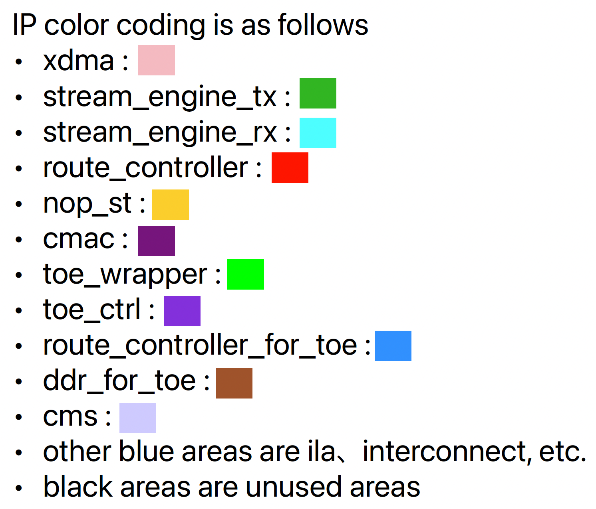

# Overview

- The board design that includes toe_wrapper, supports tcp, and has only nop_st HLS function

## Overall structure of board design

# Implementation

## clock regions

- The HLS function runs at 250MHz, which is the user clk of xdma.
- toe_wrapper, toe_ctrl, and route_controller_for_toe run at 300MHz and perform clock conversion between functions.
## tdest routing

- The tdest controlled by route_controller has the following settings
  - function inputs
    - 0 : nop_st
  - route_controller
    - 0 : pcie side
    - 1 : qsfp side
- The implementation discards the other than the above tdest by axis sink

## Synthesis Result

 

