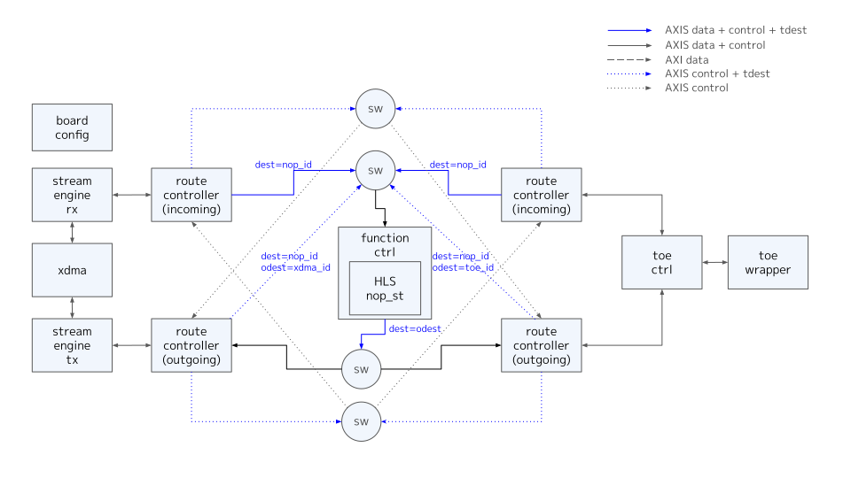
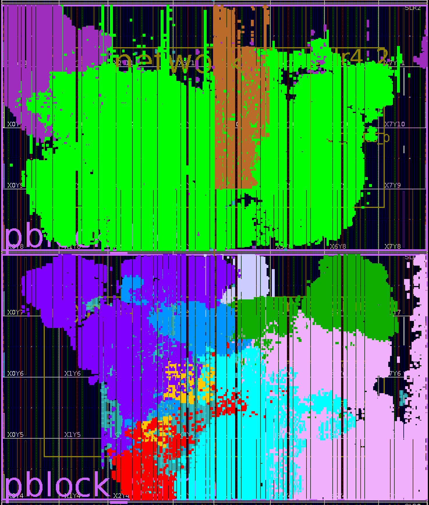
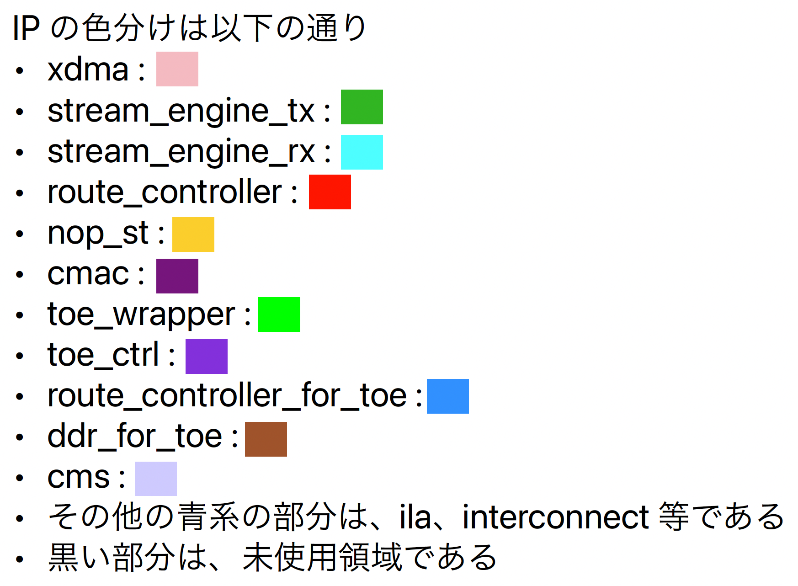

# Overview

- toe_wrapper を含み、tcp に対応した board design であり、nop_st HLS function のみを備えている

## board design 全体構成

# Implementation

## clock regions

- HLS function は xdma の user clk である 250MHz で動作するものである
- toe_wrapper, toe_ctrl, route_controller_for_toe は 300MHz で動作し、function との間で clock 変換を行っている
## tdest routing

- route_controller によって制御する tdest は以下の設定としている
  - function inputs
    - 0 : nop_st
  - route_controller
    - 0 : pcie side
    - 1 : qsfp side
- tdest が上記以外のものを axis sink によって捨てる実装となっている

## Synthesis Result

 

