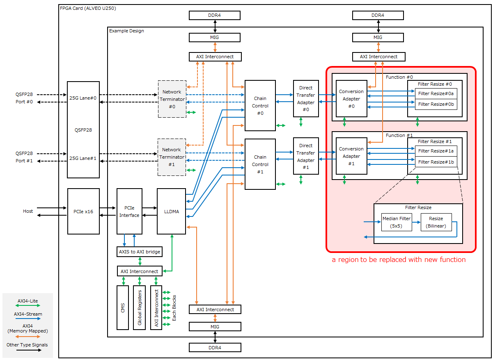
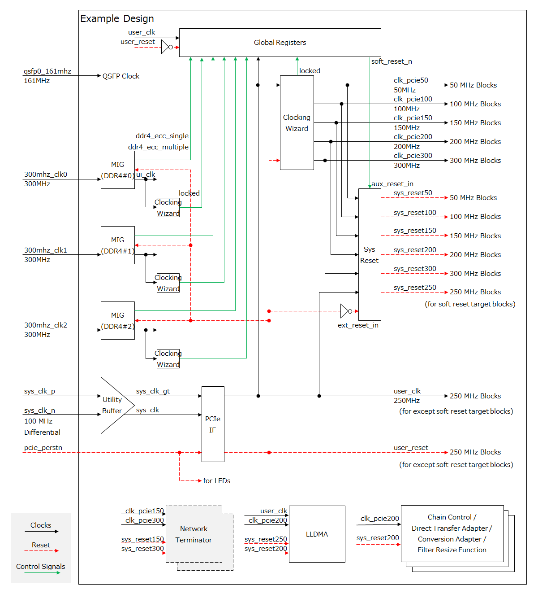
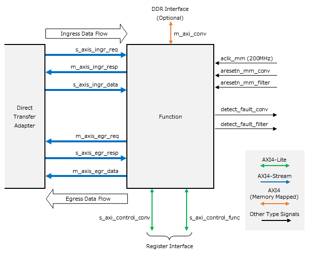
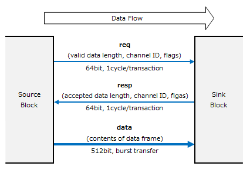
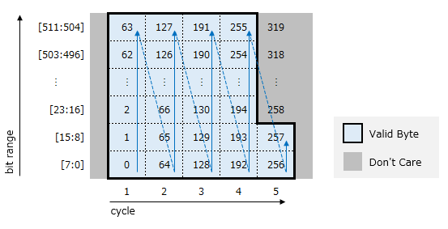
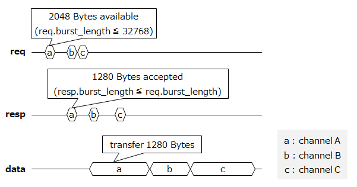
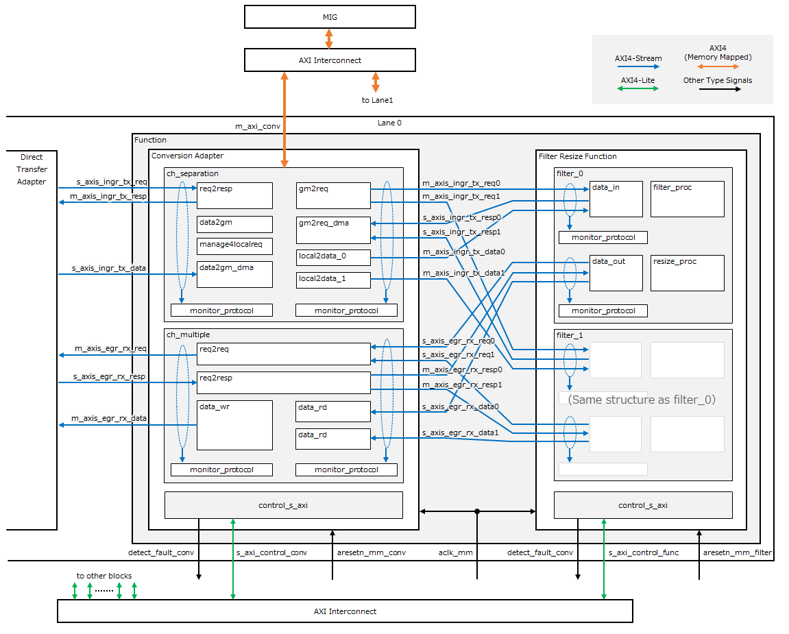

Function Block Development Guidelines
##################################

..  toctree::
    :hidden:
    :maxdepth: 2

For the Japanese site, please refer to `here <./index_ja.rst>`_. 

Purpose and positioning of this document
==================================

Purpose
----------------------------------

This document provides a basic specification of a implementation sample and instructions for building a function block for the developer of the function block.

Function block development flow
----------------------------------

1. Designs and implements function blocks based on the `Function Block Interface <#function-block-interface-specification>`_ specification described below.
2. Change the build script, etc. and replace the existing function block in the implementation sample with the new function block.
3. Perform an FPGA Bitstream building.

FPGA Card Specifications
----------------------------------

The specifications of the FPGA card used when the implementation sample was designed are shown below. See `Device Vendor Sites <https://www.amd.com/ja/products/accelerators/alveo/u250/a-u250-a64g-pq-g.html>`_ for more information.

+------------------------+---------------------------------------------------------------+
| Item                   | Description                                                   |
+========================+===============================================================+
| FPGA used              | Xilinx Ultrascale+ XCU250-FIGD2104-2L-e                       |
+------------------------+---------------------------------------------------------------+
| Installed Board        | Alveo U250 (PCI card)                                         |
+------------------------+---------------------------------------------------------------+
| Operating frequency    | 50MHz / 100MHz / 150MHz / 200MHz / 250MHz / 300MHz            |
+------------------------+---------------------------------------------------------------+
| External interface     | PCIe Gen3 x16 / QSFP28 / DDR4 / UART / GPIO                   |
+------------------------+---------------------------------------------------------------+
| Input clock            | 100MHz / 161MHz / 300MHz                                      |
+------------------------+---------------------------------------------------------------+
| Configuration          | Flash ROM Write, USB Write, PCI Write (Tandem PCIe)           |
+------------------------+---------------------------------------------------------------+

Configuring the Implementation Sample
==================================

Shows the block configuration for a implementation sample. The red hatched area is the area to be replaced with a new function block.

Chain Control
--------------------------------------------------------------------

This provides a function chain data transfer function. It performs association (ID conversion) and data transfer between logical connection (connection) of external IF and logical connection (function channel) in FPGA.

LLDMA (Low-Latency direct Device Memory Access)
--------------------------------------------------------------------

In addition to the transfer between the host and the FPGA card, it provides the ability to transfer data directly between the FPGA cards without going through the CPU processing of the host (D2D).

Network Terminator
--------------------------------------------------------------------

Provides external interface functions via Ethernet.

The network termination function is not included in the implementation sample. For information about this function, refer to `"About the network termination function" in the README <../../README.md#about-the-network-termination-function>`_.

Direct Transfer Adapter
--------------------------------------------------------------------

Bypasses the function block and allows direct transfer from ingress to egress of chain control.

Function (Conversion Adapter/Filter Resize)
--------------------------------------------------------------------

The implementation sample provides image processing functionality. It consists of a conversion adapter block and a filter Resize block.

- Conversion adapter block, which buffers data frames and distributes image processing tasks.
- Filter Resize Block: Enables parallel execution of distributed image processing tasks (5x5 median filter and resizing).

Other Blocks
--------------------------------------------------------------------

..  list-table::
    :header-rows: 1

    * - Block name
      - Description
    * - PCIe Interface
      - Hard IP for terminating PCI Express x16 bus.
    * - MIG
      - Memory Interface Generator. Provides an interface to access DDR SDRAM on ALVEO cards.
    * - AXIS to AXI bridge
      - Translates register access from PCI Express from AXI4-Stream to the AXI4-Lite protocol used internally by the FPGA.
    * - CMS
      - Card Management System. Obtain power and temperature information for the ALVEO card.
    * - Global Registers
      - Provides a set of registers for controlling and monitoring the entire implementation sample.

Clock/Reset type
----------------------------------

The Clock/Reset for the implementation sample is shown below.

.. _func_intf_spec:

Function Block Interface Specification
==================================

Following are the interface specifications that a function block must meet:

+---------------------+----------------+-----+-----------------------------+--------------------------------------------------------------------+-----------+
|Signal Name/Bus Name | I/O Type [#]_  |Width|Connection-Destination Block | Function Description                                               | Necessity |
+=====================+================+=====+=============================+====================================================================+===========+
| aclk_mm             | input          | 1   | Clocking Wizard             | 200 MHz clock                                                      | Required  |
+---------------------+----------------+-----+-----------------------------+--------------------------------------------------------------------+-----------+
| aresetn_mm_filter   | input          | 1   | Processor System Reset      | Subblock 0 Reset (aclk_mm synchronous, negative logic)             | Required  |
+---------------------+----------------+-----+-----------------------------+--------------------------------------------------------------------+-----------+
| aresetn_mm_conv     | input          | 1   | Processor System Reset      | Subblock 1 Reset (aclk_mm synchronous, negative logic)             |           |
+---------------------+----------------+-----+-----------------------------+--------------------------------------------------------------------+-----------+
| s_axis_ingr_req     | AXIS Slave     | 64  | Direct Transfer Adapter     | Ingress Transfer Request                                           | Required  |
+---------------------+----------------+-----+-----------------------------+--------------------------------------------------------------------+-----------+
| m_axis_ingr_resp    | AXIS Master    | 64  | Direct Transfer Adapter     | Ingress Transfer Response                                          | Required  |
+---------------------+----------------+-----+-----------------------------+--------------------------------------------------------------------+-----------+
| s_axis_ingr_data    | AXIS Slave     | 512 | Direct Transfer Adapter     | Ingress Transfer Data Stream                                       | Required  |
+---------------------+----------------+-----+-----------------------------+--------------------------------------------------------------------+-----------+
| m_axis_egr_req      | AXIS Master    | 64  | Direct Transfer Adapter     | Egress Transfer Request                                            | Required  |
+---------------------+----------------+-----+-----------------------------+--------------------------------------------------------------------+-----------+
| s_axis_egr_resp     | AXIS Slave     | 64  | Direct Transfer Adapter     | Egress Forward Response                                            | Required  |
+---------------------+----------------+-----+-----------------------------+--------------------------------------------------------------------+-----------+
| m_axis_egr_data     | AXIS Master    | 512 | Direct Transfer Adapter     | Egress transport data stream                                       | Required  |
+---------------------+----------------+-----+-----------------------------+--------------------------------------------------------------------+-----------+
| m_axi_conv          | AXI4 Master    | 512 | AXI Interconnect            | DDR Access Bus                                                     |           |
+---------------------+----------------+-----+-----------------------------+--------------------------------------------------------------------+-----------+
| s_axi_control_func  | AXIL Slave     | 32  | AXI Interconnect            | Subblock 0 Register Access Bus                                     | Required  |
+---------------------+----------------+-----+-----------------------------+--------------------------------------------------------------------+-----------+
| s_axi_control_conv  | AXIL Slave     | 32  | AXI Interconnect            | Subblock 1 Register Access Bus                                     |           |
+---------------------+----------------+-----+-----------------------------+--------------------------------------------------------------------+-----------+
| detect_fault_filter | output         | 1   | global register             | Subblock 0 Failure Detection Notification (positive logic, level)  | Required  |
+---------------------+----------------+-----+-----------------------------+--------------------------------------------------------------------+-----------+
| detect_fault_conv   | output         | 1   | global register             | Subblock 1 Failure Detection Notification (positive logic, level)  |           |
+---------------------+----------------+-----+-----------------------------+--------------------------------------------------------------------+-----------+

.. [#] :code:`AXIS` : AXI4-Stream / :code:`AXIL` : AXI4-Lite

Clock input (aclk_mm)
----------------------------------

The sample implementation assumes a 200 MHz clock ( :code:`clk_pcie200`) generated by the Clocking Wizard IP is connected and all other interfaces (Reset, AXI Bus, Failure Detection Notification) are synchronized to it.

Reset input (aresetn_mm_filter/conv)
--------------------------------------------------------------------

In the implementation sample, two reset inputs are provided for resetting the function block. This is because the implementation sample includes two subblocks within the function block so that they can be reset independently.

If a function block consists of only one block, the reset for the second block ( :code:`aresetn_mm_conv`) can be disconnected.

Ingress transport interface (axis_ingr_req/resp/data)
--------------------------------------------------------------------

Interface for data frame transfer on the ingress side. Consists of three AXI4-Stream interfaces (req/resp/data). The protocol is will explain later.

Egress forwarding interface (axis_egr_req/resp/data)
--------------------------------------------------------------------

Interface for data frame transfer on egress side. Consists of three AXI4-Stream interfaces (req/resp/data). The protocol is will explain later.

DDR Access Interface (m_axi_conv)
--------------------------------------------------------------------

AXI4 (Memory Mapped) interface for accessing DDR4 SDRAM on an ALVEO card. The implementation sample uses it for frame buffering on the ingress side. If buffering to DDR is not required by the function block function, it can be disconnected.

Register access interface (s_axi_control_func/conv)
--------------------------------------------------------------------

This is a register access interface for controlling function blocks. The implementation sample contains two subblocks within a function block, so an interface is provided for each.

If the function block contains only one block, the interface for the second block ( :code:`s_axi_control_conv`) can be disconnected.

Failure Detection Notification (detect_fault_filter/conv)
--------------------------------------------------------------------

This interface is used to notify the global register of a failure detected in a function block. The implementation sample contains two subblocks within a block, so an interface is provided for each.

Read Clear : This is a positive logic level signal that outputs the result of OR-combining all bits of the implemented failure detection register.

If the function block contains only one block, the interface for the second block ( :code:`detect_fault_conv`) can be zero fixed.

Protocol for transferring data between blocks
==================================

Indicates the interface between blocks used to transfer data frames. This interface consists of three AXI4-Streams. The sender block is the Source Block, and the receiver block is the Sink Block. For an ingress forwarding interface, the direct-forward adapter block is the Source Block and the function block is the Sink Block; for an egress forwarding interface, the function block is the Source Block and the direct-forward adapter block is the Sink Block.

Relationship between DataFrames and Transactions
----------------------------------

A dataframe is the entire data input and output by a single computing task. For example, in an image processing task, a data frame is expected to be an entire image frame.

When transferring data between blocks, transferring large data frames in bulk can occupy the bus for a long time and cause deadlocks between function channels. Therefore, this protocol divides data frames into transactions of up to 32 kByte and transfers them.

The transaction that includes the beginning of the data frame is given the Start of Frame (SOF) flag and information about the total length of the data frame. Transactions that include the end of a data frame are given the End of Frame (EOF) flag.

You cannot mix data frames in a single transaction.

req / resp
----------------------------------

This is a 64 bit wide control bus for determining the data length of the transaction to be transferred between Source and Sink. Transfers the following structure in one cycle per transaction:

+--------------+--------------+----------------------------------------------------------------------------------------------+------------------+
| Field Name   | Bit Range    | Description                                                                                  | Range            |
+==============+==============+==============================================================================================+==================+
| frame_length | [31:0]       | Data Frame Length (In bytes, valid only for SOF)                                             | 1～4,294,967,295 |
+--------------+--------------+----------------------------------------------------------------------------------------------+------------------+
| channel      | [40:32]      | Function Channel ID                                                                          | 0～511 [#]_      |
+--------------+--------------+----------------------------------------------------------------------------------------------+------------------+
| sof          | [41]         | SOF Flag (When 1, the beginning of the transaction data is the beginning of the data frame.) |                  |
+--------------+--------------+----------------------------------------------------------------------------------------------+------------------+
| eof          | [42]         | EOF flag (When 1, the end of the transaction data is the end of the data frame.)             |                  |
+--------------+--------------+----------------------------------------------------------------------------------------------+------------------+
| direct       | [43]         | Direct transfer indication bit. Not used in function blocks.                                 |                  |
+--------------+--------------+----------------------------------------------------------------------------------------------+------------------+
| (reserved)   | [47:44]      | Reserved                                                                                     |                  |
+--------------+--------------+----------------------------------------------------------------------------------------------+------------------+
| burst_length | [63:48]      | Transaction data length (bytes, up to 32768 Bytes)                                           | 0～32,768 [#]_   |
+--------------+--------------+----------------------------------------------------------------------------------------------+------------------+

.. [#] The maximum range allowed on the protocol. The actual possible values depend on the function block.
.. [#] 1 ≦ req.burst_length ≦ 32768, 0 ≦ resp.burst_length ≦ req.burst_length

The burst_length in req indicates the length of transaction data that the Source Block can transfer. The burst_length in resp indicates the length of transaction data that can be received by the Sink Block. The burst_length of resp must not exceed the burst_length of req. If the sink block cannot receive a single byte of transaction data (for example, because the buffer is full), you can set the burst_length of resp to 0.

data
----------------------------------

This is a 512 bit wide bus for transferring data between blocks based on the transaction data length determined by req/resp communication.

The transaction data length matches the burst_length value of resp. If the burst_length of resp is 0, no data is transferred between blocks.

The transaction data begins at the LSB of the 512 bit bus. If the transaction data length is not a multiple of 64 bytes, invalid data is appended to the end of the remaining space in the last cycle of the transaction data.

The byte order for transferring 258 bytes of 0~257 in 5 cycles is shown below.

Timing
----------------------------------

The signal timing of req/resp/data is shown below. When multiple functional channel transactions are superimposed on the same interblock data transfer interface, the channel order of req/resp/data must be in-order.

Filter Resize Function Block Specification
==================================

The following shows the block configuration of the Filter Resize function block implemented in the implementation sample.

Conversion Adapter
----------------------------------

This sub-block buffers the image data corresponding to the data frame of the implementation sample and distributes the image data to two Filter Resize circuits.

..  list-table::
    :header-rows: 1

    *   - Block Name
        - Description
    *   - ch_seperation
        - Receives data frames from the Direct Transfer Adapter and buffers them in the DDR. Images are transferred to Filter Resize in order after buffering is completed.
    *   - ch_multiple
        - Coordinates the input of image processing results from two Filter Resizes and transfers the received image processing results to the Direct Transfer Adapter.
    *   - control_s_axi
        - Provides a set of control registers.

Filter Resize
----------------------------------

This sub-block performs filtering and resizing on the image data.

..  list-table::
    :header-rows: 1

    *   - Block Name
        - Description
    *   - data_in
        - Receives a dataframe from the conversion adapter and inputs it to a later filter_proc.
    *   - filter_proc
        - Receives image data from data_in and transfers it to resize_proc with 5x5 median filtering.
    *   - resize_proc
        - Receives image data from filter_proc and applies resizing. Applies Bilinear as the interpolation algorithm. Transfer resizing results to data_out.
    *   - data_out
        - Receives image data from resize_proc and outputs it to the Conversion Adapter.

Function block register map
-----------------------------------------

Conversion Adapter
************************************

======  ================================  ==========  =================
Offset  Name                              Type [#]_   Initial Value
======  ================================  ==========  =================
0x0000  control                           R/W         0x00000000
0x0010  module_id                         R           0x0000F1C2
0x0020  local_version                     R           (Version Number)
0x0030  m_axi_ingr_frame_buffer_l         R/W         0x00000000
0x0034  m_axi_ingr_frame_buffer_h         R/W         0x00000000
0x0040  rows_in                           R/W         0x00000000
0x0044  cols_in                           R/W         0x00000000
0x0050  stat_sel_channel                  R/W         0x00000000
0x0060  stat_ingr_rcv_data_value_l        RC          0x00000000
0x0064  stat_ingr_rcv_data_value_h        RC          0x00000000
0x0070  stat_ingr_snd_data_0_value_l      RC          0x00000000
0x0074  stat_ingr_snd_data_0_value_h      RC          0x00000000
0x0078  stat_ingr_snd_data_1_value_l      RC          0x00000000
0x007C  stat_ingr_snd_data_1_value_h      RC          0x00000000
0x0080  stat_egr_rcv_data_0_value_l       RC          0x00000000
0x0084  stat_egr_rcv_data_0_value_h       RC          0x00000000
0x0088  stat_egr_rcv_data_1_value_l       RC          0x00000000
0x008C  stat_egr_rcv_data_1_value_h       RC          0x00000000
0x0090  stat_egr_snd_data_value_l         RC          0x00000000
0x0094  stat_egr_snd_data_value_h         RC          0x00000000
0x0098  stat_ingr_rcv_frame_value         RC          0x00000000
0x00A0  stat_ingr_snd_frame_0_value       RC          0x00000000
0x00A4  stat_ingr_snd_frame_1_value       RC          0x00000000
0x00A8  stat_egr_rcv_frame_0_value        RC          0x00000000
0x00AC  stat_egr_rcv_frame_1_value        RC          0x00000000
0x00B0  stat_egr_snd_frame_value          RC          0x00000000
0x00C0  stat_ingr_frame_buffer_overflow   R/WC        0x00000000
0x00C4  stat_ingr_frame_buffer_usage      R           0x00000000
0x0100  detect_fault                      R           0x00000000
0x0110  ingr_rcv_protocol_fault           R/WC        0x00000000
0x0118  ingr_rcv_protocol_fault_mask      R/W         0x00000000
0x011C  ingr_rcv_protocol_fault_force     R/W         0x00000000
0x0120  ingr_snd_protocol_fault_0         R/WC        0x00000000
0x0128  ingr_snd_protocol_fault_0_mask    R/W         0x00000000
0x012C  ingr_snd_protocol_fault_0_force   R/W         0x00000000
0x0130  ingr_snd_protocol_fault_1         R/WC        0x00000000
0x0138  ingr_snd_protocol_fault_1_mask    R/W         0x00000000
0x013C  ingr_snd_protocol_fault_1_force   R/W         0x00000000
0x0140  egr_rcv_protocol_fault_0          R/WC        0x00000000
0x0148  egr_rcv_protocol_fault_0_mask     R/W         0x00000000
0x014C  egr_rcv_protocol_fault_0_force    R/W         0x00000000
0x0150  egr_rcv_protocol_fault_1          R/WC        0x00000000
0x0158  egr_rcv_protocol_fault_1_mask     R/W         0x00000000
0x015C  egr_rcv_protocol_fault_1_force    R/W         0x00000000
0x0160  egr_snd_protocol_fault            R/WC        0x00000000
0x0168  egr_snd_protocol_fault_mask       R/W         0x00000000
0x016C  egr_snd_protocol_fault_force      R/W         0x00000000
0x0170  mem_parity_fault                  R/WC        0x00000000
0x0178  mem_parity_fault_mask             R/W         0x00000000
0x017C  mem_parity_fault_force            R/W         0x00000000
0x0180  ingr_rcv_length_fault             R/WC        0x00000000
0x0188  ingr_rcv_length_fault_mask        R/W         0x00000000
0x018C  ingr_rcv_length_fault_force       R/W         0x00000000
0x0190  streamif_stall                    R           0x00000000
0x0198  streamif_stall_mask               R/W         0x00000000
0x019C  streamif_stall_force              R/W         0x00000000
0x01C0  ingr_rcv_insert_protocol_fault    R/W         0x00000000
0x01C4  ingr_snd_insert_protocol_fault_0  R/W         0x00000000
0x01C8  ingr_snd_insert_protocol_fault_1  R/W         0x00000000
0x01CC  egr_rcv_insert_protocol_fault_0   R/W         0x00000000
0x01D0  egr_rcv_insert_protocol_fault_1   R/W         0x00000000
0x01D4  egr_snd_insert_protocol_fault     R/W         0x00000000
0x01D8  insert_mem_parity_fault           R/W         0x00000000
======  ================================  ==========  =================

.. [#] :code:`R/W`: Read Write / :code:`R`: Read Only / :code:`RC`: Read Clear / :code:`R/WC`: Read Write Clear

Filter Resize
************************************

======  ================================  ==========  =================
Offset  Name                              Type [#]_   Initial Value
======  ================================  ==========  =================
0x0000  control                           R/W         0x00000000
0x0010  module_id                         R           0x0000F2C2
0x0020  local_version                     R           (Version Number)
0x0030  rows_in                           R/W         0x00000000
0x0034  cols_in                           R/W         0x00000000
0x0038  rows_out                          R/W         0x00000000
0x003C  cols_out                          R/W         0x00000000
0x0040  stat_sel_channel                  R/W         0x00000000
0x0050  stat_ingr_rcv_data_0_value_l      RC          0x00000000
0x0054  stat_ingr_rcv_data_0_value_h      RC          0x00000000
0x0058  stat_ingr_rcv_data_1_value_l      RC          0x00000000
0x005C  stat_ingr_rcv_data_1_value_h      RC          0x00000000
0x0060  stat_egr_snd_data_0_value_l       RC          0x00000000
0x0064  stat_egr_snd_data_0_value_h       RC          0x00000000
0x0068  stat_egr_snd_data_1_value_l       RC          0x00000000
0x006C  stat_egr_snd_data_1_value_h       RC          0x00000000
0x0070  stat_ingr_rcv_frame_0_value       RC          0x00000000
0x0074  stat_ingr_rcv_frame_1_value       RC          0x00000000
0x0078  stat_egr_snd_frame_0_value        RC          0x00000000
0x007C  stat_egr_snd_frame_1_value        RC          0x00000000
0x0100  detect_fault                      R           0x00000000
0x0110  ingr_rcv_protocol_fault_0         R/WC        0x00000000
0x0118  ingr_rcv_protocol_fault_0_mask    R/W         0x00000000
0x011C  ingr_rcv_protocol_fault_0_force   R/W         0x00000000
0x0120  ingr_rcv_protocol_fault_1         R/WC        0x00000000
0x0128  ingr_rcv_protocol_fault_1_mask    R/W         0x00000000
0x012C  ingr_rcv_protocol_fault_1_force   R/W         0x00000000
0x0130  egr_snd_protocol_fault_0          R/WC        0x00000000
0x0138  egr_snd_protocol_fault_0_mask     R/W         0x00000000
0x013C  egr_snd_protocol_fault_0_force    R/W         0x00000000
0x0140  egr_snd_protocol_fault_1          R/WC        0x00000000
0x0148  egr_snd_protocol_fault_1_mask     R/W         0x00000000
0x014C  egr_snd_protocol_fault_1_force    R/W         0x00000000
0x0150  streamif_stall                    R           0x00000000
0x0158  streamif_stall_mask               R/W         0x00000000
0x015C  streamif_stall_force              R/W         0x00000000
0x0180  ingr_rcv_insert_protocol_fault_0  R/W         0x00000000
0x0184  ingr_rcv_insert_protocol_fault_1  R/W         0x00000000
0x0188  egr_snd_insert_protocol_fault_0   R/W         0x00000000
0x018C  egr_snd_insert_protocol_fault_1   R/W         0x00000000
======  ================================  ==========  =================

.. [#] :code:`R/W`: Read Write / :code:`R`: Read Only / :code:`RC`: Read Clear / :code:`R/WC`: Read Write Clear

Resource Information
----------------------------------

A implementation sample resource report is provided as a reference.

.. code-block:: none

    1. CLB Logic
    ------------

    +----------------------------+--------+-------+------------+-----------+-------+
    |          Site Type         |  Used  | Fixed | Prohibited | Available | Util% |
    +----------------------------+--------+-------+------------+-----------+-------+
    | CLB LUTs                   | 546439 |     0 |          0 |   1728000 | 31.62 |
    |   LUT as Logic             | 514191 |     0 |          0 |   1728000 | 29.76 |
    |   LUT as Memory            |  32248 |     0 |          0 |    791040 |  4.08 |
    |     LUT as Distributed RAM |  21292 |     0 |            |           |       |
    |     LUT as Shift Register  |  10956 |     0 |            |           |       |
    | CLB Registers              | 708697 |     8 |          0 |   3456000 | 20.51 |
    |   Register as Flip Flop    | 708564 |     8 |          0 |   3456000 | 20.50 |
    |   Register as Latch        |    128 |     0 |          0 |   3456000 | <0.01 |
    |   Register as AND/OR       |      5 |     0 |          0 |   3456000 | <0.01 |
    | CARRY8                     |  16506 |     0 |          0 |    216000 |  7.64 |
    | F7 Muxes                   |  15776 |     0 |          0 |    864000 |  1.83 |
    | F8 Muxes                   |   3797 |     0 |          0 |    432000 |  0.88 |
    | F9 Muxes                   |     92 |     0 |          0 |    216000 |  0.04 |
    +----------------------------+--------+-------+------------+-----------+-------+

.. code-block:: none

    14. SLR CLB Logic and Dedicated Block Utilization
    -------------------------------------------------

    +----------------------------+--------+--------+--------+-------+--------+--------+--------+--------+
    |          Site Type         |  SLR0  |  SLR1  |  SLR2  |  SLR3 | SLR0 % | SLR1 % | SLR2 % | SLR3 % |
    +----------------------------+--------+--------+--------+-------+--------+--------+--------+--------+
    | CLB                        |  40680 |  50177 |  24476 |  6500 |  75.33 |  92.92 |  45.33 |  12.04 |
    |   CLBL                     |  22119 |  27186 |  13172 |  3602 |  75.54 |  92.85 |  44.99 |  12.30 |
    |   CLBM                     |  18561 |  22991 |  11304 |  2898 |  75.08 |  93.01 |  45.73 |  11.72 |
    | CLB LUTs                   | 185688 | 228277 | 108015 | 24459 |  42.98 |  52.84 |  25.00 |   5.66 |
    |   LUT as Logic             | 182063 | 211766 |  98446 | 21916 |  42.14 |  49.02 |  22.79 |   5.07 |
    |     using O5 output only   |   1352 |   2272 |   1260 |   518 |   0.31 |   0.53 |   0.29 |   0.12 |
    |     using O6 output only   | 141199 | 149601 |  55462 | 14701 |  32.68 |  34.63 |  12.84 |   3.40 |
    |     using O5 and O6        |  39512 |  59893 |  41724 |  6697 |   9.15 |  13.86 |   9.66 |   1.55 |
    |   LUT as Memory            |   3625 |  16511 |   9569 |  2543 |   1.83 |   8.35 |   4.84 |   1.29 |
    |     LUT as Distributed RAM |   2912 |   8054 |   8450 |  1876 |   1.47 |   4.07 |   4.27 |   0.95 |
    |       using O5 output only |      0 |      0 |      0 |     0 |   0.00 |   0.00 |   0.00 |   0.00 |
    |       using O6 output only |    320 |   1314 |      2 |     0 |   0.16 |   0.66 |  <0.01 |   0.00 |
    |       using O5 and O6      |   2592 |   6740 |   8448 |  1876 |   1.31 |   3.41 |   4.27 |   0.95 |
    |     LUT as Shift Register  |    713 |   8457 |   1119 |   667 |   0.36 |   4.28 |   0.57 |   0.34 |
    |       using O5 output only |      0 |      0 |      0 |     0 |   0.00 |   0.00 |   0.00 |   0.00 |
    |       using O6 output only |    630 |   4530 |    986 |   632 |   0.32 |   2.29 |   0.50 |   0.32 |
    |       using O5 and O6      |     83 |   3927 |    133 |    35 |   0.04 |   1.99 |   0.07 |   0.02 |
    | CLB Registers              | 215945 | 335319 | 118243 | 39190 |  24.99 |  38.81 |  13.69 |   4.54 |
    | CARRY8                     |   6800 |   6128 |   3520 |    58 |  12.59 |  11.35 |   6.52 |   0.11 |
    | F7 Muxes                   |   8404 |   5627 |   1244 |   501 |   3.89 |   2.61 |   0.58 |   0.23 |
    | F8 Muxes                   |   2109 |   1388 |    242 |    58 |   1.95 |   1.29 |   0.22 |   0.05 |
    | F9 Muxes                   |      0 |     92 |      0 |     0 |   0.00 |   0.17 |   0.00 |   0.00 |
    | Block RAM Tile             |    220 |    428 |    124 |  25.5 |  32.74 |  63.69 |  18.45 |   3.79 |
    |   RAMB36/FIFO              |    166 |    350 |    122 |    25 |  24.70 |  52.08 |  18.15 |   3.72 |
    |   RAMB18                   |    108 |    156 |      4 |     1 |   8.04 |  11.61 |   0.30 |   0.07 |
    | URAM                       |      0 |     92 |      0 |     0 |   0.00 |  28.75 |   0.00 |   0.00 |
    | DSPs                       |      3 |    537 |     15 |     3 |   0.10 |  17.48 |   0.49 |   0.10 |
    | Unique Control Sets        |   5073 |  10444 |   2766 |  1159 |   4.70 |   9.67 |   2.56 |   1.07 |
    +----------------------------+--------+--------+--------+-------+--------+--------+--------+--------+
    * Note: Available Control Sets based on CLB Registers / 8

.. code-block:: none

    1. Utilization by Hierarchy
    ---------------------------

    +-------------------------------+----------------------------------------+------------+------------+---------+-------+--------+--------+--------+------+------------+
    |           Instance            |                  Module                | Total LUTs | Logic LUTs | LUTRAMs |  SRLs |   FFs  | RAMB36 | RAMB18 | URAM | DSP Blocks |
    +-------------------------------+----------------------------------------+------------+------------+---------+-------+--------+--------+--------+------+------------+
    | function_0                    |                 function_0_imp_1MVGFZK |      60739 |      59436 |     208 |  1095 |  61079 |    117 |      5 |   32 |         75 |
    |   axi4l_decoupler_conv        |        design_1_axi4l_decoupler_conv_0 |          7 |          7 |       0 |     0 |      0 |      0 |      0 |    0 |          0 |
    |   axi4l_decoupler_filter      |      design_1_axi4l_decoupler_filter_0 |          7 |          7 |       0 |     0 |      0 |      0 |      0 |    0 |          0 |
    |   conversion_ada_0            |            design_1_conversion_ada_0_0 |      25150 |      24075 |     208 |   867 |  30289 |     43 |      3 |   32 |         21 |
    |   dfx_decoupler_conv_axi_m    |    design_1_dfx_decoupler_conv_axi_m_0 |          5 |          5 |       0 |     0 |      0 |      0 |      0 |    0 |          0 |
    |   dfx_decoupler_conv_axis_m   |   design_1_dfx_decoupler_conv_axis_m_0 |          9 |          9 |       0 |     0 |      0 |      0 |      0 |    0 |          0 |
    |   dfx_decoupler_conv_axis_s   |   design_1_dfx_decoupler_conv_axis_s_0 |          9 |          9 |       0 |     0 |      0 |      0 |      0 |    0 |          0 |
    |   dfx_decoupler_conv_fault    |    design_1_dfx_decoupler_conv_fault_0 |          1 |          1 |       0 |     0 |      0 |      0 |      0 |    0 |          0 |
    |   dfx_decoupler_filter_axis_m | design_1_dfx_decoupler_filter_axis_m_0 |          6 |          6 |       0 |     0 |      0 |      0 |      0 |    0 |          0 |
    |   dfx_decoupler_filter_axis_s | design_1_dfx_decoupler_filter_axis_s_0 |          6 |          6 |       0 |     0 |      0 |      0 |      0 |    0 |          0 |
    |   dfx_decoupler_filter_fault  |  design_1_dfx_decoupler_filter_fault_0 |          1 |          1 |       0 |     0 |      0 |      0 |      0 |    0 |          0 |
    |   filter_resize_0             |             design_1_filter_resize_0_0 |      35554 |      35326 |       0 |   228 |  30790 |     74 |      2 |    0 |         54 |
    |   xlconcat_1                  |                  design_1_xlconcat_1_1 |          0 |          0 |       0 |     0 |      0 |      0 |      0 |    0 |          0 |
    | function_1                    |                 function_1_imp_1I7392R |      60704 |      59401 |     208 |  1095 |  61087 |    117 |      5 |   32 |         75 |
    |   axi4l_decoupler_conv        |        design_1_axi4l_decoupler_conv_1 |          7 |          7 |       0 |     0 |      0 |      0 |      0 |    0 |          0 |
    |   axi4l_decoupler_filter      |      design_1_axi4l_decoupler_filter_1 |          7 |          7 |       0 |     0 |      0 |      0 |      0 |    0 |          0 |
    |   conversion_ada_0            |            design_1_conversion_ada_0_1 |      25121 |      24046 |     208 |   867 |  30270 |     43 |      3 |   32 |         21 |
    |   dfx_decoupler_conv_axi_m    |    design_1_dfx_decoupler_conv_axi_m_1 |          5 |          5 |       0 |     0 |      0 |      0 |      0 |    0 |          0 |
    |   dfx_decoupler_conv_axis_m   |   design_1_dfx_decoupler_conv_axis_m_1 |          9 |          9 |       0 |     0 |      0 |      0 |      0 |    0 |          0 |
    |   dfx_decoupler_conv_axis_s   |   design_1_dfx_decoupler_conv_axis_s_1 |          9 |          9 |       0 |     0 |      0 |      0 |      0 |    0 |          0 |
    |   dfx_decoupler_conv_fault    |    design_1_dfx_decoupler_conv_fault_1 |          1 |          1 |       0 |     0 |      0 |      0 |      0 |    0 |          0 |
    |   dfx_decoupler_filter_axis_m | design_1_dfx_decoupler_filter_axis_m_1 |          6 |          6 |       0 |     0 |      0 |      0 |      0 |    0 |          0 |
    |   dfx_decoupler_filter_axis_s | design_1_dfx_decoupler_filter_axis_s_1 |          6 |          6 |       0 |     0 |      0 |      0 |      0 |    0 |          0 |
    |   dfx_decoupler_filter_fault  |  design_1_dfx_decoupler_filter_fault_1 |          1 |          1 |       0 |     0 |      0 |      0 |      0 |    0 |          0 |
    |   filter_resize_0             |             design_1_filter_resize_0_1 |      35551 |      35323 |       0 |   228 |  30817 |     74 |      2 |    0 |         54 |
    |   xlconcat_1                  |                  design_1_xlconcat_1_2 |          0 |          0 |       0 |     0 |      0 |      0 |      0 |    0 |          0 |
    +-------------------------------+----------------------------------------+------------+------------+---------+-------+--------+--------+--------+------+------------+
    * Note: The sum of lower-level cells may be larger than their parent cells total, due to cross-hierarchy LUT combining

Design of a new function block
==================================

From now on, the root of the hardware-design repository should be :code:`$workdir/hardware-design` and the module name of the new function block to be added should be :code:`myfunc`.

Directory Configuration
----------------------------------

Create a directory under :code:`$workdir/hardware-design/function/` to store the new function block. 

.. code-block:: none

    $workdir/hardware-design/function/
    +-- myfunc/
        +-- src/
        |   +-- hls/
        |   |   +-- include/
        |   |   |   +-- *.h / *.hpp ..... C/C++ header files for high-level synthesis
        |   |   +-- *.c / *.hpp ......... C/C++ source files for high-level synthesis
        |   +-- hdl/
        |   |   +-- *.v / *.sv .......... RTL source file
        |   +-- ip/
        |       +-- *.xci ............... IP generation file
        +-- script/	
            +-- hls/
            |   +-- ipgen.sh ............ IP build script
            |   +-- Makefile ............ IP build makefile
            |   +-- ipgen_template.tc ... TCL script templates for IP builds
            +-- ip/
                +-- Makefile.bd_top.mk .. makefile for IP
                +-- myfunc_bd.tcl ....... TCL scripts for generating block designs
                +-- package_kernel.bd_top.tcl
                                  ....... TCL script for IP

You can omit directories that are not used. For example, :code:`hls/` is not needed if you do not include high-level synthesis sources.

The scripts under :code:`script/` can be created by referring to the scripts of existing function blocks.

The important thing is :code:`Makefile.bd_top.mk`, which must be configured to allow packaging of function blocks with the following command.

.. code-block:: shell

    $ cd $workdir/hardware-design/function/myfunc/script/ip
    $ make -f Makefile.bd_top.mk all

Edit Build Script
----------------------------------

Add to your script the source code that you put in the directory to get myfunc into your Vivado project.

Add HDL Source File
**********************************

Edit :code:`$workdir/hardware-design/example-design/script/impl/build_design.tcl` and add the :code:`add_files` command.

.. code-block:: tcl

    # Add source
    add_files -norecurse { \
    ../../function/myfunc/src/hdl/AAA/aaa.sv \
    ../../function/myfunc/src/hdl/AAA/bbb.sv \
    ../../function/myfunc/src/hdl/BBB/ccc.sv \
    ../../function/myfunc/src/hdl/BBB/ddd.v \
    }

    # Add IP
    add_files -norecurse { \
    ../../function/myfunc/src/ip/AAA/aaa.xci \
    ../../function/myfunc/src/ip/BBB/bbb.xci \
    ../../function/myfunc/src/ip/CCC/ccc.xci \
    }

Add high-level synthesis build commands
**********************************

Edit :code:`$workdir/hardware-design/example-design/script/Makefile`` and add code to execute :code:`Makefile.bd_top.mk`.

.. code-block:: diff

      CONVERSION_ADAPTOR_DIR = ../../function/filter_resize/conversion_adaptor/script/ip
    - FILTER_RESIZE_DIR = ../../function/filter_resize/filter_resize/script/ip
    + MYFUNC_DIR = ../../function/myfunc/script/ip

.. code-block:: diff

    - ifeq ($(USE_FIL), 1)
    - LIST_XO += $(CONVERSION_ADAPTOR_DIR)/conversion_adaptor.xo
    - LIST_XO += $(FILTER_RESIZE_DIR)/filter_resize.xo
    - endif
    + LIST_XO += $(MYFUNC_DIR)/myfunc.xo

.. code-block:: diff

      distcleanall: distclean
      	make -C $(CHAIN_CONTROL_DIR) -f Makefile.bd_top.mk clean
      	make -C $(DIRECT_TRANS_ADAPTOR_DIR) -f Makefile.bd_top.mk clean
      	make -C $(CONVERSION_ADAPTOR_DIR) -f Makefile.bd_top.mk clean
    -  	make -C $(FILTER_RESIZE_DIR) -f Makefile.bd_top.mk clean
    + 	make -C $(MYFUNC_DIR) -f Makefile.bd_top.mk clean

.. code-block:: diff

      # Building kernel
    - $(FILTER_RESIZE_DIR)/%.xo:
	-   make -C $(FILTER_RESIZE_DIR) -f Makefile.bd_top.mk all
    + $(MYFUNC_DIR)/%.xo:
    + 	make -C $(MYFUNC_DIR) -f Makefile.bd_top.mk all

Editing Vivado Projects
----------------------------------

Create a Vivado project of the existing configuration as the basis for the function block replacement. See the `"Build Environment" section of the build instructions <../../IMPLEMENT.md#Build Environment>`_ for the Vivado tools version.

1. Go to :code:`$workdir/hardware-design/example-design/script/` and run the project generation command.

    .. code-block:: shell

        cd $workdir/hardware-design/example-design/script/
        make build-design

    The file :code:`project_1/` is generated under the current directory.

2. Go to :code:`project_1/` generated above and open the Vivado project.

    .. code-block:: shell

        cd project_1
        vivado project_1.xpr

3. Open Block Design from Flow Navigator > IP INTEGRATOR > Open Block Design.

    .. image:: ./_images/vivado_open_block_design.png

4. Delete the replacement original function block ( :code:`function_0`, `function_1`) and :code:`Xlconcat_2` from Block Design. ※ :code:`Xlconcat_2` bundles the :code:`decouple status` of :code:`function_0/1` and is not used in the implementation sample.

    .. image:: ./_images/vivado_del_func.png

5. Add myfunc to Block Design with "Add Module" (for RTL) or "Add IP" (for high-level synthesis).

    .. image:: ./_images/vivado_add_module.png

6. Prepare a connection script to connect the terminals of the added function block to the surrounding blocks. Replace :code:`function_0/1` in the script with the instance name of the newly placed function block.

    .. code-block:: shell

        cp $workdir/hardware-design/example-design/script/impl/function_connect_conf1.tcl .
        sed -i function_connect_conf1.tcl -e "s/function_0/myfunc_0/g"
        sed -i function_connect_conf1.tcl -e "s/function_1/myfunc_1/g"

7. Select the Tcl Console tab and perform the connection using the above script.

    .. image:: ./_images/vivado_source_connect_conf.png

8. Save the Block Design with :code:`Ctrl + S`.

9. Export the Block Design to a TCL script for build automation. Execute the following command in the Tcl Console.

    .. code-block:: tcl

        write_bd_tcl -force tmp.tcl

10. Quit Vivado.

11. If you use :code:`tmp.tcl` as it was created above, you will get an error, so fix it. Comment out or delete the following lines.

    - address configuration: :code:`assign_bd_address ***`
    - validate design: :code:`validate_bd_design`

12. Overwrite the modified Tcl script to :code:`$workdir/hardware-design/example-design/script/impl/bd_design_conf1.tcl`.

    .. code-block:: shell
        
        cp tmp.tcl ../impl/function_connect_conf1.tcl

13. Modify the address mapping to allow register access for the replaced function block. In :code:`$workdir/hardware-design/example-design/script/impl/bd_address_conf1.csv`, replace :code:`function0/1` with the instance name/terminal name from :code:`myfunc` that you added to Block Design. If there is a change to the address map, change it to the address you want to set to :code:`myfunc`.

    - Parts to be corrected

        .. code-block:: tcl
            
            SEG_axi4l_decoupler_conv_reg0_1,/axis2axi_bridge_0/m_axi,/function_0/axi4l_decoupler_conv/s_axi/reg0,0x24000,1K
            SEG_axi4l_decoupler_conv_reg0,/axis2axi_bridge_0/m_axi,/function_1/axi4l_decoupler_conv/s_axi/reg0,0x24400,1K
            SEG_axi4l_decoupler_filter_reg0_1,/axis2axi_bridge_0/m_axi,/function_0/axi4l_decoupler_filter/s_axi/reg0,0x25000,1K
            SEG_axi4l_decoupler_filter_reg0,/axis2axi_bridge_0/m_axi,/function_1/axi4l_decoupler_filter/s_axi/reg0,0x26000,1K

    - Parts to be deleted

        .. code-block:: tcl
            
            # Assignments in Address Space /function_0/axi4l_decoupler_conv/m_axi
            #
            SEG_conversion_ada_0_reg0,/function_0/axi4l_decoupler_conv/m_axi,/function_0/conversion_ada_0/s_axi_control/reg0,0x000,1K
            # 
            # Assignments in Address Space /function_0/axi4l_decoupler_filter/m_axi
            #
            SEG_filter_resize_0_reg0,/function_0/axi4l_decoupler_filter/m_axi,/function_0/filter_resize_0/s_axi_control/reg0,0x000,1K
            # 
            # Assignments in Address Space /function_0/conversion_ada_0/m_axi_ingr_frame_buffer
            #
            SEG_ddr4_1_C0_DDR4_ADDRESS_BLOCK,/function_0/conversion_ada_0/m_axi_ingr_frame_buffer,/ddr4_1/C0_DDR4_MEMORY_MAP/C0_DDR4_ADDRESS_BLOCK,0x400000000,16G
            # 
            # Assignments in Address Space /function_1/axi4l_decoupler_conv/m_axi
            #
            SEG_conversion_ada_0_reg0,/function_1/axi4l_decoupler_conv/m_axi,/function_1/conversion_ada_0/s_axi_control/reg0,0x000,1K
            # 
            # Assignments in Address Space /function_1/axi4l_decoupler_filter/m_axi
            #
            SEG_filter_resize_0_reg0,/function_1/axi4l_decoupler_filter/m_axi,/function_1/filter_resize_0/s_axi_control/reg0,0x000,1K
            # 
            # Assignments in Address Space /function_1/conversion_ada_0/m_axi_ingr_frame_buffer
            #
            SEG_ddr4_1_C0_DDR4_ADDRESS_BLOCK,/function_1/conversion_ada_0/m_axi_ingr_frame_buffer,/ddr4_1/C0_DDR4_MEMORY_MAP/C0_DDR4_ADDRESS_BLOCK,0x400000000,16G

14. Run the build and generate the Bitstream.

    .. code-block:: shell

        cd $workdir/hardware-design/example-design/script/
        make run-impl

