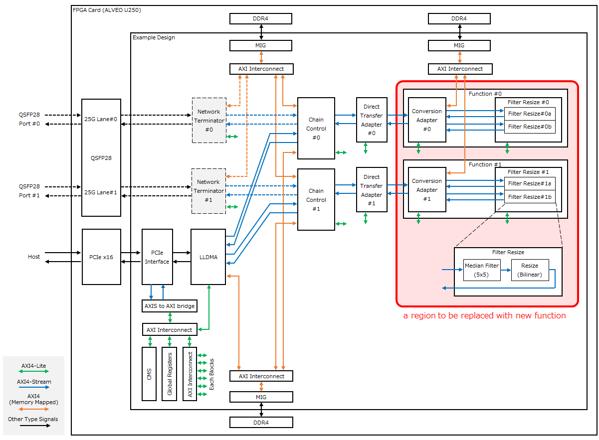
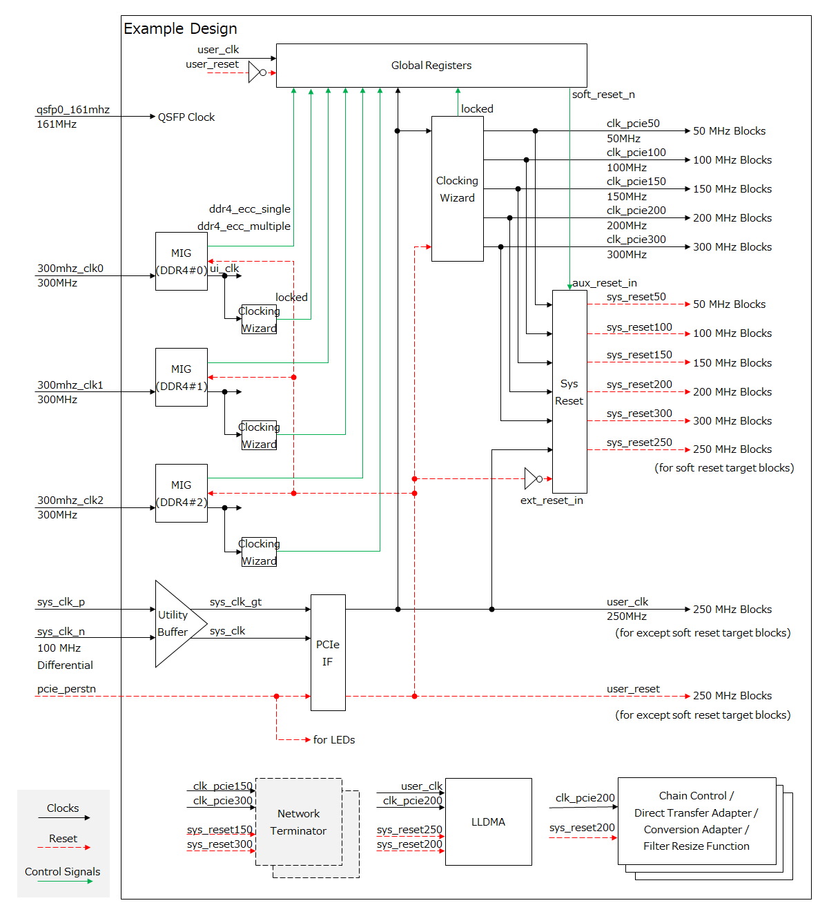
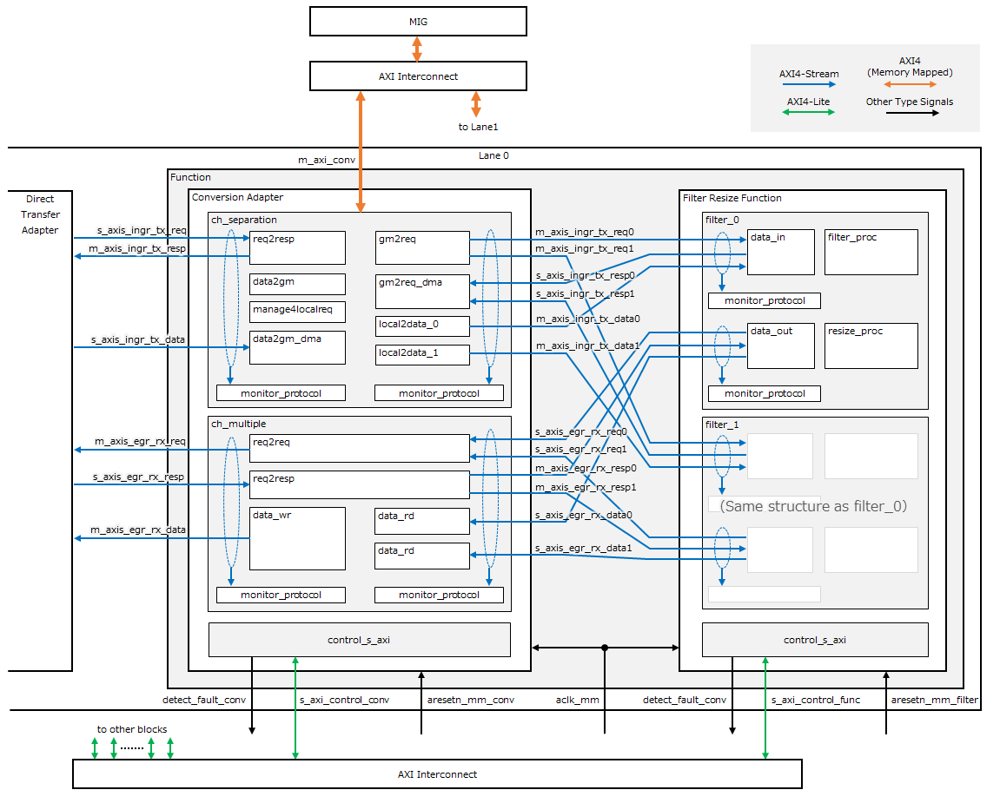

ファンクションブロック開発ガイドライン
##################################

..  toctree::
    :hidden:
    :maxdepth: 2

本資料の目的と位置づけ
==================================

目的
----------------------------------

本書は、ファンクションブロックを開発する技術者に対して、実装サンプルの基本仕様と、ファンクションブロックのビルド手順を提供します。

ファンクションブロック開発フロー
----------------------------------

1. 後述の `ファンクションブロックインタフェース <#func-intf-spec>`_ 仕様に基づいてファンクションブロックを設計・実装します。
2. ビルドスクリプト等を変更し、実装サンプルの既存ファンクションブロックを新しいファンクションブロックに置き換えます。
3. FPGA Bitstreamのビルドを実行します。

FPGAカード諸元
----------------------------------

実装サンプルを設計した際に使用した FPGAカードの諸元を示します。詳細は `デバイスベンダのサイト <https://www.amd.com/ja/products/accelerators/alveo/u250/a-u250-a64g-pq-g.html>`_ を参照してください。

+------------------------+---------------------------------------------------------------+
| 項目                   | 内容                                                          |
+========================+===============================================================+
| 使用FPGA               | Xilinx Ultrascale+ XCU250-FIGD2104-2L-e                       |
+------------------------+---------------------------------------------------------------+
| 搭載 Board             | Alveo U250 (PCI card)                                         |
+------------------------+---------------------------------------------------------------+
| 動作周波数             | 50MHz / 100MHz / 150MHz / 200MHz / 250MHz / 300MHz            |
+------------------------+---------------------------------------------------------------+
| 外部インタフェース     | PCIe Gen3 x16 / QSFP28 / DDR4 / UART / GPIO                   |
+------------------------+---------------------------------------------------------------+
| 入力クロック           | 100MHz / 161MHz / 300MHz                                      |
+------------------------+---------------------------------------------------------------+
| コンフィグレーション   | Flash ROM 書き込み、USB 書き込み、PCI 書き込み (Tandem PCIe)  |
+------------------------+---------------------------------------------------------------+

実装サンプルの構成
==================================

実装サンプルのブロック構成を示します。赤くハッチングされた領域が新たなファンクションブロックと置き換えられる領域です。

Chain Control
--------------------------------------------------------------------

ファンクションチェインのデータ転送機能を実現します。外部IFの論理的接続(コネクション)と FPGA内の論理的接続(ファンクションチャネル)の間の紐付け (ID変換) とデータ転送を行います。

LLDMA (Low-Latency direct Device Memory Access)
--------------------------------------------------------------------

ホストとFPGAカード間の転送の他、ホストのCPU処理を介さずにFPGAカード間で直接データ転送する機能（D2D）を提供します。

Network Terminator
--------------------------------------------------------------------

Ethernetによる外部インタフェース機能を提供します。

NW終端機能は実装サンプルでは未搭載です。本機能については `"READMEのNW終端機能について <../../README_ja.md#nw終端機能について>`_.を参照してください。

Direct Transfer Adapter
--------------------------------------------------------------------

ファンクションブロックをバイパスし、チェイン制御のIngressからEgressへの直接の転送を可能にします。

Function (Conversion Adapter/Filter Resize)
--------------------------------------------------------------------

実装サンプルでは画像処理機能を提供します。変換アダプタブロックとフィルタリサイズブロックから構成されます。

- 変換アダプタブロック: データフレームのバッファリングと画像処理タスクの振り分けを行います。
- フィルタリサイズブロック: 振り分けられた画像処理タスク（5x5メディアンフィルタとリサイズ）の並列実行を可能とします。

その他のブロック
--------------------------------------------------------------------

..  list-table::
    :header-rows: 1

    *   - ブロック名
        - 説明
    *   - PCIe Interface
        - PCI Express x16 バスを終端するハードIP。
    *   - MIG
        - Memory Interface Generator。ALVEO カード上の DDR SDRAM にアクセスするためのインタフェースを提供します。
    *   - AXIS to AXI bridge
        - PCI Express からのレジスタアクセスを AXI4-Stream から FPGA 内部で使用する AXI4-Lite プロトコルに変換します。
    *   - CMS
        - Card Management System。ALVEO カードの電力情報や温度情報を取得します。
    *   - Global Registers
        - 実装サンプル全体の制御や監視に関わるレジスタ群を提供します。

Clock/Reset 系
----------------------------------

以下に、実装サンプルの Clock/Reset 系を示します。

.. _func_intf_spec:

ファンクションブロックインタフェース仕様
==================================

以下に、ファンクションブロックが満たすべきインタフェースの仕様を示します。

.. image:: _images/inter_block_intf_func.png

+---------------------+----------------+-----+------------------------+----------------------------------------------+------+
|   信号名 / バス名   | I/Oタイプ [#]_ | 幅  |     接続先ブロック     |                   機能説明                   | 要否 |
+=====================+================+=====+========================+==============================================+======+
| aclk_mm             | input          | 1   | Clocking Wizard        | 200 MHz クロック                             | 必須 |
+---------------------+----------------+-----+------------------------+----------------------------------------------+------+
| aresetn_mm_filter   | input          | 1   | Processor System Reset | サブブロック0 リセット (aclk_mm同期、負論理) | 必須 |
+---------------------+----------------+-----+------------------------+----------------------------------------------+------+
| aresetn_mm_conv     | input          | 1   | Processor System Reset | サブブロック1 リセット (aclk_mm同期、負論理) |      |
+---------------------+----------------+-----+------------------------+----------------------------------------------+------+
| s_axis_ingr_req     | AXIS Slave     | 64  | 直接転送アダプタ       | Ingress転送要求                              | 必須 |
+---------------------+----------------+-----+------------------------+----------------------------------------------+------+
| m_axis_ingr_resp    | AXIS Master    | 64  | 直接転送アダプタ       | Ingress転送応答                              | 必須 |
+---------------------+----------------+-----+------------------------+----------------------------------------------+------+
| s_axis_ingr_data    | AXIS Slave     | 512 | 直接転送アダプタ       | Ingress転送データストリーム                  | 必須 |
+---------------------+----------------+-----+------------------------+----------------------------------------------+------+
| m_axis_egr_req      | AXIS Master    | 64  | 直接転送アダプタ       | Egress転送要求                               | 必須 |
+---------------------+----------------+-----+------------------------+----------------------------------------------+------+
| s_axis_egr_resp     | AXIS Slave     | 64  | 直接転送アダプタ       | Egress転送応答                               | 必須 |
+---------------------+----------------+-----+------------------------+----------------------------------------------+------+
| m_axis_egr_data     | AXIS Master    | 512 | 直接転送アダプタ       | Egress転送データストリーム                   | 必須 |
+---------------------+----------------+-----+------------------------+----------------------------------------------+------+
| m_axi_conv          | AXI4 Master    | 512 | AXI Interconnect       | DDR アクセスバス                             |      |
+---------------------+----------------+-----+------------------------+----------------------------------------------+------+
| s_axi_control_func  | AXIL Slave     | 32  | AXI Interconnect       | サブブロック0 レジスタアクセスバス           | 必須 |
+---------------------+----------------+-----+------------------------+----------------------------------------------+------+
| s_axi_control_conv  | AXIL Slave     | 32  | AXI Interconnect       | サブブロック1 レジスタアクセスバス           |      |
+---------------------+----------------+-----+------------------------+----------------------------------------------+------+
| detect_fault_filter | output         | 1   | グローバルレジスタ     | サブブロック0 障害検出通知 (正論理、レベル)  | 必須 |
+---------------------+----------------+-----+------------------------+----------------------------------------------+------+
| detect_fault_conv   | output         | 1   | グローバルレジスタ     | サブブロック1 障害検出通知 (正論理、レベル)  |      |
+---------------------+----------------+-----+------------------------+----------------------------------------------+------+

.. [#] :code:`AXIS` : AXI4-Stream / :code:`AXIL` : AXI4-Lite

クロック入力 (aclk_mm)
----------------------------------

実装サンプルでは Clocking Wizard IP で生成された 200 MHz のクロック(:code:`clk_pcie200`)を接続する想定になっており、その他のインタフェース (リセット、AXIバス、障害検出通知) も全てこれに同期しています。

リセット入力 (aresetn_mm_filter/conv)
--------------------------------------------------------------------

実装サンプルではファンクションブロックのリセットのために 2系統のリセット入力が用意されています。これは実装サンプルにおいてファンクションブロック内に 2つのサブブロックが含まれ、これらを個別にリセットできるようにするためです。

ファンクションブロック内が 1つのブロックのみで構成される場合は 2つ目のブロック用のリセット(:code:`aresetn_mm_conv`)は未接続にすることができます。

Ingress 転送インタフェース (axis_ingr_req/resp/data)
--------------------------------------------------------------------

Ingress 側のデータフレーム転送のためのインタフェースです。3つの AXI4-Stream インタフェース(req/resp/data) から構成されます。プロトコルは後述します。

Egress 転送インタフェース (axis_egr_req/resp/data)
--------------------------------------------------------------------

Egress 側のデータフレーム転送のためのインタフェースです。3つの AXI4-Stream インタフェース(req/resp/data) から構成されます。プロトコルは後述します。

DDR アクセスインタフェース (m_axi_conv)
--------------------------------------------------------------------

ALVEO カード上の DDR4 SDRAM にアクセスするための AXI4 (Memory Mapped) インタフェースです。実装サンプルでは Ingress 側のフレームバッファリングのために使用されます。ファンクションブロックの機能によって DDR へのバッファリングを必要としない場合は未接続にすることができます。

レジスタアクセスインタフェース (s_axi_control_func/conv)
--------------------------------------------------------------------

ファンクションブロックを制御するためのレジスタアクセスインタフェースです。実装サンプルではファンクションブロック内に 2つのサブブロックが含まれるため、それぞれのためにインタフェースが用意されています。

ファンクションブロック内部が 1つのブロックのみで構成される場合は 2つ目のブロック用のインタフェース(:code:`s_axi_control_conv`)は未接続にすることができます。

障害検出通知 (detect_fault_filter/conv)
--------------------------------------------------------------------

ファンクションブロック内で検出された障害をグローバルレジスタへ通知するためのインタフェースです。実装サンプルではブロック内に 2つのサブブロックが含まれるため、それぞれのためにインタフェースが用意されています。

Read Clear 実装された障害検出レジスタの全てのビットを OR結合した結果を出力する、正論理のレベル信号です。

ファンクションブロック内部が 1つのブロックのみで構成される場合は 2つ目のブロック用のインタフェース(:code:`detect_fault_conv`)はゼロ固定出力にすることができます。

ブロック間のデータ転送プロトコル
==================================

データフレームの転送に用いるブロック間のインタフェースを示します。このインタフェースは 3 つの AXI4-Stream から構成されます。送信側のブロックを Source Block、受信側のブロックを Sink Block としています。Ingress 転送インタフェースであれば、直接転送アダプタブロックが Source Block、ファンクションブロックが Sink Block となり、Egress 転送インタフェースであれば、ファンクションブロックが Source Block、直接転送アダプタブロックが Sink Block となります。

.. image:: _images/inter_block_intf.png

データフレームとトランザクションの関係
----------------------------------

データフレームは 1 つの演算タスクで入出力されるデータ全体を指します。例えば画像処理タスクでは、データフレームは 1 枚の画像フレーム全体であることが想定されます。

ブロック間でデータを転送する際、大きなデータフレームを一括して転送するとバスが長時間占有され、ファンクションチャネル間でデッドロックが発生する可能性があります。そこで本プロトコルではデータフレームを最大 32 kByte のトランザクションに分割して転送します。

データフレームの先頭を含むトランザクションには Start of Frame (SOF) フラグと、そのデータフレーム全体の長さの情報が付与されます。データフレームの末尾を含むトランザクションには End of Frame (EOF) フラグが付与されます。

1 つのトランザクションに複数のデータフレームを混在させることはできません。

req / resp
----------------------------------

Source と Sink の間で転送するトランザクションのデータ長を決定するための 64 bit 幅の制御用バスです。トランザクション毎に以下の構造体を 1 cycle で転送します。

+--------------+--------------+---------------------------------------------------------------------------+------------------+
| フィールド名 | ビットレンジ |                            説明                                           |       値域       |
+==============+==============+===========================================================================+==================+
| frame_length | [31:0]       | データフレーム長（バイト単位、SOF時のみ有効）                             | 1～4,294,967,295 |
+--------------+--------------+---------------------------------------------------------------------------+------------------+
| channel      | [40:32]      | ファンクションチャネルID                                                  | 0～511 [#]_      |
+--------------+--------------+---------------------------------------------------------------------------+------------------+
| sof          | [41]         | SOFフラグ（1 のとき、トランザクションデータの先頭がデータフレームの先頭） |                  |
+--------------+--------------+---------------------------------------------------------------------------+------------------+
| eof          | [42]         | EOFフラグ（1 のとき、トランザクションデータの末尾がデータフレームの末尾） |                  |
+--------------+--------------+---------------------------------------------------------------------------+------------------+
| direct       | [43]         | 直接転送指示ビット。ファンクションブロックでは使用しません。              |                  |
+--------------+--------------+---------------------------------------------------------------------------+------------------+
| (reserved)   | [47:44]      | 予約                                                                      |                  |
+--------------+--------------+---------------------------------------------------------------------------+------------------+
| burst_length | [63:48]      | トランザクションデータ長（バイト単位、最大 32768 Bytes）                  | 0～32,768 [#]_   |
+--------------+--------------+---------------------------------------------------------------------------+------------------+

.. [#] プロトコル上で使用可能な最大範囲。実際に使用可能な値はファンクションブロックに依存します。
.. [#] 1 ≦ req.burst_length ≦ 32768, 0 ≦ resp.burst_length ≦ req.burst_length

req の burst_length は Source Block が転送可能なトランザクションデータ長を示します。resp の burst_length は Sink Block が受け取ることが可能なトランザクションデータ長を示します。resp の burst_length は req の burst_length を超えてはいけません。Sink Block がバッファフルなどのためにトランザクションデータを 1 Byte も受け取ることができない場合、resp の burst_length を 0 にすることができます。

data
----------------------------------

req / resp のやりとりで決定されたトランザクションデータ長に基づきブロック間のデータ転送を行うための 512 bit 幅のバスです。

トランザクションデータ長は resp の burst_length の値に一致します。resp の burst_length が 0 の場合はブロック間のデータ転送を実施しません。

トランザクションデータの先頭は 512 bit バスの LSB から開始します。トランザクションデータ長が 64 Bytes の倍数でない場合は、トランザクションデータの末尾のサイクルの残った領域末尾に無効データを付与します。

以下に 0～257 の 258 Bytes のデータを 5サイクル で転送する場合のバイト順を示します。

.. image:: ./_images/inter_block_if_burst_format.png

タイミング
----------------------------------

以下に req / resp / data の信号タイミングを示します。複数のファンクションチャネルのトランザクションを同一のブロック間データ転送インタフェースに重畳する場合は、 req / resp / data のチャネルの順序は in-order でなければなりません。

.. image:: _images/inter_block_timing.png

フィルタリサイズファンクションブロック仕様
==================================

(★ブロッキング転送に関する記載(チュートリアルから参照))

以下に、実装サンプルに実装されているフィルタリサイズファンクションブロックのブロック構成を示します。

Conversion Adapter
----------------------------------

実装サンプルのデータフレームに相当する画像データのバッファリングと、2つのフィルタリサイズ回路への画像データの振り分けを行うサブブロックです。

..  list-table::
    :header-rows: 1

    *   - ブロック名
        - 説明
    *   - ch_seperation
        - Direct Transfer Adapter からデータフレームを受け取り、DDR にバッファリングします。画像 1枚分のバッファリングが完了したものから順に Filter Resize へ転送します。
    *   - ch_multiple
        - 2 つの Filter Resize からの画像処理結果の入力を調停し、受け取った画像処理結果を Direct Transfer Adapter へ転送します。
    *   - control_s_axi
        - 制御レジスタ群を提供します。

Filter Resize
----------------------------------

画像データに対しフィルタ処理とリサイズ処理を実施するサブブロックです。

..  list-table::
    :header-rows: 1

    *   - ブロック名
        - 説明
    *   - data_in
        - Conversion Adapter からデータフレームを受け取り、後段の filter_proc へ入力します。
    *   - filter_proc
        - data_in から画像データを受け取り、5x5 メディアンフィルタ処理を適用して resize_proc へ転送します。
    *   - resize_proc
        - filter_proc から画像データを受け取り、リサイズ処理を適用します。補間アルゴリズムとして Bilinear を適用します。リサイズの結果を data_out へ転送します。
    *   - data_out
        - resize_proc から画像データを受け取り、Conversion Adapter へ出力します。

ファンクションブロックレジスタマップ
-----------------------------------------

Conversion Adapter
************************************

======  ================================  ==========  =================
Offset  Name                              Type [#]_   Initial Value
======  ================================  ==========  =================
0x0000  control                           R/W         0x00000000
0x0010  module_id                         R           0x0000F1C2
0x0020  local_version                     R           (Version Number)
0x0030  m_axi_ingr_frame_buffer_l         R/W         0x00000000
0x0034  m_axi_ingr_frame_buffer_h         R/W         0x00000000
0x0040  rows_in                           R/W         0x00000000
0x0044  cols_in                           R/W         0x00000000
0x0050  stat_sel_channel                  R/W         0x00000000
0x0060  stat_ingr_rcv_data_value_l        RC          0x00000000
0x0064  stat_ingr_rcv_data_value_h        RC          0x00000000
0x0070  stat_ingr_snd_data_0_value_l      RC          0x00000000
0x0074  stat_ingr_snd_data_0_value_h      RC          0x00000000
0x0078  stat_ingr_snd_data_1_value_l      RC          0x00000000
0x007C  stat_ingr_snd_data_1_value_h      RC          0x00000000
0x0080  stat_egr_rcv_data_0_value_l       RC          0x00000000
0x0084  stat_egr_rcv_data_0_value_h       RC          0x00000000
0x0088  stat_egr_rcv_data_1_value_l       RC          0x00000000
0x008C  stat_egr_rcv_data_1_value_h       RC          0x00000000
0x0090  stat_egr_snd_data_value_l         RC          0x00000000
0x0094  stat_egr_snd_data_value_h         RC          0x00000000
0x0098  stat_ingr_rcv_frame_value         RC          0x00000000
0x00A0  stat_ingr_snd_frame_0_value       RC          0x00000000
0x00A4  stat_ingr_snd_frame_1_value       RC          0x00000000
0x00A8  stat_egr_rcv_frame_0_value        RC          0x00000000
0x00AC  stat_egr_rcv_frame_1_value        RC          0x00000000
0x00B0  stat_egr_snd_frame_value          RC          0x00000000
0x00C0  stat_ingr_frame_buffer_overflow   R/WC        0x00000000
0x00C4  stat_ingr_frame_buffer_usage      R           0x00000000
0x0100  detect_fault                      R           0x00000000
0x0110  ingr_rcv_protocol_fault           R/WC        0x00000000
0x0118  ingr_rcv_protocol_fault_mask      R/W         0x00000000
0x011C  ingr_rcv_protocol_fault_force     R/W         0x00000000
0x0120  ingr_snd_protocol_fault_0         R/WC        0x00000000
0x0128  ingr_snd_protocol_fault_0_mask    R/W         0x00000000
0x012C  ingr_snd_protocol_fault_0_force   R/W         0x00000000
0x0130  ingr_snd_protocol_fault_1         R/WC        0x00000000
0x0138  ingr_snd_protocol_fault_1_mask    R/W         0x00000000
0x013C  ingr_snd_protocol_fault_1_force   R/W         0x00000000
0x0140  egr_rcv_protocol_fault_0          R/WC        0x00000000
0x0148  egr_rcv_protocol_fault_0_mask     R/W         0x00000000
0x014C  egr_rcv_protocol_fault_0_force    R/W         0x00000000
0x0150  egr_rcv_protocol_fault_1          R/WC        0x00000000
0x0158  egr_rcv_protocol_fault_1_mask     R/W         0x00000000
0x015C  egr_rcv_protocol_fault_1_force    R/W         0x00000000
0x0160  egr_snd_protocol_fault            R/WC        0x00000000
0x0168  egr_snd_protocol_fault_mask       R/W         0x00000000
0x016C  egr_snd_protocol_fault_force      R/W         0x00000000
0x0170  mem_parity_fault                  R/WC        0x00000000
0x0178  mem_parity_fault_mask             R/W         0x00000000
0x017C  mem_parity_fault_force            R/W         0x00000000
0x0180  ingr_rcv_length_fault             R/WC        0x00000000
0x0188  ingr_rcv_length_fault_mask        R/W         0x00000000
0x018C  ingr_rcv_length_fault_force       R/W         0x00000000
0x0190  streamif_stall                    R           0x00000000
0x0198  streamif_stall_mask               R/W         0x00000000
0x019C  streamif_stall_force              R/W         0x00000000
0x01C0  ingr_rcv_insert_protocol_fault    R/W         0x00000000
0x01C4  ingr_snd_insert_protocol_fault_0  R/W         0x00000000
0x01C8  ingr_snd_insert_protocol_fault_1  R/W         0x00000000
0x01CC  egr_rcv_insert_protocol_fault_0   R/W         0x00000000
0x01D0  egr_rcv_insert_protocol_fault_1   R/W         0x00000000
0x01D4  egr_snd_insert_protocol_fault     R/W         0x00000000
0x01D8  insert_mem_parity_fault           R/W         0x00000000
======  ================================  ==========  =================

.. [#] :code:`R/W`: Read Write / :code:`R`: Read Only / :code:`RC`: Read Clear / :code:`R/WC`: Read Write Clear

Filter Resize
************************************

======  ================================  ==========  =================
Offset  Name                              Type [#]_   Initial Value
======  ================================  ==========  =================
0x0000  control                           R/W         0x00000000
0x0010  module_id                         R           0x0000F2C2
0x0020  local_version                     R           (Version Number)
0x0030  rows_in                           R/W         0x00000000
0x0034  cols_in                           R/W         0x00000000
0x0038  rows_out                          R/W         0x00000000
0x003C  cols_out                          R/W         0x00000000
0x0040  stat_sel_channel                  R/W         0x00000000
0x0050  stat_ingr_rcv_data_0_value_l      RC          0x00000000
0x0054  stat_ingr_rcv_data_0_value_h      RC          0x00000000
0x0058  stat_ingr_rcv_data_1_value_l      RC          0x00000000
0x005C  stat_ingr_rcv_data_1_value_h      RC          0x00000000
0x0060  stat_egr_snd_data_0_value_l       RC          0x00000000
0x0064  stat_egr_snd_data_0_value_h       RC          0x00000000
0x0068  stat_egr_snd_data_1_value_l       RC          0x00000000
0x006C  stat_egr_snd_data_1_value_h       RC          0x00000000
0x0070  stat_ingr_rcv_frame_0_value       RC          0x00000000
0x0074  stat_ingr_rcv_frame_1_value       RC          0x00000000
0x0078  stat_egr_snd_frame_0_value        RC          0x00000000
0x007C  stat_egr_snd_frame_1_value        RC          0x00000000
0x0100  detect_fault                      R           0x00000000
0x0110  ingr_rcv_protocol_fault_0         R/WC        0x00000000
0x0118  ingr_rcv_protocol_fault_0_mask    R/W         0x00000000
0x011C  ingr_rcv_protocol_fault_0_force   R/W         0x00000000
0x0120  ingr_rcv_protocol_fault_1         R/WC        0x00000000
0x0128  ingr_rcv_protocol_fault_1_mask    R/W         0x00000000
0x012C  ingr_rcv_protocol_fault_1_force   R/W         0x00000000
0x0130  egr_snd_protocol_fault_0          R/WC        0x00000000
0x0138  egr_snd_protocol_fault_0_mask     R/W         0x00000000
0x013C  egr_snd_protocol_fault_0_force    R/W         0x00000000
0x0140  egr_snd_protocol_fault_1          R/WC        0x00000000
0x0148  egr_snd_protocol_fault_1_mask     R/W         0x00000000
0x014C  egr_snd_protocol_fault_1_force    R/W         0x00000000
0x0150  streamif_stall                    R           0x00000000
0x0158  streamif_stall_mask               R/W         0x00000000
0x015C  streamif_stall_force              R/W         0x00000000
0x0180  ingr_rcv_insert_protocol_fault_0  R/W         0x00000000
0x0184  ingr_rcv_insert_protocol_fault_1  R/W         0x00000000
0x0188  egr_snd_insert_protocol_fault_0   R/W         0x00000000
0x018C  egr_snd_insert_protocol_fault_1   R/W         0x00000000
======  ================================  ==========  =================

.. [#] :code:`R/W`: Read Write / :code:`R`: Read Only / :code:`RC`: Read Clear / :code:`R/WC`: Read Write Clear

リソース情報
----------------------------------

参考として、実装サンプルのリソースレポートを例示します。

.. code-block:: none

    1. CLB Logic
    ------------

    +----------------------------+--------+-------+------------+-----------+-------+
    |          Site Type         |  Used  | Fixed | Prohibited | Available | Util% |
    +----------------------------+--------+-------+------------+-----------+-------+
    | CLB LUTs                   | 546439 |     0 |          0 |   1728000 | 31.62 |
    |   LUT as Logic             | 514191 |     0 |          0 |   1728000 | 29.76 |
    |   LUT as Memory            |  32248 |     0 |          0 |    791040 |  4.08 |
    |     LUT as Distributed RAM |  21292 |     0 |            |           |       |
    |     LUT as Shift Register  |  10956 |     0 |            |           |       |
    | CLB Registers              | 708697 |     8 |          0 |   3456000 | 20.51 |
    |   Register as Flip Flop    | 708564 |     8 |          0 |   3456000 | 20.50 |
    |   Register as Latch        |    128 |     0 |          0 |   3456000 | <0.01 |
    |   Register as AND/OR       |      5 |     0 |          0 |   3456000 | <0.01 |
    | CARRY8                     |  16506 |     0 |          0 |    216000 |  7.64 |
    | F7 Muxes                   |  15776 |     0 |          0 |    864000 |  1.83 |
    | F8 Muxes                   |   3797 |     0 |          0 |    432000 |  0.88 |
    | F9 Muxes                   |     92 |     0 |          0 |    216000 |  0.04 |
    +----------------------------+--------+-------+------------+-----------+-------+

.. code-block:: none

    14. SLR CLB Logic and Dedicated Block Utilization
    -------------------------------------------------

    +----------------------------+--------+--------+--------+-------+--------+--------+--------+--------+
    |          Site Type         |  SLR0  |  SLR1  |  SLR2  |  SLR3 | SLR0 % | SLR1 % | SLR2 % | SLR3 % |
    +----------------------------+--------+--------+--------+-------+--------+--------+--------+--------+
    | CLB                        |  40680 |  50177 |  24476 |  6500 |  75.33 |  92.92 |  45.33 |  12.04 |
    |   CLBL                     |  22119 |  27186 |  13172 |  3602 |  75.54 |  92.85 |  44.99 |  12.30 |
    |   CLBM                     |  18561 |  22991 |  11304 |  2898 |  75.08 |  93.01 |  45.73 |  11.72 |
    | CLB LUTs                   | 185688 | 228277 | 108015 | 24459 |  42.98 |  52.84 |  25.00 |   5.66 |
    |   LUT as Logic             | 182063 | 211766 |  98446 | 21916 |  42.14 |  49.02 |  22.79 |   5.07 |
    |     using O5 output only   |   1352 |   2272 |   1260 |   518 |   0.31 |   0.53 |   0.29 |   0.12 |
    |     using O6 output only   | 141199 | 149601 |  55462 | 14701 |  32.68 |  34.63 |  12.84 |   3.40 |
    |     using O5 and O6        |  39512 |  59893 |  41724 |  6697 |   9.15 |  13.86 |   9.66 |   1.55 |
    |   LUT as Memory            |   3625 |  16511 |   9569 |  2543 |   1.83 |   8.35 |   4.84 |   1.29 |
    |     LUT as Distributed RAM |   2912 |   8054 |   8450 |  1876 |   1.47 |   4.07 |   4.27 |   0.95 |
    |       using O5 output only |      0 |      0 |      0 |     0 |   0.00 |   0.00 |   0.00 |   0.00 |
    |       using O6 output only |    320 |   1314 |      2 |     0 |   0.16 |   0.66 |  <0.01 |   0.00 |
    |       using O5 and O6      |   2592 |   6740 |   8448 |  1876 |   1.31 |   3.41 |   4.27 |   0.95 |
    |     LUT as Shift Register  |    713 |   8457 |   1119 |   667 |   0.36 |   4.28 |   0.57 |   0.34 |
    |       using O5 output only |      0 |      0 |      0 |     0 |   0.00 |   0.00 |   0.00 |   0.00 |
    |       using O6 output only |    630 |   4530 |    986 |   632 |   0.32 |   2.29 |   0.50 |   0.32 |
    |       using O5 and O6      |     83 |   3927 |    133 |    35 |   0.04 |   1.99 |   0.07 |   0.02 |
    | CLB Registers              | 215945 | 335319 | 118243 | 39190 |  24.99 |  38.81 |  13.69 |   4.54 |
    | CARRY8                     |   6800 |   6128 |   3520 |    58 |  12.59 |  11.35 |   6.52 |   0.11 |
    | F7 Muxes                   |   8404 |   5627 |   1244 |   501 |   3.89 |   2.61 |   0.58 |   0.23 |
    | F8 Muxes                   |   2109 |   1388 |    242 |    58 |   1.95 |   1.29 |   0.22 |   0.05 |
    | F9 Muxes                   |      0 |     92 |      0 |     0 |   0.00 |   0.17 |   0.00 |   0.00 |
    | Block RAM Tile             |    220 |    428 |    124 |  25.5 |  32.74 |  63.69 |  18.45 |   3.79 |
    |   RAMB36/FIFO              |    166 |    350 |    122 |    25 |  24.70 |  52.08 |  18.15 |   3.72 |
    |   RAMB18                   |    108 |    156 |      4 |     1 |   8.04 |  11.61 |   0.30 |   0.07 |
    | URAM                       |      0 |     92 |      0 |     0 |   0.00 |  28.75 |   0.00 |   0.00 |
    | DSPs                       |      3 |    537 |     15 |     3 |   0.10 |  17.48 |   0.49 |   0.10 |
    | Unique Control Sets        |   5073 |  10444 |   2766 |  1159 |   4.70 |   9.67 |   2.56 |   1.07 |
    +----------------------------+--------+--------+--------+-------+--------+--------+--------+--------+
    * Note: Available Control Sets based on CLB Registers / 8

.. code-block:: none

    1. Utilization by Hierarchy
    ---------------------------

    +-------------------------------+----------------------------------------+------------+------------+---------+-------+--------+--------+--------+------+------------+
    |           Instance            |                  Module                | Total LUTs | Logic LUTs | LUTRAMs |  SRLs |   FFs  | RAMB36 | RAMB18 | URAM | DSP Blocks |
    +-------------------------------+----------------------------------------+------------+------------+---------+-------+--------+--------+--------+------+------------+
    | function_0                    |                 function_0_imp_1MVGFZK |      60739 |      59436 |     208 |  1095 |  61079 |    117 |      5 |   32 |         75 |
    |   axi4l_decoupler_conv        |        design_1_axi4l_decoupler_conv_0 |          7 |          7 |       0 |     0 |      0 |      0 |      0 |    0 |          0 |
    |   axi4l_decoupler_filter      |      design_1_axi4l_decoupler_filter_0 |          7 |          7 |       0 |     0 |      0 |      0 |      0 |    0 |          0 |
    |   conversion_ada_0            |            design_1_conversion_ada_0_0 |      25150 |      24075 |     208 |   867 |  30289 |     43 |      3 |   32 |         21 |
    |   dfx_decoupler_conv_axi_m    |    design_1_dfx_decoupler_conv_axi_m_0 |          5 |          5 |       0 |     0 |      0 |      0 |      0 |    0 |          0 |
    |   dfx_decoupler_conv_axis_m   |   design_1_dfx_decoupler_conv_axis_m_0 |          9 |          9 |       0 |     0 |      0 |      0 |      0 |    0 |          0 |
    |   dfx_decoupler_conv_axis_s   |   design_1_dfx_decoupler_conv_axis_s_0 |          9 |          9 |       0 |     0 |      0 |      0 |      0 |    0 |          0 |
    |   dfx_decoupler_conv_fault    |    design_1_dfx_decoupler_conv_fault_0 |          1 |          1 |       0 |     0 |      0 |      0 |      0 |    0 |          0 |
    |   dfx_decoupler_filter_axis_m | design_1_dfx_decoupler_filter_axis_m_0 |          6 |          6 |       0 |     0 |      0 |      0 |      0 |    0 |          0 |
    |   dfx_decoupler_filter_axis_s | design_1_dfx_decoupler_filter_axis_s_0 |          6 |          6 |       0 |     0 |      0 |      0 |      0 |    0 |          0 |
    |   dfx_decoupler_filter_fault  |  design_1_dfx_decoupler_filter_fault_0 |          1 |          1 |       0 |     0 |      0 |      0 |      0 |    0 |          0 |
    |   filter_resize_0             |             design_1_filter_resize_0_0 |      35554 |      35326 |       0 |   228 |  30790 |     74 |      2 |    0 |         54 |
    |   xlconcat_1                  |                  design_1_xlconcat_1_1 |          0 |          0 |       0 |     0 |      0 |      0 |      0 |    0 |          0 |
    | function_1                    |                 function_1_imp_1I7392R |      60704 |      59401 |     208 |  1095 |  61087 |    117 |      5 |   32 |         75 |
    |   axi4l_decoupler_conv        |        design_1_axi4l_decoupler_conv_1 |          7 |          7 |       0 |     0 |      0 |      0 |      0 |    0 |          0 |
    |   axi4l_decoupler_filter      |      design_1_axi4l_decoupler_filter_1 |          7 |          7 |       0 |     0 |      0 |      0 |      0 |    0 |          0 |
    |   conversion_ada_0            |            design_1_conversion_ada_0_1 |      25121 |      24046 |     208 |   867 |  30270 |     43 |      3 |   32 |         21 |
    |   dfx_decoupler_conv_axi_m    |    design_1_dfx_decoupler_conv_axi_m_1 |          5 |          5 |       0 |     0 |      0 |      0 |      0 |    0 |          0 |
    |   dfx_decoupler_conv_axis_m   |   design_1_dfx_decoupler_conv_axis_m_1 |          9 |          9 |       0 |     0 |      0 |      0 |      0 |    0 |          0 |
    |   dfx_decoupler_conv_axis_s   |   design_1_dfx_decoupler_conv_axis_s_1 |          9 |          9 |       0 |     0 |      0 |      0 |      0 |    0 |          0 |
    |   dfx_decoupler_conv_fault    |    design_1_dfx_decoupler_conv_fault_1 |          1 |          1 |       0 |     0 |      0 |      0 |      0 |    0 |          0 |
    |   dfx_decoupler_filter_axis_m | design_1_dfx_decoupler_filter_axis_m_1 |          6 |          6 |       0 |     0 |      0 |      0 |      0 |    0 |          0 |
    |   dfx_decoupler_filter_axis_s | design_1_dfx_decoupler_filter_axis_s_1 |          6 |          6 |       0 |     0 |      0 |      0 |      0 |    0 |          0 |
    |   dfx_decoupler_filter_fault  |  design_1_dfx_decoupler_filter_fault_1 |          1 |          1 |       0 |     0 |      0 |      0 |      0 |    0 |          0 |
    |   filter_resize_0             |             design_1_filter_resize_0_1 |      35551 |      35323 |       0 |   228 |  30817 |     74 |      2 |    0 |         54 |
    |   xlconcat_1                  |                  design_1_xlconcat_1_2 |          0 |          0 |       0 |     0 |      0 |      0 |      0 |    0 |          0 |
    +-------------------------------+----------------------------------------+------------+------------+---------+-------+--------+--------+--------+------+------------+
    * Note: The sum of lower-level cells may be larger than their parent cells total, due to cross-hierarchy LUT combining

新たなファンクションブロックの設計
==================================

これ以降、hardware-design リポジトリのルートを :code:`$workdir/hardware-design` とし、追加する新しいファンクションブロックのモジュール名を :code:`myfunc` とします。

ディレクトリ構成
----------------------------------

:code:`$workdir/hardware-design/function/` の配下に新しいファンクションブロックを格納するディレクトリを作成します。

.. code-block:: none

    $workdir/hardware-design/function/
    +-- myfunc/
        +-- src/
        |   +-- hls/
        |   |   +-- include/
        |   |   |   +-- *.h / *.hpp ..... 高位合成用C/C++ヘッダファイル
        |   |   +-- *.c / *.hpp ......... 高位合成用C/C++ソースファイル
        |   +-- hdl/
        |   |   +-- *.v / *.sv .......... RTLソースファイル
        |   +-- ip/
        |       +-- *.xci ............... IP生成用ファイル
        +-- script/	
            +-- hls/
            |   +-- ipgen.sh ............ IPビルド用スクリプト
            |   +-- Makefile ............ IPビルド用Makefile
            |   +-- ipgen_template.tc ... IPビルド用TCLスクリプトのテンプレート
            +-- ip/
                +-- Makefile.bd_top.mk .. IP化用Makefile
                +-- myfunc_bd.tcl ....... ブロックデザイン生成用TCLスクリプト
                +-- package_kernel.bd_top.tcl
                                  ....... IP化用TCLスクリプト

使用しないディレクトリは省略できます。例えば高位合成ソースを含まない場合は :code:`hls/` は不要です。

:code:`script/` 配下のスクリプト類は、既存のファンクションブロックのスクリプトなどを参考に作成することができます。

重要なのは :code:`Makefile.bd_top.mk` であり、以下のコマンドにてファンクションブロックのパッケージ化が行えるように構成する必要があります。

.. code-block:: shell

    $ cd $workdir/hardware-design/function/myfunc/script/ip
    $ make -f Makefile.bd_top.mk all

ビルドスクリプトの編集
----------------------------------

Vivadoプロジェクトに myfunc を取り込むためにディレクトリに格納したソースコードをスクリプトに追加します。

HDLソースファイルの追加
**********************************

:code:`$workdir/hardware-design/example-design/script/impl/build_design.tcl` を編集し、:code:`add_files` コマンドを追加します。

.. code-block:: tcl

    # Add source
    add_files -norecurse { \
    ../../function/myfunc/src/hdl/AAA/aaa.sv \
    ../../function/myfunc/src/hdl/AAA/bbb.sv \
    ../../function/myfunc/src/hdl/BBB/ccc.sv \
    ../../function/myfunc/src/hdl/BBB/ddd.v \
    }

    # Add IP
    add_files -norecurse { \
    ../../function/myfunc/src/ip/AAA/aaa.xci \
    ../../function/myfunc/src/ip/BBB/bbb.xci \
    ../../function/myfunc/src/ip/CCC/ccc.xci \
    }

高位合成ビルドコマンドの追加
**********************************

:code:`$workdir/hardware-design/example-design/script/Makefile` を編集し、:code:`Makefile.bd_top.mk` を実行するコードを追加します。

.. code-block:: diff

      CONVERSION_ADAPTOR_DIR = ../../function/filter_resize/conversion_adaptor/script/ip
    - FILTER_RESIZE_DIR = ../../function/filter_resize/filter_resize/script/ip
    + MYFUNC_DIR = ../../function/myfunc/script/ip

.. code-block:: diff

    - ifeq ($(USE_FIL), 1)
    - LIST_XO += $(CONVERSION_ADAPTOR_DIR)/conversion_adaptor.xo
    - LIST_XO += $(FILTER_RESIZE_DIR)/filter_resize.xo
    - endif
    + LIST_XO += $(MYFUNC_DIR)/myfunc.xo

.. code-block:: diff

      distcleanall: distclean
      	make -C $(CHAIN_CONTROL_DIR) -f Makefile.bd_top.mk clean
      	make -C $(DIRECT_TRANS_ADAPTOR_DIR) -f Makefile.bd_top.mk clean
      	make -C $(CONVERSION_ADAPTOR_DIR) -f Makefile.bd_top.mk clean
    -  	make -C $(FILTER_RESIZE_DIR) -f Makefile.bd_top.mk clean
    + 	make -C $(MYFUNC_DIR) -f Makefile.bd_top.mk clean

.. code-block:: diff

      # Building kernel
    - $(FILTER_RESIZE_DIR)/%.xo:
	-   make -C $(FILTER_RESIZE_DIR) -f Makefile.bd_top.mk all
    + $(MYFUNC_DIR)/%.xo:
    + 	make -C $(MYFUNC_DIR) -f Makefile.bd_top.mk all

Vivado プロジェクトの編集
----------------------------------

ファンクションブロック置き換えのベースとなる既存構成のVivadoプロジェクトを作成します。Vivadoのツールバージョンについては `ビルド手順書の『ビルド環境』 <./IMPLEMENT.md#ビルド環境>`_ を参照してください。

1. :code:`$workdir/hardware-design/example-design/script/` に移動し、プロジェクト生成コマンドを実行します。

    .. code-block:: shell

        cd $workdir/hardware-design/example-design/script/
        make build-design

    カレントディレクトリ配下に :code:`project_1/` が生成されます。

2. 上記で生成された :code:`project_1/` に移動し、Vivado プロジェクトを開きます。

    .. code-block:: shell

        cd project_1
        vivado project_1.xpr

3. Flow Navigator > IP INTEGRATOR > Open Block Design から Block Design を開きます。

    .. image:: ./_images/vivado_open_block_design.png

4. Block Design から置き換え元のファンクションブロック( :code:`function_0` 、 :code:`function_1` )と :code:`Xlconcat_2` を削除します。 ※ :code:`Xlconcat_2` は :code:`function_0/1` の :code:`decouple status` を束ねているもので、実装サンプルでは使用されません。

    .. image:: ./_images/vivado_del_func.png

5. Add Module(RTLの場合) または Add IP(高位合成の場合) で Block Design に myfunc を追加します。

    .. image:: ./_images/vivado_add_module.png

6. 追加したファンクションブロックの端子を周辺のブロックに接続するために、接続用スクリプトを準備します。スクリプト内の :code:`function_0/1` を、新たに配置したファンクションブロックのインスタンス名に置き換えます。

    .. code-block:: shell

        cp $workdir/hardware-design/example-design/script/impl/function_connect_conf1.tcl .
        sed -i function_connect_conf1.tcl -e "s/function_0/myfunc_0/g"
        sed -i function_connect_conf1.tcl -e "s/function_1/myfunc_1/g"

7. Tcl Console タブを選択し、上記スクリプトを使用して接続を実施します。

    .. image:: ./_images/vivado_source_connect_conf.png

8. :code:`Ctrl + S` で Block Design を保存します。

9. ビルドの自動化のため、Block Design を TCLスクリプトにエクスポートします。Tcl Console で次のコマンドを実行します。

    .. code-block:: tcl

        write_bd_tcl -force tmp.tcl

10. Vivado を終了します。

11. 上記で作成した :code:`tmp.tcl` をそのまま使用するとエラーが発生するため、修正します。下記の行をコメントアウトまたは削除します。

    - アドレス設定: :code:`assign_bd_address ***`
    - デザインバリデーション: :code:`validate_bd_design`

12. 修正後の TCL スクリプトを :code:`$workdir/hardware-design/example-design/script/impl/bd_design_conf1.tcl` に上書きします。

    .. code-block:: shell
        
        cp tmp.tcl ../impl/function_connect_conf1.tcl

13. 置き換えたファンクションブロックのレジスタアクセスを可能とするために、アドレスマッピングを修正します。 :code:`$workdir/hardware-design/example-design/script/impl/bd_address_conf1.csv` の :code:`function0/1` を、Block Design に追加した :code:`myfunc` のインスタンス名/端子名に置き換えます。アドレスマップに変更がある場合は :code:`myfunc` に設定したいアドレスに変更します。

    - 修正対象箇所

        .. code-block:: tcl
            
            SEG_axi4l_decoupler_conv_reg0_1,/axis2axi_bridge_0/m_axi,/function_0/axi4l_decoupler_conv/s_axi/reg0,0x24000,1K
            SEG_axi4l_decoupler_conv_reg0,/axis2axi_bridge_0/m_axi,/function_1/axi4l_decoupler_conv/s_axi/reg0,0x24400,1K
            SEG_axi4l_decoupler_filter_reg0_1,/axis2axi_bridge_0/m_axi,/function_0/axi4l_decoupler_filter/s_axi/reg0,0x25000,1K
            SEG_axi4l_decoupler_filter_reg0,/axis2axi_bridge_0/m_axi,/function_1/axi4l_decoupler_filter/s_axi/reg0,0x26000,1K

    - 削除対象箇所

        .. code-block:: tcl
            
            # Assignments in Address Space /function_0/axi4l_decoupler_conv/m_axi
            #
            SEG_conversion_ada_0_reg0,/function_0/axi4l_decoupler_conv/m_axi,/function_0/conversion_ada_0/s_axi_control/reg0,0x000,1K
            # 
            # Assignments in Address Space /function_0/axi4l_decoupler_filter/m_axi
            #
            SEG_filter_resize_0_reg0,/function_0/axi4l_decoupler_filter/m_axi,/function_0/filter_resize_0/s_axi_control/reg0,0x000,1K
            # 
            # Assignments in Address Space /function_0/conversion_ada_0/m_axi_ingr_frame_buffer
            #
            SEG_ddr4_1_C0_DDR4_ADDRESS_BLOCK,/function_0/conversion_ada_0/m_axi_ingr_frame_buffer,/ddr4_1/C0_DDR4_MEMORY_MAP/C0_DDR4_ADDRESS_BLOCK,0x400000000,16G
            # 
            # Assignments in Address Space /function_1/axi4l_decoupler_conv/m_axi
            #
            SEG_conversion_ada_0_reg0,/function_1/axi4l_decoupler_conv/m_axi,/function_1/conversion_ada_0/s_axi_control/reg0,0x000,1K
            # 
            # Assignments in Address Space /function_1/axi4l_decoupler_filter/m_axi
            #
            SEG_filter_resize_0_reg0,/function_1/axi4l_decoupler_filter/m_axi,/function_1/filter_resize_0/s_axi_control/reg0,0x000,1K
            # 
            # Assignments in Address Space /function_1/conversion_ada_0/m_axi_ingr_frame_buffer
            #
            SEG_ddr4_1_C0_DDR4_ADDRESS_BLOCK,/function_1/conversion_ada_0/m_axi_ingr_frame_buffer,/ddr4_1/C0_DDR4_MEMORY_MAP/C0_DDR4_ADDRESS_BLOCK,0x400000000,16G

14. ビルドを実行し、Bitstream を生成します。

    .. code-block:: shell

        cd $workdir/hardware-design/example-design/script/
        make run-impl
